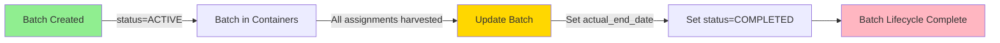

# Harvest-to-Batch Lifecycle Logic Analysis

**Date**: 2025-10-18  
**Issue**: Batches remain ACTIVE after harvest completion  
**Status**: 🚨 CRITICAL GAP IN BUSINESS LOGIC

---

## 🔍 Problem Summary

Batches are fully harvested (all container assignments deactivated) but remain in `status='ACTIVE'` with no `actual_end_date` set. This breaks operational reporting, dashboards, and batch lifecycle management.

**Example**: Batch ID 194 has been harvested but still shows as ACTIVE in the GUI.

---

## 📊 Current State Analysis

### ✅ What EXISTS

#### 1. **Batch Model Fields** (`apps/batch/models/batch.py`)
```python
class Batch(models.Model):
    status = models.CharField(
        choices=[('ACTIVE', 'Active'), ('COMPLETED', 'Completed'), ('TERMINATED', 'Terminated')],
        default='ACTIVE'
    )
    expected_end_date = models.DateField(null=True, blank=True)
    actual_end_date = models.DateField(null=True, blank=True)
```

#### 2. **BatchContainerAssignment Tracking** (`apps/batch/models/assignment.py`)
```python
class BatchContainerAssignment(models.Model):
    is_active = models.BooleanField(default=True)
    departure_date = models.DateField(null=True, blank=True)
    # Tracks whether fish are still in this container
```

#### 3. **HarvestEvent Records** (`apps/harvest/models/harvest_event.py`)
```python
class HarvestEvent(models.Model):
    batch = models.ForeignKey("batch.Batch", related_name="harvest_events")
    assignment = models.ForeignKey("batch.BatchContainerAssignment", related_name="harvest_events")
    event_date = models.DateTimeField()
    # Records when and where fish are harvested
```

#### 4. **Data Generation Script Logic** (`scripts/data_generation/03_event_engine_core.py:681-683`)
```python
# Mark assignment as harvested (inactive)
a.is_active = False
a.save()
```
**✅ Assignments are correctly deactivated during harvest**

---

### ❌ What's MISSING

#### 1. **NO Signal to Update Batch on Final Harvest**
- No `post_save` signal on `BatchContainerAssignment` to detect when the last assignment becomes inactive
- No `post_save` signal on `HarvestEvent` to check if batch is fully harvested

#### 2. **NO Automatic `actual_end_date` Logic**
- When the last container assignment for a batch is deactivated, nothing sets `batch.actual_end_date`
- Expected: `batch.actual_end_date = max(assignment.departure_date for all assignments)`

#### 3. **NO Automatic `status` Transition**
- When all assignments are inactive (`is_active=False`), nothing changes `batch.status` to 'COMPLETED'
- Batches remain 'ACTIVE' forever, breaking operational queries like `Batch.objects.filter(status='ACTIVE')`

#### 4. **NO Validation in HarvestEvent Creation**
- No checks to ensure harvest only happens on active assignments
- No automatic batch status update after harvest event creation

---

## 🎯 Expected Business Logic

### Lifecycle Transition Rules



### Trigger Events

1. **On BatchContainerAssignment.is_active → False**:
   - Check if this is the LAST active assignment for the batch
   - If YES:
     - Set `batch.actual_end_date = max(assignment.departure_date or assignment.updated_at for all assignments)`
     - Set `batch.status = 'COMPLETED'`

2. **On HarvestEvent Creation**:
   - After creating harvest event
   - Check if ALL assignments for `batch` are now `is_active=False`
   - If YES: Apply same logic as above

---

## 🔧 Proposed Solution

### Option 1: Django Signal on BatchContainerAssignment (RECOMMENDED)

**Location**: `apps/batch/signals.py` (new file)

```python
from django.db.models.signals import post_save
from django.dispatch import receiver
from django.db.models import Max
from apps.batch.models import BatchContainerAssignment, Batch

@receiver(post_save, sender=BatchContainerAssignment)
def check_batch_completion_on_assignment_deactivation(sender, instance, **kwargs):
    """
    When a BatchContainerAssignment is deactivated, check if the batch is fully harvested.
    If all assignments are inactive, mark the batch as COMPLETED.
    """
    if not instance.is_active:  # Assignment was just deactivated
        batch = instance.batch
        
        # Check if any assignments are still active
        has_active_assignments = batch.batch_assignments.filter(is_active=True).exists()
        
        if not has_active_assignments:
            # All assignments are inactive - batch is complete
            
            # Get the latest departure date as the actual end date
            latest_departure = batch.batch_assignments.aggregate(
                Max('departure_date')
            )['departure_date__max']
            
            # If departure_date wasn't set, use the latest updated_at
            if not latest_departure:
                latest_update = batch.batch_assignments.aggregate(
                    Max('updated_at')
                )['updated_at__max']
                latest_departure = latest_update.date() if latest_update else instance.updated_at.date()
            
            # Update batch
            batch.actual_end_date = latest_departure
            batch.status = 'COMPLETED'
            batch.save(update_fields=['actual_end_date', 'status'])
            
            print(f"✓ Batch {batch.batch_number} marked as COMPLETED on {latest_departure}")
```

**Advantages**:
- ✅ Centralized logic in batch app
- ✅ Works for ANY way assignments are deactivated (harvest, transfers, manual edits)
- ✅ Single source of truth
- ✅ Follows Django best practices

---

### Option 2: Signal on HarvestEvent (Alternative)

**Location**: `apps/harvest/signals.py` (new file)

```python
from django.db.models.signals import post_save
from django.dispatch import receiver
from apps.harvest.models import HarvestEvent

@receiver(post_save, sender=HarvestEvent)
def check_batch_completion_on_harvest(sender, instance, created, **kwargs):
    """
    When a HarvestEvent is created, check if the batch is fully harvested.
    """
    if created:  # Only for new harvest events
        batch = instance.batch
        assignment = instance.assignment
        
        # Mark assignment as harvested if not already
        if assignment.is_active:
            assignment.is_active = False
            assignment.departure_date = instance.event_date.date()
            assignment.save()
        
        # Check if batch is fully harvested
        has_active_assignments = batch.batch_assignments.filter(is_active=True).exists()
        
        if not has_active_assignments and batch.status != 'COMPLETED':
            batch.actual_end_date = instance.event_date.date()
            batch.status = 'COMPLETED'
            batch.save(update_fields=['actual_end_date', 'status'])
```

**Disadvantages**:
- ❌ Only works for harvest-based completion (not transfers or manual edits)
- ❌ Creates coupling between harvest and batch apps
- ❌ Doesn't handle edge cases (batch terminated, manual assignment deactivation)

---

## 🎯 Recommended Implementation: Option 1

### Implementation Steps

1. **Create signal handler** in `apps/batch/signals.py`
2. **Register signals** in `apps/batch/apps.py`:
   ```python
   class BatchConfig(AppConfig):
       def ready(self):
           import apps.batch.signals  # noqa
   ```
3. **Add tests** in `apps/batch/tests/test_batch_lifecycle_signals.py`
4. **Update data generation** to expect automatic status changes
5. **Backfill existing data** with migration/management command

---

## 🧪 Test Scenarios

### Test 1: Harvest Completes Batch
```python
def test_batch_completed_when_all_assignments_harvested():
    batch = create_batch(status='ACTIVE')
    assignment1 = create_assignment(batch=batch, is_active=True)
    assignment2 = create_assignment(batch=batch, is_active=True)
    
    # Harvest first assignment
    assignment1.is_active = False
    assignment1.departure_date = date(2025, 10, 1)
    assignment1.save()
    
    batch.refresh_from_db()
    assert batch.status == 'ACTIVE'  # Still has active assignment
    assert batch.actual_end_date is None
    
    # Harvest second (last) assignment
    assignment2.is_active = False
    assignment2.departure_date = date(2025, 10, 5)
    assignment2.save()
    
    batch.refresh_from_db()
    assert batch.status == 'COMPLETED'  # Now complete
    assert batch.actual_end_date == date(2025, 10, 5)  # Latest departure
```

### Test 2: Manual Assignment Deactivation
```python
def test_batch_completed_when_assignments_manually_deactivated():
    batch = create_batch(status='ACTIVE')
    assignment = create_assignment(batch=batch, is_active=True)
    
    # Manually deactivate (e.g., batch terminated)
    assignment.is_active = False
    assignment.save()
    
    batch.refresh_from_db()
    assert batch.status == 'COMPLETED'
    assert batch.actual_end_date is not None
```

### Test 3: Multiple Assignments, Staggered Harvest
```python
def test_batch_completion_uses_latest_departure_date():
    batch = create_batch()
    a1 = create_assignment(batch=batch, is_active=False, departure_date=date(2025, 10, 1))
    a2 = create_assignment(batch=batch, is_active=False, departure_date=date(2025, 10, 10))
    a3 = create_assignment(batch=batch, is_active=True)
    
    a3.is_active = False
    a3.departure_date = date(2025, 10, 5)
    a3.save()
    
    batch.refresh_from_db()
    assert batch.actual_end_date == date(2025, 10, 10)  # Latest of all departures
```

---

## 📋 Data Migration Plan

### Step 1: Backfill Existing Batches

**Management Command**: `python manage.py backfill_batch_completion_status`

```python
# apps/batch/management/commands/backfill_batch_completion_status.py
from django.core.management.base import BaseCommand
from apps.batch.models import Batch

class Command(BaseCommand):
    def handle(self, *args, **options):
        batches = Batch.objects.filter(status='ACTIVE')
        updated = 0
        
        for batch in batches:
            has_active = batch.batch_assignments.filter(is_active=True).exists()
            
            if not has_active:
                latest_departure = batch.batch_assignments.aggregate(
                    Max('departure_date')
                )['departure_date__max']
                
                batch.status = 'COMPLETED'
                batch.actual_end_date = latest_departure
                batch.save(update_fields=['status', 'actual_end_date'])
                updated += 1
        
        self.stdout.write(f"Updated {updated} batches to COMPLETED")
```

---

## 🚀 Deployment Checklist

- [ ] Create `apps/batch/signals.py` with batch completion logic
- [ ] Update `apps/batch/apps.py` to register signals
- [ ] Add comprehensive tests for batch lifecycle transitions
- [ ] Create backfill management command
- [ ] Run backfill on test database
- [ ] Verify existing batches are correctly updated
- [ ] Deploy to production
- [ ] Run backfill on production (with dry-run first)
- [ ] Update documentation and PRD

---

## 📚 Related Files

- **Models**: `apps/batch/models/batch.py`, `apps/batch/models/assignment.py`
- **Harvest**: `apps/harvest/models/harvest_event.py`
- **Data Gen**: `scripts/data_generation/03_event_engine_core.py`
- **Tests**: `apps/batch/tests/api/test_batch_viewset.py` (manual status updates exist)

---

## 🎯 Success Metrics

After implementation:
- ✅ All batches with zero active assignments should have `status='COMPLETED'`
- ✅ All completed batches should have valid `actual_end_date`
- ✅ Dashboard queries for active batches should exclude harvested batches
- ✅ Batch ID 194 (and similar) should show as COMPLETED
- ✅ Future harvests automatically update batch status

---

## 📝 Notes

- This is a **critical operational gap** - batches staying ACTIVE forever breaks core functionality
- The fix is **low-risk** - signals are idempotent and only update when appropriate
- **Backward compatible** - existing manual status updates still work
- **Performance impact**: Minimal - O(1) query on assignment save


