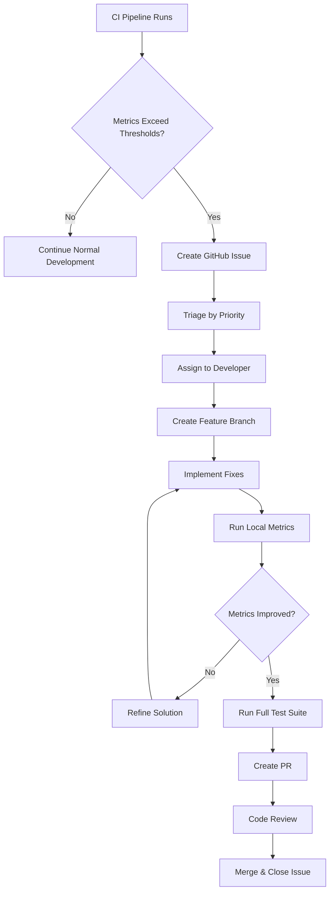

# AquaMind Backend CI Metrics Remediation Workflow

**Last Updated:** 2025-09-14
**Purpose:** Standardized process for addressing code quality issues identified by CI metrics

## Overview

This document outlines the systematic approach for addressing code quality issues detected by the CI metrics pipeline. The workflow ensures consistent remediation while maintaining code stability and feature development velocity.

## Workflow Overview



## Step-by-Step Remediation Process

### Step 1: Issue Identification

#### CI Pipeline Detection
- **Trigger:** Automated metrics collection in CI pipeline
- **Location:** `.github/workflows/django-tests.yml`
- **Artifacts:** `aquamind/docs/metrics/` directory

#### Manual Detection
```bash
# Run metrics locally
python scripts/run_radon_metrics.py
python scripts/run_cognitive_metrics.py

# Check specific files
radon cc apps/batch/api/serializers/growth.py
radon mi apps/batch/api/serializers/growth.py
flake8 --select=C90 apps/batch/api/serializers/growth.py
```

### Step 2: Issue Triage

#### Priority Classification

##### 🚨 Critical Priority
- **CC > 30** per function
- **MI < 40** per file
- **Cognitive Complexity > 25** per function
- **Action:** Immediate remediation required

##### ⚠️ High Priority
- **CC 21-30** per function
- **MI 40-50** per file
- **Cognitive Complexity 16-25** per function
- **Action:** Address in current sprint

##### 🔶 Medium Priority
- **CC 16-20** per function
- **MI 50-60** per file
- **Cognitive Complexity 11-15** per function
- **Action:** Address when convenient

##### ✅ Low Priority
- **CC 11-15** per function
- **MI 60-70** per file
- **Cognitive Complexity 6-10** per function
- **Action:** Address during code cleanup sessions

### Step 3: GitHub Issue Creation

#### Issue Template
```markdown
## Title: `[METRICS] Fix {metric} in {file_path}`

### Issue Type
- [x] Code Quality Improvement
- [ ] Bug Fix
- [ ] Feature Enhancement

### Current Metrics
- **File:** `{file_path}`
- **Cyclomatic Complexity:** {current_cc}
- **Maintainability Index:** {current_mi}
- **Cognitive Complexity:** {current_cognitive}
- **Priority:** {priority_level}

### Thresholds Exceeded
- [x] CC > {threshold}
- [ ] MI < {threshold}
- [ ] Cognitive > {threshold}

### Expected Outcome
- CC ≤ {target_cc}
- MI ≥ {target_mi}
- Cognitive ≤ {target_cognitive}

### Additional Context
- CI Run: {ci_run_link}
- Artifact: {artifact_path}
- Related Issues: {related_issue_links}
```

#### Labels to Apply
- `metrics-improvement`
- `priority-{critical|high|medium|low}`
- `complexity-{cc|mi|cognitive}`
- `app-{batch|environmental|health|etc.}`

### Step 4: Branch and Development

#### Branch Naming Convention
```
feat/metrics-{app}-{metric}-{filename}
```
**Examples:**
- `feat/metrics-batch-cc-growth-serializer`
- `feat/metrics-environmental-mi-serializers`
- `feat/metrics-health-cognitive-health-observation`

#### Development Process

1. **Pull Latest Main**
   ```bash
   git checkout main
   git pull origin main
   ```

2. **Create Feature Branch**
   ```bash
   git checkout -b feat/metrics-batch-cc-growth-serializer
   ```

3. **Implement Fixes**
   Follow the remediation patterns below based on the metric type.

### Step 5: Remediation Patterns

#### Cyclomatic Complexity Fixes

##### Pattern 1: Extract Method
```python
# BEFORE (CC = 18)
def process_measurements(self, measurements):
    if not measurements:
        return []
    results = []
    for measurement in measurements:
        if measurement.status == 'valid':
            if measurement.value > 0:
                if measurement.unit in ['kg', 'g']:
                    converted = self.convert_weight(measurement)
                    if converted is not None:
                        results.append(converted)
    return results

# AFTER (CC = 6)
def process_measurements(self, measurements):
    if not self._validate_measurements(measurements):
        return []
    return [self._process_valid_measurement(m) for m in measurements if self._is_valid_measurement(m)]

def _validate_measurements(self, measurements):
    return bool(measurements)

def _is_valid_measurement(self, measurement):
    return (measurement.status == 'valid' and
            measurement.value > 0 and
            measurement.unit in ['kg', 'g'])

def _process_valid_measurement(self, measurement):
    converted = self.convert_weight(measurement)
    return converted if converted is not None else None
```

##### Pattern 2: Replace Conditional with Polymorphism
```python
# BEFORE (CC = 22)
def calculate_feed_requirement(self, fish_type, weight, temperature):
    if fish_type == 'tilapia':
        if temperature < 20:
            return weight * 0.02
        elif temperature < 25:
            return weight * 0.025
        else:
            return weight * 0.03
    elif fish_type == 'catfish':
        if temperature < 22:
            return weight * 0.015
        elif temperature < 28:
            return weight * 0.02
        else:
            return weight * 0.025
    # ... more fish types

# AFTER (CC = 3)
def calculate_feed_requirement(self, fish_type, weight, temperature):
    calculator = self._get_feed_calculator(fish_type)
    return calculator.calculate(weight, temperature)

def _get_feed_calculator(self, fish_type):
    calculators = {
        'tilapia': TilapiaFeedCalculator(),
        'catfish': CatfishFeedCalculator(),
        # ... more calculators
    }
    return calculators.get(fish_type, DefaultFeedCalculator())
```

##### Pattern 3: Use Guard Clauses
```python
# BEFORE (CC = 15)
def validate_batch_data(self, data):
    if data.get('species'):
        if data.get('initial_count', 0) > 0:
            if data.get('target_weight'):
                if self._species_supported(data['species']):
                    if self._weight_realistic(data['target_weight']):
                        return True, None
                    else:
                        return False, "Unrealistic target weight"
                else:
                    return False, "Unsupported species"
            else:
                return False, "Target weight required"
        else:
            return False, "Initial count must be positive"
    else:
        return False, "Species required"
    return False, "Unknown validation error"

# AFTER (CC = 6)
def validate_batch_data(self, data):
    if not data.get('species'):
        return False, "Species required"

    if data.get('initial_count', 0) <= 0:
        return False, "Initial count must be positive"

    if not data.get('target_weight'):
        return False, "Target weight required"

    if not self._species_supported(data['species']):
        return False, "Unsupported species"

    if not self._weight_realistic(data['target_weight']):
        return False, "Unrealistic target weight"

    return True, None
```

#### Maintainability Index Fixes

##### Add Comprehensive Documentation
```python
# BEFORE (MI = 45)
def calculate_fcr(self, feed_intake, weight_gain):
    if weight_gain <= 0:
        return 0
    return feed_intake / weight_gain

# AFTER (MI = 78)
def calculate_fcr(self, feed_intake, weight_gain):
    """
    Calculate Feed Conversion Ratio (FCR).

    FCR represents the amount of feed required to produce one unit of weight gain.
    Lower FCR values indicate better feed efficiency.

    Args:
        feed_intake (float): Total feed consumed in kg
        weight_gain (float): Total weight gain in kg

    Returns:
        float: Feed conversion ratio (feed_intake / weight_gain)

    Raises:
        ValueError: If weight_gain is zero or negative

    Example:
        >>> calculator = FeedCalculator()
        >>> calculator.calculate_fcr(100.5, 25.2)
        3.99
    """
    if weight_gain <= 0:
        raise ValueError("Weight gain must be positive")

    fcr = feed_intake / weight_gain
    return round(fcr, 2)
```

##### Extract Configuration Constants
```python
# BEFORE (MI = 52)
def validate_environmental_params(self, params):
    if params['temperature'] < 15 or params['temperature'] > 35:
        return False, "Temperature out of range 15-35°C"
    if params['ph'] < 6.0 or params['ph'] > 9.0:
        return False, "pH out of range 6.0-9.0"
    if params['dissolved_oxygen'] < 3.0:
        return False, "Dissolved oxygen too low (< 3.0 mg/L)"
    return True, None

# AFTER (MI = 71)
# Configuration constants
ENVIRONMENTAL_LIMITS = {
    'temperature': {'min': 15.0, 'max': 35.0, 'unit': '°C'},
    'ph': {'min': 6.0, 'max': 9.0, 'unit': 'pH'},
    'dissolved_oxygen': {'min': 3.0, 'unit': 'mg/L'}
}

def validate_environmental_params(self, params):
    """
    Validate environmental parameters against predefined limits.

    Args:
        params (dict): Environmental measurements

    Returns:
        tuple: (is_valid: bool, error_message: str or None)
    """
    for param_name, limits in ENVIRONMENTAL_LIMITS.items():
        if param_name not in params:
            continue

        value = params[param_name]
        min_val = limits['min']
        max_val = limits.get('max')

        if max_val is not None:
            if not (min_val <= value <= max_val):
                unit = limits['unit']
                return False, f"{param_name.title()} out of range {min_val}-{max_val} {unit}"
        else:
            if value < min_val:
                unit = limits['unit']
                return False, f"{param_name.title()} too low (< {min_val} {unit})"

    return True, None
```

#### Cognitive Complexity Fixes

##### Extract Complex Conditions
```python
# BEFORE (Cognitive = 18)
def determine_feeding_schedule(self, fish_type, current_weight, temperature, water_quality):
    schedule = []

    if fish_type == 'tilapia':
        if current_weight < 50:
            if temperature >= 25 and temperature <= 30:
                if water_quality == 'good':
                    schedule = ['08:00', '14:00', '20:00']
                elif water_quality == 'fair':
                    schedule = ['08:00', '20:00']
                else:
                    schedule = ['12:00']
            else:
                schedule = ['12:00']
        else:
            schedule = ['06:00', '18:00']
    elif fish_type == 'catfish':
        # ... similar complex logic

    return schedule

# AFTER (Cognitive = 6)
def determine_feeding_schedule(self, fish_type, current_weight, temperature, water_quality):
    if fish_type == 'tilapia':
        return self._calculate_tilapia_schedule(current_weight, temperature, water_quality)
    elif fish_type == 'catfish':
        return self._calculate_catfish_schedule(current_weight, temperature, water_quality)
    else:
        return self._calculate_default_schedule()

def _calculate_tilapia_schedule(self, weight, temp, quality):
    if weight >= 50:
        return ['06:00', '18:00']

    if not self._is_optimal_temperature(temp):
        return ['12:00']

    return self._determine_feeding_frequency(quality)

def _is_optimal_temperature(self, temperature):
    return 25 <= temperature <= 30

def _determine_feeding_frequency(self, water_quality):
    frequency_map = {
        'good': ['08:00', '14:00', '20:00'],
        'fair': ['08:00', '20:00'],
        'poor': ['12:00']
    }
    return frequency_map.get(water_quality, ['12:00'])
```

### Step 6: Testing and Validation

#### Local Metrics Validation
```bash
# Test your changes locally
python scripts/run_radon_metrics.py
python scripts/run_cognitive_metrics.py

# Check specific improvements
radon cc apps/batch/api/serializers/growth.py
flake8 --select=C90 apps/batch/api/serializers/growth.py
```

#### Regression Testing
```bash
# Run full test suite
python manage.py test --settings=aquamind.settings_ci

# Run specific app tests
python manage.py test apps.batch --settings=aquamind.settings_ci
```

### Step 7: Pull Request and Review

#### PR Template
```markdown
## Description
Fixes code quality metrics in `{file_path}`

### Changes Made
- [x] Extracted helper methods to reduce CC
- [x] Added comprehensive documentation to improve MI
- [x] Simplified conditional logic to reduce cognitive complexity
- [x] Added unit tests for new helper methods

### Metrics Improvement
| Metric | Before | After | Target | Status |
|--------|--------|-------|---------|--------|
| CC | {old_cc} | {new_cc} | ≤ {target_cc} | ✅ |
| MI | {old_mi} | {new_mi} | ≥ {target_mi} | ✅ |
| Cognitive | {old_cognitive} | {new_cognitive} | ≤ {target_cognitive} | ✅ |

### Testing
- [x] Unit tests pass
- [x] Integration tests pass
- [x] Local metrics validation
- [x] No regression in functionality

### Related Issues
- Closes #{issue_number}
- Related to #{related_issues}

### Checklist
- [x] Code follows project style guidelines
- [x] Documentation updated
- [x] Tests added/updated
- [x] CI pipeline passes
```

### Step 8: Monitoring and Follow-up

#### Post-Merge Validation
- Monitor CI pipeline for continued compliance
- Track metrics trends over time
- Address any regressions promptly

#### Documentation Updates
- Update metrics reports if significant improvements
- Share remediation patterns with team
- Update this workflow document as needed

## Common Pitfalls to Avoid

### 1. Over-Engineering
- **Problem:** Making changes more complex than necessary
- **Solution:** Focus on the simplest fix that achieves the metrics target

### 2. Breaking Functionality
- **Problem:** Metrics improvements break existing functionality
- **Solution:** Always run full test suite and validate behavior

### 3. Ignoring Related Issues
- **Problem:** Fixing one function reveals issues in calling code
- **Solution:** Consider the broader context and fix related issues together

### 4. Not Testing Edge Cases
- **Problem:** Refactored code misses edge cases handled by original complex logic
- **Solution:** Ensure comprehensive test coverage before and after changes

## Tools and Resources

### Local Development Tools
- **Radon:** `pip install radon`
- **Flake8 Cognitive:** `pip install flake8-cognitive-complexity`
- **Metrics Scripts:** `scripts/run_radon_metrics.py`, `scripts/run_cognitive_metrics.py`

### Code Quality References
- **Clean Code:** Robert C. Martin principles
- **Refactoring:** Martin Fowler patterns
- **Python Best Practices:** PEP 8, Google Style Guide

### Team Resources
- **Code Review Guidelines:** `docs/code_organization_guidelines.md`
- **Testing Strategy:** `docs/testing_strategy.md`
- **Architecture Patterns:** `docs/architecture.md`

## Success Metrics

### Individual Issue Success
- ✅ Target metrics achieved
- ✅ All tests pass
- ✅ No functional regressions
- ✅ Code review approval
- ✅ CI pipeline passes

### Team Success
- 📈 Overall metrics trending in positive direction
- 📉 Fewer critical complexity issues
- ⏱️ Faster remediation times
- 📚 Improved team knowledge of quality patterns

---

**Remember:** Code quality improvements should enhance maintainability without sacrificing functionality. When in doubt, favor simpler solutions that achieve the metrics targets.
