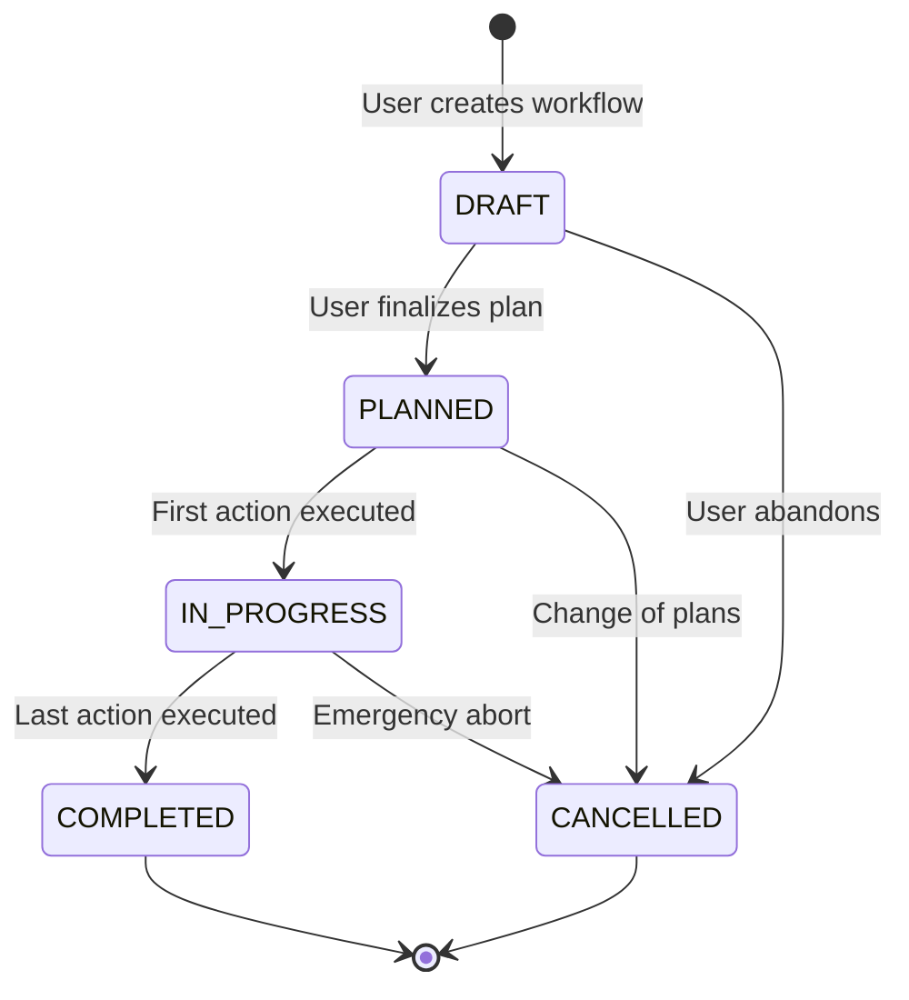
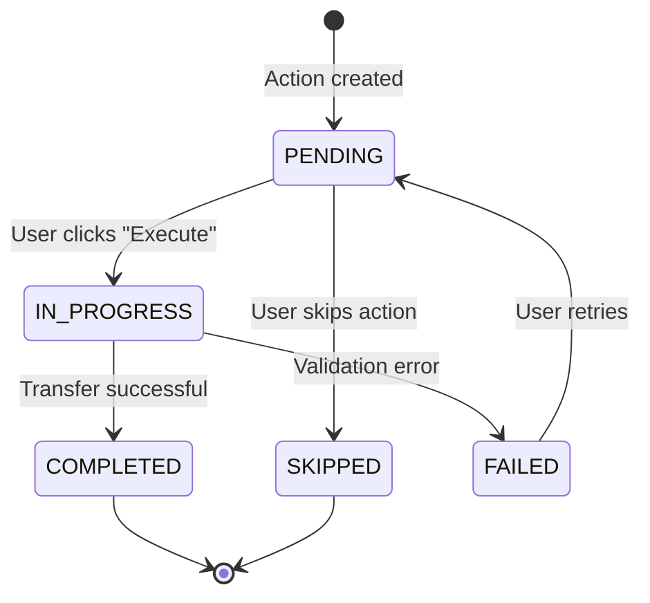

# Batch Transfer Workflow Architecture Design

**Date**: 2025-10-18  
**Status**: 🏗️ **ARCHITECTURE PROPOSAL**  
**Priority**: Critical - Required for Finance Integration

---

## 🎯 **Operational Reality (User Requirements)**

### **Real-World Transfer Scenarios**:

#### **Scenario 1: Gradual Stage Transition (2 Weeks)**
```
Transfer Operation: Fry → Parr (Batch SCO-2024-001)
Start Date: 2024-03-24
Expected Completion: 2024-04-07

Week 1:
  Day 1: Transfer Container Fry-01 (100k fish, largest) → Parr-01 ✅
  Day 2: Transfer Container Fry-02 (95k fish) → Parr-02 ✅
  Day 5: Transfer Container Fry-03 (90k fish) → Parr-03 ✅

Week 2:
  Day 8: Transfer Container Fry-04 (85k fish) → Parr-04 ✅
  Day 10: Transfer Container Fry-05 (80k fish) → Parr-05 ✅
  Day 14: Transfer Container Fry-06 (75k fish) → Parr-06 ✅
  
Status: IN_PROGRESS (6 of 10 containers transferred)
```

#### **Scenario 2: Cascading Emergency Transfer**
```
Problem: Alevin need immediate Fry tank (egg sac depleting)

Step 1: Free up Fry-Tank-B3
  - Transfer Fry-B3 → Parr-C4 (need to wait 3 days for acclimation)
  
Step 2: Transfer Alevin → Freed Fry Tank
  - Transfer Alevin-A2 → Fry-B3 (now empty)

Transfer Operation spans 5 days, involves 3 lifecycle stages!
```

#### **Scenario 3: Partial Transfers (Container Splits)**
```
Smolt-Tank-07 has 200k fish
Target: Move 100k to Sea-Ring-15, keep 100k in tank

Transfer #1: Partial (50% of container)
  Source: Smolt-Tank-07 (200k)
  Dest: Sea-Ring-15 (100k transferred)
  Remaining: Smolt-Tank-07 (100k still active)
```

---

## 🏗️ **Proposed Architecture: Transfer Workflow System**

### **Conceptual Model**:

```
Transfer Workflow (Header)
├── Status: DRAFT → PLANNED → IN_PROGRESS → COMPLETED / CANCELLED
├── Multiple Transfer Actions (Lines)
│   ├── Action 1: Container-to-Container movement
│   │   ├── Status: PENDING → COMPLETED
│   │   ├── Source Assignment
│   │   └── Destination Assignment
│   ├── Action 2: Another movement
│   └── ...
└── Finance Events (Generated on COMPLETED)
    └── IntercompanyTransaction (if applicable)
```

---

## 📋 **Proposed Data Model**

### **Model 1: BatchTransferWorkflow (Header/Orchestrator)**

```python
class BatchTransferWorkflow(models.Model):
    """
    Orchestrates a batch transfer operation that may take days/weeks to complete.
    Represents the LOGICAL transfer operation (e.g., "Fry → Parr transition").
    """
    # Identification
    workflow_number = CharField(unique=True)  # e.g., "TRF-2024-001"
    batch = FK(Batch)
    
    # Transfer Type & Lifecycle Context
    workflow_type = Choice([
        ('LIFECYCLE_TRANSITION', 'Lifecycle Stage Transition'),  # Fry → Parr
        ('CONTAINER_REDISTRIBUTION', 'Container Redistribution'), # Rebalance
        ('EMERGENCY_CASCADE', 'Emergency Cascading Transfer'),   # Multi-step
        ('PARTIAL_HARVEST', 'Partial Harvest Preparation')
    ])
    
    source_lifecycle_stage = FK(LifeCycleStage)
    dest_lifecycle_stage = FK(LifeCycleStage, nullable=True)
    
    # State Machine
    status = Choice([
        ('DRAFT', 'Draft - Planning'),           # User designing transfer
        ('PLANNED', 'Planned - Ready to Execute'), # Approved, not started
        ('IN_PROGRESS', 'In Progress'),           # Partially executed
        ('COMPLETED', 'Completed'),               # All actions done
        ('CANCELLED', 'Cancelled')                # Abandoned
    ])
    
    # Timeline
    planned_start_date = Date
    planned_completion_date = Date(nullable=True)
    actual_start_date = Date(nullable=True)      # First action executed
    actual_completion_date = Date(nullable=True) # Last action executed
    
    # Summary Metrics (Calculated from actions)
    total_source_count = PositiveInteger(default=0)
    total_transferred_count = PositiveInteger(default=0)
    total_mortality_count = PositiveInteger(default=0)
    total_biomass_kg = Decimal(default=0)
    
    # Progress Tracking
    total_actions_planned = PositiveInteger(default=0)
    actions_completed = PositiveInteger(default=0)
    completion_percentage = Decimal(max_digits=5, decimal_places=2, default=0)
    
    # Finance Integration
    is_intercompany = Boolean(default=False)
    source_subsidiary = CharField(nullable=True)  # Derived from source containers
    dest_subsidiary = CharField(nullable=True)    # Derived from dest containers
    finance_transaction = FK('finance.IntercompanyTransaction', nullable=True)
    
    # Audit & Notes
    initiated_by = FK(User)
    completed_by = FK(User, nullable=True)
    notes = TextField(blank=True)
    cancellation_reason = TextField(blank=True)
    
    created_at = DateTime
    updated_at = DateTime
    
    history = HistoricalRecords()
    
    class Meta:
        ordering = ['-created_at']
        indexes = [
            Index(fields=['batch', 'status']),
            Index(fields=['planned_start_date']),
            Index(fields=['workflow_type']),
        ]
    
    def can_add_actions(self):
        """Can only add actions in DRAFT or PLANNED status"""
        return self.status in ['DRAFT', 'PLANNED']
    
    def can_execute_actions(self):
        """Can only execute in PLANNED or IN_PROGRESS status"""
        return self.status in ['PLANNED', 'IN_PROGRESS']
    
    def mark_in_progress(self):
        """Auto-called when first action is executed"""
        if self.status == 'PLANNED' and not self.actual_start_date:
            self.status = 'IN_PROGRESS'
            self.actual_start_date = timezone.now().date()
            self.save()
    
    def check_completion(self):
        """Auto-called after each action completes"""
        if self.status == 'IN_PROGRESS':
            if self.actions_completed >= self.total_actions_planned:
                self.status = 'COMPLETED'
                self.actual_completion_date = timezone.now().date()
                self.save()
                
                # Trigger finance integration if intercompany
                if self.is_intercompany:
                    self._create_intercompany_transaction()
    
    def update_progress(self):
        """Recalculate completion percentage from actions"""
        if self.total_actions_planned > 0:
            self.completion_percentage = (
                Decimal(self.actions_completed) / 
                Decimal(self.total_actions_planned) * 100
            )
            self.save()
```

### **Model 2: TransferAction (Lines/Steps)**

```python
class TransferAction(models.Model):
    """
    Individual container-to-container transfer action within a workflow.
    Each action represents ONE physical movement of fish.
    """
    workflow = FK(BatchTransferWorkflow, related_name='actions')
    action_number = PositiveInteger  # Sequence within workflow (1, 2, 3...)
    
    # What's being moved
    source_assignment = FK(BatchContainerAssignment, related_name='transfer_actions_as_source')
    dest_assignment = FK(BatchContainerAssignment, nullable=True, related_name='transfer_actions_as_dest')
    
    # Counts & Biomass
    source_population_before = PositiveInteger  # Population in source before this action
    transferred_count = PositiveInteger
    mortality_during_transfer = PositiveInteger(default=0)
    transferred_biomass_kg = Decimal
    
    # Status & Timeline
    status = Choice([
        ('PENDING', 'Pending - Not Started'),
        ('IN_PROGRESS', 'In Progress - Being Executed'),
        ('COMPLETED', 'Completed'),
        ('FAILED', 'Failed - Rolled Back'),
        ('SKIPPED', 'Skipped')
    ])
    
    planned_date = Date(nullable=True)
    actual_execution_date = Date(nullable=True)
    
    # Transfer Details
    transfer_method = Choice([
        ('NET', 'Net Transfer'),
        ('PUMP', 'Pump Transfer'),
        ('GRAVITY', 'Gravity Transfer'),
        ('MANUAL', 'Manual Bucket Transfer')
    ], nullable=True)
    
    # Environmental Conditions During Transfer
    water_temp_c = Decimal(nullable=True)
    oxygen_level = Decimal(nullable=True)
    
    # Execution Details
    executed_by = FK(User, nullable=True)
    execution_duration_minutes = PositiveInteger(nullable=True)
    notes = TextField(blank=True)
    
    created_at = DateTime
    updated_at = DateTime
    
    history = HistoricalRecords()
    
    class Meta:
        unique_together = ['workflow', 'action_number']
        ordering = ['workflow', 'action_number']
        indexes = [
            Index(fields=['workflow', 'status']),
            Index(fields=['actual_execution_date']),
        ]
    
    def execute(self, executed_by, mortality_count=0):
        """
        Execute this transfer action.
        Updates source assignment, creates destination assignment.
        """
        with transaction.atomic():
            # Validate we can execute
            if self.status != 'PENDING':
                raise ValidationError(f"Cannot execute action in {self.status} status")
            
            # Lock source assignment
            source = BatchContainerAssignment.objects.select_for_update().get(
                pk=self.source_assignment_id
            )
            
            # Validate population
            total_reduction = self.transferred_count + mortality_count
            if total_reduction > source.population_count:
                raise ValidationError(
                    f"Cannot transfer {total_reduction} fish "
                    f"from container with {source.population_count} fish"
                )
            
            # Update source assignment
            source.population_count -= total_reduction
            if source.population_count == 0:
                source.is_active = False
                source.departure_date = timezone.now().date()
            source.save()
            
            # Create/update destination assignment if provided
            if self.dest_assignment:
                dest = self.dest_assignment
                dest.population_count += self.transferred_count
                dest.save()
            
            # Mark this action complete
            self.status = 'COMPLETED'
            self.actual_execution_date = timezone.now().date()
            self.executed_by = executed_by
            self.mortality_during_transfer = mortality_count
            self.save()
            
            # Update workflow status
            self.workflow.mark_in_progress()
            self.workflow.actions_completed += 1
            self.workflow.check_completion()
            self.workflow.update_progress()
```

### **Model 3: TransferPlan (Optional - For Complex Cascading)**

```python
class TransferPlan(models.Model):
    """
    High-level plan for complex, multi-workflow transfers.
    E.g., cascading transfers that need precise coordination.
    """
    plan_number = CharField(unique=True)  # e.g., "PLAN-2024-001"
    batch = FK(Batch)
    plan_type = Choice([
        ('SIMPLE', 'Simple Stage Transition'),
        ('CASCADE', 'Cascading Transfer'),
        ('EMERGENCY', 'Emergency Reallocation')
    ])
    
    status = Choice([
        ('DRAFT', 'Draft'),
        ('APPROVED', 'Approved'),
        ('EXECUTING', 'Executing'),
        ('COMPLETED', 'Completed'),
        ('CANCELLED', 'Cancelled')
    ])
    
    # Links to multiple workflows (e.g., Fry→Parr THEN Alevin→Fry)
    # workflows = FK(BatchTransferWorkflow, related_name='transfer_plan')
    
    created_by = FK(User)
    approved_by = FK(User, nullable=True)
    notes = TextField
    
    created_at = DateTime
    updated_at = DateTime
```

---

## 🎨 **UI/UX Design for Transfer Management**

### **Screen 1: Create Transfer Workflow (Planning)**

```
┌─────────────────────────────────────────────────────────┐
│ New Transfer Workflow                                   │
├─────────────────────────────────────────────────────────┤
│ Batch: SCO-2024-001 (Atlantic Salmon, Fry Stage)       │
│ Transfer Type: ● Lifecycle Transition                  │
│                ○ Container Redistribution               │
│                ○ Emergency Cascade                      │
│                                                          │
│ Source Stage: Fry                                       │
│ Destination Stage: Parr                                 │
│                                                          │
│ Planned Start: [2024-03-24]                            │
│ Planned End: [2024-04-07] (2 weeks)                    │
│                                                          │
│ ┌────────────────────────────────────────────────────┐ │
│ │ Source Containers (10 Fry Tanks)                   │ │
│ │ ☑ Fry-01: 100,000 fish (12.5g avg) - LARGEST      │ │
│ │ ☑ Fry-02: 95,000 fish (11.8g avg)                 │ │
│ │ ☑ Fry-03: 90,000 fish (11.2g avg)                 │ │
│ │ ... (7 more)                                       │ │
│ │ Total Selected: 925,000 fish                       │ │
│ └────────────────────────────────────────────────────┘ │
│                                                          │
│ ┌────────────────────────────────────────────────────┐ │
│ │ Destination Containers (12 Parr Tanks)             │ │
│ │ ☑ Parr-01: Empty                                   │ │
│ │ ☑ Parr-02: Empty                                   │ │
│ │ ... (10 more)                                      │ │
│ │ Total Capacity: 1,200,000 fish                     │ │
│ └────────────────────────────────────────────────────┘ │
│                                                          │
│ Distribution Strategy:                                  │
│ ● Even Split (77,083 fish per dest tank)              │
│ ○ Manual Assignment                                    │
│ ○ Prioritize Largest Fish First                       │
│                                                          │
│ [Cancel] [Save as Draft] [Create Plan]                │
└─────────────────────────────────────────────────────────┘
```

**Result**: Creates `BatchTransferWorkflow` in **DRAFT** status

---

### **Screen 2: Execute Transfer (Operations)**

```
┌─────────────────────────────────────────────────────────┐
│ Transfer Workflow: TRF-2024-001                         │
│ Status: IN_PROGRESS (60% Complete)                      │
│ Batch: SCO-2024-001 | Fry → Parr                       │
├─────────────────────────────────────────────────────────┤
│ Progress: [████████████░░░░░░░] 6 of 10 completed      │
│                                                          │
│ Started: 2024-03-24 | Target: 2024-04-07               │
│ Days Elapsed: 5 | Days Remaining: 9                    │
├─────────────────────────────────────────────────────────┤
│ Transfer Actions:                                       │
│                                                          │
│ ✅ Action 1: Fry-01 (100k) → Parr-01                   │
│    Executed: 2024-03-24 by John | 0 mortality          │
│                                                          │
│ ✅ Action 2: Fry-02 (95k) → Parr-02                    │
│    Executed: 2024-03-25 by Mary | 150 mortality        │
│                                                          │
│ ✅ Action 3-6: ... (collapsed)                         │
│                                                          │
│ ⏳ Action 7: Fry-07 (75k) → Parr-07                    │
│    Status: PENDING | Planned: 2024-03-30               │
│    [Execute Now] [Skip] [Reschedule]                   │
│                                                          │
│ ⏳ Action 8-10: ... (collapsed)                        │
│                                                          │
├─────────────────────────────────────────────────────────┤
│ Summary:                                                │
│ Completed: 575,000 / 925,000 fish (62.2%)              │
│ Total Mortality: 1,200 fish (0.2%)                     │
│ Remaining: 4 actions                                   │
│                                                          │
│ [Mark Complete] [Cancel Workflow] [Add Action]         │
└─────────────────────────────────────────────────────────┘
```

---

### **Screen 3: Execute Individual Action (Mobile-Friendly)**

```
┌─────────────────────────────────────────────────────────┐
│ Execute Transfer Action #7                              │
├─────────────────────────────────────────────────────────┤
│ Workflow: TRF-2024-001 (Fry → Parr)                    │
│                                                          │
│ FROM:                                                   │
│ ┌─────────────────────────────────────────────────────┐ │
│ │ 🏺 Fry-Tank-07                                      │ │
│ │ Current Population: 75,000 fish                     │ │
│ │ Avg Weight: 10.5g                                   │ │
│ │ Biomass: 787.5 kg                                   │ │
│ └─────────────────────────────────────────────────────┘ │
│                                                          │
│ TO:                                                     │
│ ┌─────────────────────────────────────────────────────┐ │
│ │ 🏺 Parr-Tank-07                                     │ │
│ │ Current: Empty                                       │ │
│ │ Capacity: 100,000 fish                              │ │
│ └─────────────────────────────────────────────────────┘ │
│                                                          │
│ Transfer Count: [75,000] fish (100% of source)         │
│ Mortality During Transfer: [0] fish                     │
│                                                          │
│ Environmental Conditions:                               │
│ Water Temp: [12.5°C]  O₂: [9.2 mg/L]                  │
│                                                          │
│ Transfer Method:                                        │
│ ● Net    ○ Pump    ○ Gravity                          │
│                                                          │
│ Duration: Started [14:30] Ended [15:45] (75 min)       │
│                                                          │
│ Notes: [Good conditions, minimal stress]               │
│                                                          │
│ [Cancel] [Execute Transfer]                            │
└─────────────────────────────────────────────────────────┘
```

**On Execute**:
1. Validates counts
2. Reduces source assignment population
3. Creates/updates destination assignment
4. Marks action COMPLETED
5. Updates workflow progress (6 → 7 completed)
6. Auto-completes workflow if last action

---

## 🔄 **State Machine Transitions**

### **Workflow State Transitions**:



### **Action State Transitions**:



---

## 📊 **Database Schema**

```sql
-- Header Table
CREATE TABLE batch_transfer_workflow (
    id BIGSERIAL PRIMARY KEY,
    workflow_number VARCHAR(50) UNIQUE NOT NULL,
    batch_id BIGINT NOT NULL REFERENCES batch_batch(id),
    
    workflow_type VARCHAR(30) NOT NULL,
    status VARCHAR(20) NOT NULL DEFAULT 'DRAFT',
    
    source_lifecycle_stage_id BIGINT NOT NULL REFERENCES batch_lifecyclestage(id),
    dest_lifecycle_stage_id BIGINT REFERENCES batch_lifecyclestage(id),
    
    planned_start_date DATE NOT NULL,
    planned_completion_date DATE,
    actual_start_date DATE,
    actual_completion_date DATE,
    
    total_source_count INTEGER DEFAULT 0,
    total_transferred_count INTEGER DEFAULT 0,
    total_mortality_count INTEGER DEFAULT 0,
    total_biomass_kg DECIMAL(12,2) DEFAULT 0,
    
    total_actions_planned INTEGER DEFAULT 0,
    actions_completed INTEGER DEFAULT 0,
    completion_percentage DECIMAL(5,2) DEFAULT 0,
    
    is_intercompany BOOLEAN DEFAULT FALSE,
    source_subsidiary VARCHAR(20),
    dest_subsidiary VARCHAR(20),
    finance_transaction_id BIGINT REFERENCES finance_intercompanytransaction(tx_id),
    
    initiated_by_id INTEGER NOT NULL REFERENCES auth_user(id),
    completed_by_id INTEGER REFERENCES auth_user(id),
    notes TEXT,
    cancellation_reason TEXT,
    
    created_at TIMESTAMPTZ NOT NULL DEFAULT NOW(),
    updated_at TIMESTAMPTZ NOT NULL DEFAULT NOW()
);

-- Lines Table
CREATE TABLE batch_transfer_action (
    id BIGSERIAL PRIMARY KEY,
    workflow_id BIGINT NOT NULL REFERENCES batch_transfer_workflow(id) ON DELETE CASCADE,
    action_number INTEGER NOT NULL,
    
    source_assignment_id BIGINT NOT NULL REFERENCES batch_batchcontainerassignment(id),
    dest_assignment_id BIGINT REFERENCES batch_batchcontainerassignment(id),
    
    source_population_before INTEGER NOT NULL,
    transferred_count INTEGER NOT NULL,
    mortality_during_transfer INTEGER DEFAULT 0,
    transferred_biomass_kg DECIMAL(10,2) NOT NULL,
    
    status VARCHAR(20) NOT NULL DEFAULT 'PENDING',
    planned_date DATE,
    actual_execution_date DATE,
    
    transfer_method VARCHAR(20),
    water_temp_c DECIMAL(5,2),
    oxygen_level DECIMAL(5,2),
    
    executed_by_id INTEGER REFERENCES auth_user(id),
    execution_duration_minutes INTEGER,
    notes TEXT,
    
    created_at TIMESTAMPTZ NOT NULL DEFAULT NOW(),
    updated_at TIMESTAMPTZ NOT NULL DEFAULT NOW(),
    
    UNIQUE(workflow_id, action_number)
);

-- Historical tables (django-simple-history)
CREATE TABLE batch_historicaltransferworkflow (...);
CREATE TABLE batch_historicaltransferaction (...);
```

---

## 🔄 **API Design**

### **Endpoints**:

```python
# Workflow Management
POST   /api/v1/batch/transfer-workflows/              # Create draft
GET    /api/v1/batch/transfer-workflows/              # List all
GET    /api/v1/batch/transfer-workflows/{id}/         # Get details
PATCH  /api/v1/batch/transfer-workflows/{id}/         # Update draft
DELETE /api/v1/batch/transfer-workflows/{id}/         # Delete draft

# Workflow Actions
POST   /api/v1/batch/transfer-workflows/{id}/plan/    # Finalize to PLANNED
POST   /api/v1/batch/transfer-workflows/{id}/cancel/  # Cancel workflow
POST   /api/v1/batch/transfer-workflows/{id}/complete/ # Force complete

# Action Management
GET    /api/v1/batch/transfer-workflows/{id}/actions/ # List actions
POST   /api/v1/batch/transfer-workflows/{id}/actions/ # Add action
PATCH  /api/v1/batch/transfer-actions/{action_id}/    # Update action
DELETE /api/v1/batch/transfer-actions/{action_id}/    # Remove action

# Action Execution
POST   /api/v1/batch/transfer-actions/{id}/execute/   # Execute ONE action
POST   /api/v1/batch/transfer-actions/{id}/skip/      # Skip action
POST   /api/v1/batch/transfer-actions/{id}/rollback/  # Rollback if failed
```

### **Example API Flow**:

```javascript
// 1. Create workflow (DRAFT)
POST /api/v1/batch/transfer-workflows/
{
  "batch": 206,
  "workflow_type": "LIFECYCLE_TRANSITION",
  "source_lifecycle_stage": 2,  // Fry
  "dest_lifecycle_stage": 3,     // Parr
  "planned_start_date": "2024-03-24",
  "planned_completion_date": "2024-04-07"
}
→ Response: { "id": 42, "workflow_number": "TRF-2024-001", "status": "DRAFT" }

// 2. Add actions (10 source containers)
POST /api/v1/batch/transfer-workflows/42/actions/
{
  "actions": [
    {
      "action_number": 1,
      "source_assignment": 101,  // Fry-01
      "dest_assignment": 201,    // Parr-01
      "transferred_count": 100000,
      "planned_date": "2024-03-24"
    },
    {
      "action_number": 2,
      "source_assignment": 102,  // Fry-02
      "dest_assignment": 202,    // Parr-02
      "transferred_count": 95000,
      "planned_date": "2024-03-25"
    },
    // ... 8 more actions
  ]
}
→ Response: { "actions_created": 10, "total_actions": 10 }

// 3. Finalize plan
POST /api/v1/batch/transfer-workflows/42/plan/
→ Response: { "status": "PLANNED", "ready_to_execute": true }

// 4. Execute action #1 (Day 1)
POST /api/v1/batch/transfer-actions/1/execute/
{
  "mortality_during_transfer": 0,
  "water_temp_c": 12.5,
  "oxygen_level": 9.2,
  "transfer_method": "NET",
  "execution_duration_minutes": 45,
  "notes": "Smooth transfer, fish adapting well"
}
→ Response: { 
  "action_status": "COMPLETED",
  "workflow_status": "IN_PROGRESS",
  "completion_percentage": 10.0,
  "actions_remaining": 9
}

// 5. Execute actions 2-10 over next 2 weeks...

// 6. After last action
POST /api/v1/batch/transfer-actions/10/execute/
→ Response: { 
  "action_status": "COMPLETED",
  "workflow_status": "COMPLETED",  // ← Auto-completed!
  "completion_percentage": 100.0,
  "finance_transaction_created": false  // Not intercompany
}
```

---

## 💼 **Finance Integration**

### **Intercompany Detection**:

```python
def detect_intercompany(workflow):
    """
    Determine if transfer crosses subsidiary boundaries.
    """
    source_containers = [
        action.source_assignment.container 
        for action in workflow.actions.all()
    ]
    dest_containers = [
        action.dest_assignment.container 
        for action in workflow.actions.all() 
        if action.dest_assignment
    ]
    
    # Get subsidiaries from container locations
    source_subs = set()
    for container in source_containers:
        if container.hall:
            # Freshwater station → Freshwater subsidiary
            source_subs.add('FRESHWATER')
        elif container.area:
            # Sea area → Farming subsidiary
            source_subs.add('FARMING')
    
    dest_subs = set()
    for container in dest_containers:
        if container.hall:
            dest_subs.add('FRESHWATER')
        elif container.area:
            dest_subs.add('FARMING')
    
    # Intercompany if subsidiaries differ
    if source_subs != dest_subs:
        workflow.is_intercompany = True
        workflow.source_subsidiary = list(source_subs)[0] if source_subs else None
        workflow.dest_subsidiary = list(dest_subs)[0] if dest_subs else None
        workflow.save()
        
        return True
    
    return False
```

### **Finance Transaction Creation** (on workflow completion):

```python
def create_intercompany_transaction(workflow):
    """
    Create IntercompanyTransaction when transfer completes.
    Called automatically when workflow.status → COMPLETED.
    """
    if not workflow.is_intercompany:
        return None
    
    # Calculate transfer value (simplified)
    avg_weight_kg = workflow.total_biomass_kg / workflow.total_transferred_count
    price_per_kg = get_intercompany_price(
        source_sub=workflow.source_subsidiary,
        dest_sub=workflow.dest_subsidiary,
        product_grade='POST_SMOLT'  # Based on stage
    )
    
    transaction = IntercompanyTransaction.objects.create(
        posting_date=workflow.actual_completion_date,
        amount=workflow.total_biomass_kg * price_per_kg,
        currency='EUR',
        state='PENDING',
        transfer_workflow=workflow,  # ← Links back!
        policy=get_pricing_policy(workflow.source_subsidiary, workflow.dest_subsidiary)
    )
    
    workflow.finance_transaction = transaction
    workflow.save()
    
    return transaction
```

---

## 🎮 **User Workflow Examples**

### **Example 1: Simple Lifecycle Transition**

**Day 1 (March 24)**:
1. User: "Create transfer workflow for Batch SCO-2024-001"
2. System: Creates workflow in DRAFT, assigns TRF-2024-001
3. User: Selects 10 Fry containers as source
4. User: Selects 12 Parr containers as destination
5. User: "Even split distribution"
6. System: Creates 10 transfer actions (PENDING)
7. User: "Finalize plan"
8. System: Workflow → PLANNED

**Day 1 Afternoon**:
9. User: "Execute Action #1" (Fry-01 → Parr-01)
10. System: Updates assignments, marks action COMPLETED
11. System: Workflow → IN_PROGRESS (10% complete)

**Days 2-14**:
12. User executes actions 2-10 gradually
13. System tracks progress (20%, 30%, ... 90%)

**Day 14**:
14. User: "Execute Action #10" (last one)
15. System: Marks action COMPLETED
16. System: **Auto-completes workflow** → COMPLETED
17. System: Checks if intercompany (No, both Freshwater)
18. System: No finance transaction needed

---

### **Example 2: Intercompany Transfer (Post-Smolt → Adult)**

**March 15**:
1. Workflow created: TRF-2024-042
2. Type: LIFECYCLE_TRANSITION
3. Post-Smolt (Freshwater tanks) → Adult (Sea rings)
4. 8 source tanks → 12 sea rings
5. Status: PLANNED

**March 20 - April 5** (2 weeks):
6. User executes 8 actions gradually
7. Progress: 12.5%, 25%, 37.5%, ... 100%

**April 5 (Last action executed)**:
8. System: Workflow → COMPLETED
9. System: **Detects intercompany** (Freshwater → Farming)
10. System: **Auto-creates `IntercompanyTransaction`**:
    - Amount: 450 tons × €8.50/kg = €3,825,000
    - Links to workflow TRF-2024-042
    - State: PENDING (awaiting finance approval)
11. Finance Manager: Reviews transaction in finance dashboard
12. Finance Manager: Approves → State: APPROVED
13. NAV Export: Includes in next journal batch

---

## 🏗️ **Migration Strategy**

### **Phase 1: Parallel Implementation (Week 1-2)**

1. Create new models (`BatchTransferWorkflow`, `TransferAction`)
2. Keep existing `BatchTransfer` model (deprecate but don't remove)
3. Add both to API (versioned endpoints)
4. Frontend uses new workflow endpoints
5. **No data migration yet** (start fresh)

### **Phase 2: Data Migration (Week 3)**

If needed, migrate old `BatchTransfer` records:
```python
# For each old transfer, create workflow with 1 action
for old_transfer in BatchTransfer.objects.all():
    workflow = BatchTransferWorkflow.objects.create(
        batch=old_transfer.source_batch,
        workflow_type='LEGACY_CONVERSION',
        status='COMPLETED',
        # ... populate from old_transfer
    )
    
    TransferAction.objects.create(
        workflow=workflow,
        action_number=1,
        source_assignment=old_transfer.source_assignment,
        dest_assignment=old_transfer.dest_assignment,
        status='COMPLETED',
        # ... populate from old_transfer
    )
```

### **Phase 3: Deprecation (Week 4+)**

1. Mark old API as deprecated
2. Update docs
3. Eventually remove old model (after migration complete)

---

## 📋 **Implementation Checklist**

### **Backend**:
- [ ] Create `BatchTransferWorkflow` model
- [ ] Create `TransferAction` model
- [ ] Add migrations
- [ ] Create serializers (workflow, action, nested)
- [ ] Create viewsets (with custom actions)
- [ ] Add filters (status, batch, date range)
- [ ] Implement state transition logic
- [ ] Add validation (population checks)
- [ ] Integrate finance detection
- [ ] Write comprehensive tests
- [ ] Update OpenAPI spec

### **Frontend**:
- [ ] Transfer Workflow List page
- [ ] Create Workflow wizard (multi-step)
- [ ] Execute Workflow dashboard (progress tracking)
- [ ] Execute Action modal (mobile-friendly)
- [ ] Transfer History display (grouped by workflow)
- [ ] Status badges and progress bars
- [ ] Finance intercompany indicators

### **Data Generation**:
- [ ] Update `simulate_full_lifecycle.py` to create workflows
- [ ] Update `03_event_engine_core.py` to create workflows
- [ ] Create backfill script for existing batches

---

## ⏱️ **Estimated Effort**

| Task | Effort | Priority |
|------|--------|----------|
| **Model Design** | 4 hours | High |
| **Migrations** | 2 hours | High |
| **Serializers & Validation** | 6 hours | High |
| **ViewSets & Endpoints** | 8 hours | High |
| **Tests (Backend)** | 8 hours | High |
| **Frontend - Workflow List** | 4 hours | Medium |
| **Frontend - Create Wizard** | 8 hours | Medium |
| **Frontend - Execute Dashboard** | 8 hours | High |
| **Frontend - Execute Action Modal** | 4 hours | High |
| **Data Generation Scripts** | 4 hours | Medium |
| **Backfill Script** | 3 hours | Low |
| **Finance Integration** | 6 hours | Medium |
| **Documentation** | 4 hours | Medium |
| **Total** | **~69 hours (~2 weeks)** | |

---

## 🎯 **Decision Points**

### **For You to Decide**:

1. **Timeline**: When do you need this?
   - Urgent (this week) → Quick backfill only
   - Normal (2-3 weeks) → Full implementation
   - Future → Defer

2. **Scope**: What's the MVP?
   - Must-have: Workflow model + basic execution
   - Nice-to-have: Advanced UI, finance integration
   - Future: Transfer planning, cascading workflows

3. **Approach**: How to transition?
   - Clean slate (new model only)
   - Parallel (both models coexist)
   - Migrate (convert old data)

---

## 💡 **My Recommendation**

### **For This Session (Next 2-3 hours)**:

**Implement the MODELS ONLY** (no UI yet):

1. ✅ Design `BatchTransferWorkflow` model
2. ✅ Design `TransferAction` model
3. ✅ Create migrations
4. ✅ Basic serializers
5. ✅ Basic viewsets (CRUD only)
6. ✅ Add to OpenAPI spec
7. ✅ Basic tests

**Result**: Backend foundation in place, ready for frontend work later

### **For Next Session**:

**Frontend + Data Generation**:
1. Update data generation to create workflows
2. Build Transfer History display (grouped by workflow)
3. Build basic Execute Action UI

### **For Future Sessions**:

**Full Workflow UI**:
1. Create Workflow wizard
2. Execute Dashboard with progress tracking
3. Finance integration
4. Advanced features (cascading, planning)

---

## ❓ **What Would You Like Me To Do RIGHT NOW?**

**Option A**: Implement the workflow models + migrations (3-4 hours)
- Gets the foundation right
- Can add UI later
- Proper architecture from the start

**Option B**: Quick backfill script (1 hour)
- Gets Transfer History showing data today
- Defer architecture decision
- Technical debt created

**Option C**: Continue with frontend fixes only
- Skip transfer architecture for now
- Focus on other bugs
- Come back to this later

**Which option?** I recommend **Option A** - let's build the proper foundation now while the analysis is fresh!
