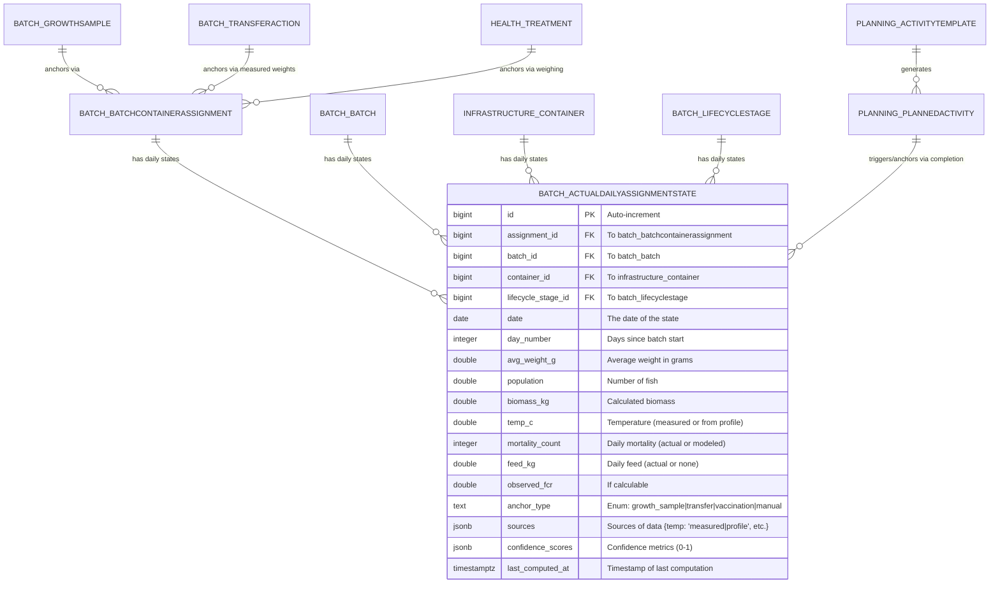

### Batch Growth Assimilation and Scenario Overlay — Technical Implementation Plan

Last updated: 2025-11-14  
Owner: Engineering  
Status: Draft for approval (no implementation yet)  

#### Why this exists

Growth samples are sparse (≈10–15 measurements over ~900 days per batch). Managers need day-to-day insight into average weight, population, and biomass to plan feed, transfers, and harvest. We will compute a daily “Actual” growth series by assimilating real measurements (temperature, mortality, feed, occasional measured weights at transfers, vaccinations, or samplings) using TGC-driven growth, then overlay it with the batch’s Scenario projection and existing growth samples in the Batch “Growth Analysis” view.  

This plan is designed to be executed in small, independently shippable phases to avoid context rot. Each phase has a clear definition of done and checklists that a single agent can complete within a focused session.  

**Refinement Note**: This feature should be implemented prior to or in parallel with the Production Planner (Operational Scheduling), as the daily calculations provide critical "reality check" data (e.g., actual weights/stages) to trigger and adjust PlannedActivities dynamically. If combining into a larger plan, merge this with the Operational Scheduling implementation (e.g., add a Phase 9 for integration hooks like template triggers from actual states). Prioritize backend computation (Phases 1-5) first for data foundation, then UI overlays (Phase 7) to enable early testing with planner prototypes.

#### Scope (what we will deliver)

- A persisted per-assignment daily time series derived from measurements and models (TimescaleDB hypertable).  
- Batch-level aggregates and weekly rollups for fast charting.  
- Overlay in the Batch Growth Analysis chart: Samples (Avg Weight, Condition Factor), Scenario projection, Actual (daily).  
- Minimal schema enhancements to capture measured weights at transfers/vaccinations and to link treatments to samplings/notes.  
- Event-driven recomputation around relevant operational events; nightly catch-up job.  
- Contract-first API to return combined data with optional drilldown by container.  
- Frontend UI updates to toggle overlays, drill down, and display variance/ETA.  

**Refinement Note**: Added integration scope with Production Planner: Use daily states to evaluate ActivityTemplate triggers (e.g., WEIGHT_THRESHOLD) and auto-generate/suggest PlannedActivities; feed completed activities back as anchors.  

Out of scope (for now): live streaming recalcs, ML calibration; these are enabled by the structure we create (residuals and provenance are preserved for future AI work).  

#### Django app placement breakdown

- Core Models/Hypertable: Put batch_actualdailyassignmentstate in batch/models.py (as planned—it's a batch extension). Schema additions like measured_* fields go directly into batch_transferaction (in batch/models.py), and includes_weighing/links into health_treatment (in health/models.py).
- Computation Engine/Services: House the recompute function, TGC calcs, and template evaluation (for planner integration) in batch/services/ or batch/utils/—e.g., a growth_assimilation.py module. Celery tasks (from the TDD) fit here too, registered in batch/tasks.py.
- Signals/Triggers: Add to batch/signals.py (for batch events like transfers/samples) and health/signals.py (for treatments). No new app needed for cross-app signals (use Django's post-save).
- API Endpoints: Extend the existing batch/api/viewsets/ and batch/api/routers/—e.g., add GrowthAnalysisViewSet for the combined endpoint. Reuse scenario/api/ for pinning.
- Frontend: Updates go into the existing Batch Management module (React components in client/src/batch-management/), reusing patterns from scenario planning UI.
- Jobs (Nightly/Celery): Configure in batch/management/commands/ for the nightly catch-up, or a shared core/tasks.py if Celery is project-wide.

#### Key principles

- Per-container accuracy first: compute per `batch_batchcontainerassignment`, then aggregate to batch with correct weighting.  
- Anchors beat models: daily weight resets are anchored by (1) growth samples, (2) measured weights on transfers/vaccinations, (3) manual admin anchors; otherwise use TGC with measured temperature.  
- Minimal user burden: auto-create/pin a “Baseline” scenario From Batch; users can switch/pin another scenario.  
- Timescale-first storage: hypertables, compression, continuous aggregates for weekly views.  
- Robustness via fallbacks: For gaps (e.g., missing temp/mortality), interpolate or use scenario models; track confidence/sources for transparency.  
- Integration-ready: Design for bidirectional flow with Production Planner (calcs trigger plans; completed plans anchor calcs).  

#### How this fits the existing architecture

- Data sources (already in system):  
  - Temperature: `environmental_environmentalreading` (per container). We will use a daily-mean CAGG by container for efficiency.  
  - Mortality: `batch_mortalityevent` and/or `health_mortalityrecord`.  
  - Feed: `inventory_feedingevent` (per container/batch).  
  - Sampling: `batch_growthsample` (per assignment).  
  - Transfers: `batch_transferaction` (assignment source/destination and counts).  
  - Vaccinations/Treatments: `health_treatment` (link to samplings for weights).  
  - Scenarios/Models: `scenario_*` (TGC/FCR/mortality models and projections).  
  - Production Planner: `planning_plannedactivity` and `planning_activitytemplate` (for triggers like WEIGHT_THRESHOLD).  
- Batch view overlay will call a new combined endpoint in the batch API layer. UI sits in the existing Batch Management module.  

#### Data Model Additions (Nullable, Backward Compatible)

- `batch_transferaction` (measured during execution; used as anchors):  
  - `measured_avg_weight_g` NUMERIC(10,2)  
  - `measured_std_dev_weight_g` NUMERIC(10,2)  
  - `measured_sample_size` INTEGER  
  - `measured_avg_length_cm` NUMERIC(10,2)  
  - `measured_notes` TEXT  
  - `selection_method` VARCHAR(16) — choices: AVERAGE | LARGEST | SMALLEST  

- `health_treatment` (traceability; used for vaccination anchors):  
  - `sampling_event_id` FK → `health_healthsamplingevent` (SET_NULL)  
  - `journal_entry_id` FK → `health_journalentry` (SET_NULL)  
  - `includes_weighing` BOOLEAN (default False) — flag for anchor eligibility.  
  - Validation: linked records must belong to the same batch; if both present, dates should match (or be within ±1 day).  

- New hypertable `batch_actualdailyassignmentstate` (TimescaleDB, in the batch app):  
  - Keys/refs: `assignment_id` (FK to `batch_batchcontainerassignment`), `batch_id`, `container_id`, `lifecycle_stage_id`  
  - Metrics: `date`, `day_number`, `avg_weight_g`, `population`, `biomass_kg`, `temp_c`, `mortality_count`, `feed_kg`, `observed_fcr`  
  - Provenance: `anchor_type` TEXT (growth_sample|transfer|vaccination|manual), `sources` jsonb (temp/mortality/feed: measured|interpolated|profile|actual|model|none), `confidence_scores` jsonb (0–1 per input), `last_computed_at`  
  - Hypertable config: chunk interval 14 days; indexes (`assignment_id`,`date`) and (`batch_id`,`date`); compression after 30 days (segment by `assignment_id`, order by `date DESC`).  
  - Retention: raw daily ≥5 years; weekly rollups kept indefinitely (configurable).  

**ERD (Mermaid Diagram)**: Paste into mermaid.live for visualization.  



#### Computation Model (Per Assignment, Per Day)

- Inputs per date d:  
  - `temp_c(a,d)`: daily mean for the assignment’s container; fallback 1: interpolate from nearest days; fallback 2: scenario temperature (or area weather) if missing.  
  - `mortality_count(a,d)`: actual count; fallback: model rate (stage-specific).  
  - `feed_kg(a,d)`: actual sum; fallback: none (or estimate from FCR * growth for diagnostics).  
  - Placements/transfers: prorate population/weight (bias via `selection_method`).  

- Population: `N_d = max(0, N_{d-1} + placements_d - mortality_d)`.  

- Weight: If anchored on d (e.g., sample/transfer/vacc), `W_d = measured`; else `W_d = f_tgc(W_{d-1}, temp_d)` with stage overrides.  

- Biomass: `B_d = N_d * W_d / 1000`.  

- Observed FCR: If feed_d >0 and ΔB_d >0, `feed_d / ΔB_d`; else model value.  

- Stage: Check bio_constraints; transition on weight thresholds or transfers.  

- Provenance: Log sources/confidence; lower confidence for fallbacks/gaps >3 days.  

**Pseudocode for Computation Engine** (Core recompute function for a date range per assignment):  

```python
def recompute_actual_daily_state(assignment_id, start_date, end_date):
    assignment = BatchContainerAssignment.objects.get(id=assignment_id)
    batch = assignment.batch
    scenario = batch.pinned_scenario  # Or default baseline
    tgc_model = scenario.tgc_model
    fcr_model = scenario.fcr_model
    mortality_model = scenario.mortality_model
    bio_constraints = scenario.biological_constraints
    
    # Get previous state or bootstrap
    prev_state = ActualDailyAssignmentState.objects.filter(assignment_id=assignment_id, date__lt=start_date).order_by('-date').first()
    if not prev_state:
        prev_weight = bio_constraints.get_stage_min_weight(assignment.lifecycle_stage) or scenario.initial_weight
        prev_population = assignment.initial_population
        prev_biomass = prev_population * prev_weight / 1000
        prev_date = batch.start_date - timedelta(days=1)
    else:
        prev_weight = prev_state.avg_weight_g
        prev_population = prev_state.population
        prev_biomass = prev_state.biomass_kg
        prev_date = prev_state.date
    
    current_stage = assignment.lifecycle_stage
    
    for date in date_range(start_date, end_date):
        # Step 1: Check for reset/anchor events
        anchor_type = None
        measured_weight = None
        
        # Growth sample
        growth_sample = GrowthSample.objects.filter(assignment=assignment, sample_date=date).first()
        if growth_sample:
            measured_weight = growth_sample.avg_weight_g
            anchor_type = 'growth_sample'
        
        # Transfer
        transfer_action = TransferAction.objects.filter(assignment=assignment, execution_date=date, status='COMPLETED').first()
        if transfer_action and transfer_action.measured_avg_weight_g:
            measured_weight = transfer_action.measured_avg_weight_g  # Adjust for selection_method
            anchor_type = 'transfer'
        
        # Vaccination/Treatment
        treatment = HealthTreatment.objects.filter(assignment=assignment, administration_date=date, includes_weighing=True).first()
        if treatment:
            observations = IndividualFishObservation.objects.filter(treatment=treatment)
            if observations:
                measured_weight = observations.aggregate(Avg('weight_g'))['weight_g__avg']
                anchor_type = 'vaccination'
        
        # Step 2: Gather inputs with fallbacks
        sources = {}
        confidence = {}
        
        # Temp
        temp_readings = EnvironmentalReading.objects.filter(container=assignment.container, reading_time__date=date, parameter='temperature')
        if temp_readings.exists():
            temp_c = temp_readings.aggregate(Avg('value'))['value__avg']
            sources['temp'] = 'measured'
            confidence['temp'] = 1.0
        else:
            nearest_temps = get_nearest_temps(assignment_id, date)
            if nearest_temps:
                temp_c = linear_interpolate(nearest_temps, date)
                sources['temp'] = 'interpolated'
                confidence['temp'] = 0.7 if gap_days <=3 else 0.4
            else:
                temp_c = scenario.temp_profile.get_temp_for_date(date)
                sources['temp'] = 'profile'
                confidence['temp'] = 0.5
        
        # Mortality
        mortality_events = MortalityEvent.objects.filter(assignment=assignment, event_date=date)
        mortality_count = mortality_events.aggregate(Sum('count'))['count__sum'] or 0
        if mortality_count > 0:
            sources['mortality'] = 'actual'
            confidence['mortality'] = 1.0
        else:
            mortality_rate = mortality_model.get_daily_rate(current_stage)
            mortality_count = round(prev_population * mortality_rate / 100)
            sources['mortality'] = 'model'
            confidence['mortality'] = 0.4
        
        # Feed
        feed_events = FeedingEvent.objects.filter(container=assignment.container, event_date=date)
        feed_kg = feed_events.aggregate(Sum('amount_kg'))['amount_kg__sum'] or 0
        if feed_kg > 0:
            sources['feed'] = 'actual'
            confidence['feed'] = 1.0
        else:
            sources['feed'] = 'none'
            confidence['feed'] = 0.0
        
        # Placements/Transfers
        placements_in = get_placements_for_date(assignment, date)
        
        # Step 3: Compute state
        population = max(0, prev_population + placements_in - mortality_count)
        
        if measured_weight:
            avg_weight_g = measured_weight
            sources['weight'] = 'measured'
            confidence['weight'] = 1.0
        else:
            tgc_value, exponents = tgc_model.get_for_stage(current_stage)
            delta_weight = tgc_value * (temp_c ** exponents['temp']) * (prev_weight ** exponents['weight'])
            avg_weight_g = prev_weight + delta_weight
            sources['weight'] = 'tgc_computed'
            confidence['weight'] = min(confidence['temp'], 0.6)  # Cap based on inputs
        
        biomass_kg = population * avg_weight_g / 1000
        
        # Observed FCR
        observed_fcr = None
        delta_biomass = biomass_kg - prev_biomass
        if feed_kg > 0 and delta_biomass > 0:
            observed_fcr = feed_kg / delta_biomass
            sources['fcr'] = 'observed'
        elif delta_biomass > 0:
            fcr_value = fcr_model.get_for_stage_and_weight(current_stage, avg_weight_g)
            observed_fcr = fcr_value
            sources['fcr'] = 'model'
        
        # Stage transition
        if should_transition_stage(avg_weight_g, current_stage, bio_constraints):
            current_stage = get_next_stage(current_stage)
        
        # Save/upsert
        state, _ = ActualDailyAssignmentState.objects.update_or_create(
            assignment_id=assignment_id, date=date,
            defaults={
                'batch_id': batch.id,
                'container_id': assignment.container.id,
                'lifecycle_stage_id': current_stage.id,
                'day_number': (date - batch.start_date).days,
                'avg_weight_g': avg_weight_g,
                'population': population,
                'biomass_kg': biomass_kg,
                'temp_c': temp_c,
                'mortality_count': mortality_count,
                'feed_kg': feed_kg,
                'observed_fcr': observed_fcr,
                'anchor_type': anchor_type,
                'sources': sources,
                'confidence_scores': confidence,
                'last_computed_at': now()
            }
        )
        
        # Integration: Evaluate planner templates (post-save)
        evaluate_activity_templates(assignment, state)  # Auto-generate/suggest PlannedActivities if triggers met
        
        # Prep next
        prev_weight = avg_weight_g
        prev_population = population
        prev_biomass = biomass_kg
        prev_date = date
    
    # Aggregate to batch
    update_batch_aggregates(batch.id, start_date, end_date)
```

#### Phase 1 — Schema enhancements ✅ COMPLETE

- [x] Add measured_* fields to `batch_transferaction`; add `selection_method`.  
- [x] Add `includes_weighing` and links to `health_treatment`; add validation.  
- [x] Add `pinned_scenario_id` to `batch_batch` (FK to `scenario_scenario`, SET_NULL).  
- [ ] Add optional `planned_activity_id` FK to `batch_actualdailyassignmentstate` (for linking completions as anchors). *(Deferred to Phase 8 - Production Planner Integration)*
- [x] Tests: migrations forward/backward; validation rules.  

**Definition of done**: migrations applied; API accepts new fields; tests pass. ✅

**Completion Summary (Phase 1)**:
- Created 3 migrations (batch/0031, batch/0032, health/0027)
- Added 6 measured weight fields to TransferAction model
- Added 3 weighing fields to Treatment model  
- Added pinned_scenario field to Batch model
- All fields nullable for backward compatibility
- 9 schema validation tests pass
- Database-agnostic (tested on PostgreSQL & SQLite)
- Full test suite: 1223/1223 tests pass on both databases
- Commits: ad5ae06, 554c075  

#### Phase 2 — Hypertable + Temperature Daily CAGG ✅ COMPLETE

- [x] Create `batch_actualdailyassignmentstate` hypertable with indexes, compression policy (segment by assignment_id).  
- [x] Add `env_daily_temp_by_container` CAGG (daily mean temperature per container).  
- [x] Optional retention policies (raw daily ≥5y; weekly indefinite). *(Configured in production setup scripts)*
- [x] Tests: DDL executes; policies created; simple insert/select sanity.  

**Definition of done**: hypertable + temp CAGG live with policies. ✅

**Completion Summary (Phase 2)**:
- Created ActualDailyAssignmentState model (18 fields)
- Migration batch/0033: Model creation
- Migration batch/0034: TimescaleDB setup (skipped in dev per testing strategy)
- Migration environmental/0014: Temperature CAGG (skipped in dev)
- Production setup scripts: setup_daily_state_hypertable.sql, setup_temperature_cagg.sql
- 8 schema validation tests pass
- Database-agnostic: Works as regular table in dev, TimescaleDB features in production
- Full test suite: 1231/1231 tests pass on both PostgreSQL and SQLite
- Commits: 062545b  

#### Phase 3 — Assimilation Engine (Per-Assignment Daily)

- [ ] Implement service to recompute `[start,end]` for a batch (per-assignment loop).  
- [ ] Implement anchor precedence (samples > measured transfers/vaccinations > manual > model).  
- [ ] Handle transfers (source/destination splits; `selection_method` bias).  
- [ ] Stage assignment per day (stage overrides and transfer-driven transitions).  
- [ ] Read aquamind/docs/progress/operational_scheduling/operational_scheduling_architecture.md and aquamind/docs/progress/operational_scheduling/operational_scheduling_implementation_plan.md for context. Then add the evaluate_activity_templates() hook in pseudocode to check triggers post-compute, even if it just logs/stubs calls to planner APIs (e.g., /activity-templates/{id}/generate-for-batch/).  
- [ ] Write “sources” and “confidence_scores” provenance.  
- [ ] Unit tests: sampled anchor, measured-transfer anchor, no-weight transfer fallback, multi-source to one-dest, stage-aware stepping.  

Definition of done: deterministic stepping with coverage for edge cases.  

#### Phase 4 — Event-Driven Recompute + Nightly Job

- [ ] Signals: FeedingEvent, MortalityEvent, GrowthSample, executed TransferAction (including measured_*), Treatment (if includes_weighing), daily temp CAGG completion, PlannedActivity completion (for anchors).  
- [ ] Enqueue small recompute window `[d-2,d+2]` per affected batch.  
- [ ] Nightly catch-up job for last 7–14 days.  
- [ ] Read aquamind/docs/progress/operational_scheduling/operational_scheduling_architecture.md and aquamind/docs/progress/operational_scheduling/operational_scheduling_implementation_plan.md for context. Then include signals for PlannedActivity completions (e.g., if type=TRANSFER/VACCINATION, anchor via includes_weighing).
- [ ] Tests: events trigger targeted recomputes; idempotency; performance bounds.  

Definition of done: events produce timely updates; nightly job stable.  

#### Phase 5 — Weekly CAGGs and Residuals

- [ ] `daily_assignment_weekly`: weekly per-assignment rollups.  
- [ ] `daily_batch_weekly`: weekly batch aggregates (weighted).  
- [ ] Optional residuals CAGG (observed vs modeled post-anchor) for analytics.  
- [ ] Tests: CAGGs build and query; correctness of aggregated metrics.  

Definition of done: weekly endpoints deliver expected values.  

#### Phase 6 — API (Combined Endpoint + Admin Actions)

- [ ] Read aquamind/docs/quality_assurance/api_standards.md. 
- [ ] `GET /api/v1/batch/{id}/growth-analysis/combined/` with downsample + drilldown.  
- [ ] `POST /api/v1/scenario/scenarios/{id}/pin_to_batch/`.  
- [ ] `POST /api/v1/batch/{id}/daily-state/recompute/` (admin).  
- [ ] `POST /api/v1/batch/{id}/assignments/{assignment_id}/daily-state/anchor/` (admin).  
- [ ] Permissions: `can_recompute_daily_state` for recompute/anchor APIs.  
- [ ] Read aquamind/docs/progress/operational_scheduling/operational_scheduling_architecture.md and aquamind/docs/progress/operational_scheduling/operational_scheduling_implementation_plan.md for context. Then expose endpoints like /daily-state/variance-for-activity/{activity_id}/ for planner variance reports.
- [ ] OpenAPI updated; regenerate frontend client (`client/src/api/generated`).  
- [ ] API tests for shape, filtering, permissions.  

Definition of done: client can call single combined endpoint for charting.  

#### Phase 7 — Frontend Overlays and Drilldown

- [ ] Overlay Samples (Avg Weight, CF), Scenario, Actual; toggles and daily/weekly switch.  
- [ ] Scenario selector + Pin.  
- [ ] Drilldown to container-level series; tooltips show sources/confidence.  
- [ ] Variance and ETA callouts.  
- [ ] UI tests: series rendering, toggles, long-window performance (uses weekly by default).  

Definition of done: Batch Growth Analysis shows three overlays with smooth UX.  

#### Phase 8 — Integration with Production Planner

- [ ] Read aquamind/docs/progress/operational_scheduling/operational_scheduling_architecture.md and aquamind/docs/progress/operational_scheduling/operational_scheduling_implementation_plan.md to fully grok how this implementation is a prerequisite for the implementation of bidirectional flows (calcs trigger activities; completions anchor calcs).  
- [ ] Extend engine: Post-compute, evaluate ActivityTemplates against state (e.g., if avg_weight_g >= threshold, generate PlannedActivity via API).  
- [ ] Signals: On PlannedActivity completion, check if it qualifies as anchor (e.g., TRANSFER/VACCINATION types) and recompute.  
- [ ] API: Add /planned-activities/variance-from-actual/ (joins with hypertable for planned vs. actual metrics).  
- [ ] UI: In Production Planner timeline, add "Recalculate from Actuals" button; show suggested activities from triggers.  
- [ ] Tests: Template triggers create activities; completions anchor series.  

Definition of done: Calcs trigger planner activities; variances reported accurately.  

#### Phase 9 — Backfill, Validation, and Rollout

- [ ] Backfill selected long-lived batches; compare Actual vs growth samples and spot-check containers.  
- [ ] Dashboard/metrics on recompute lag and data freshness; admin view of anchors.  
- [ ] Documentation for operators/managers (what Actual means; anchors; selection_method).  
- [ ] Update aquamind/docs/prd.md and aquamind/docs/database/data_model.md to reflect the changes made to the feature set and data model in AquaMind

Definition of done: validated outputs; docs shipped; monitoring in place.  

#### Risks and Mitigations

- Selective sorting bias at transfers: captured via `selection_method`; default to population-weighted average when unknown.  
- Missing sensors: fallback to scenario/area temperatures; lower confidence scoring.  
- Storage growth: compression + retention (raw daily horizon configurable) + weekly aggregates for UI.  
- Integration Overhead: Phase 8 is optional initially; test with mock planner data.  

#### Acceptance Criteria (Summary)

- Daily Actual series exists for each assignment with provenance and confidence; batch aggregates compute correctly.  
- Combined endpoint returns Samples/Scenario/Actual with optional drilldown and weekly downsampling.  
- Batch Growth Analysis overlays look correct and remain performant for ~900-day lifetimes.  
- Recompute is timely after relevant events; nightly job keeps data current.  
- Integration: Templates trigger from actual states; variances use actual metrics.  

#### References

- PRD sections 3.1.2 (Batch) and 3.3.1 (Scenario Planning).  
- Data model doc (`aquamind/docs/database/data_model.md`): batch, health, inventory, environmental.  
- Frontend scenario planning summary (`AquaMind-Frontend/docs/deprecated/scenario_planning_implementation_plan_summary.md`) for UI patterns.  
- Operational Scheduling docs: Architecture, API specs, UI specs, User Guide.