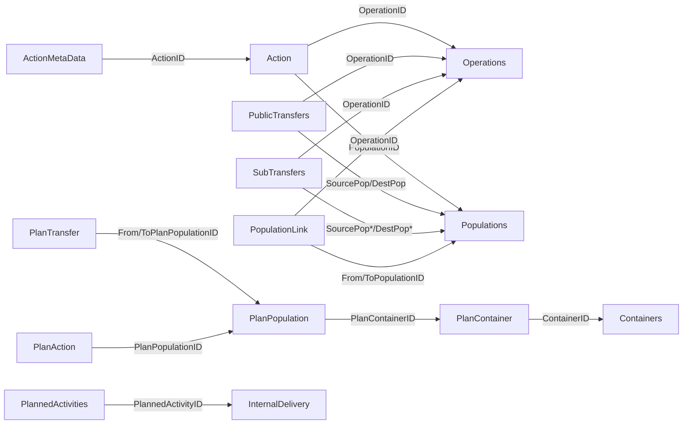

# FishTalk Database Schema Analysis

**Date:** December 2024 (base export)  
**Updated:** 2026-01-22 (input-based stitching + feeding schema corrections)  
**Source:** FishTalk Database Export + live schema inspection  

## Executive Summary

This document provides a detailed analysis of the FishTalk database schema based on exported table/column information and later live inspection. The analysis focuses on identifying key entities and their relationships for migration to AquaMind.

**2026-01-22 Addendum (critical correction):** `dbo.Feeding` is **ActionID-based** and does **not** include PopulationID/ContainerID/FeedingTime columns. Population + timestamp must be joined via `Action` and `Operations`.

## 1. Database Overview

### 1.1 Database Statistics
- **Total Tables Identified:** ~340+ tables
- **Largest Tables by Row Count:**
  - PublicPlanStatusValues: 89.4M rows
  - PublicMortalityStatus: 32.1M rows
  - Action: 12.8M rows
  - Feeding: 4.5M rows
  - Mortality: 4.4M rows
  - SensorReadings: 2.6M rows
  - UserSample: 1.1M rows

### 1.2 Key Schema Patterns
- Heavy use of GUIDs (uniqueidentifier) for primary keys
- Plan-based architecture (PlanPopulation, PlanContainer, PlanSite, etc.)
- Public vs. internal tables (Public* prefix for reporting/views)
- Extensive status tracking (StatusValues, StatusCalculation)
- FF prefix likely indicates "Fish Farming" specific tables

## 2. Core Entity Mapping

### 2.1 Population/Batch Management

**Primary Tables:**
- **Populations** - Core batch/population entity
- **PublicPlanPopulation** (563K rows) - Planning view of populations
- **PlanPopulation** (229K rows) - Detailed population planning
- **PopulationAttributes** - Additional batch attributes
- **PopulationProperty** - Extended properties
- **PopulationLink** - Relationships between populations
- **FishGroupHistory** - Population → InputProject (fish group anchor)
- **InputProjects** - Fish group/project metadata (name, year class, site)

**Key Columns Identified:**
- PopulationID (uniqueidentifier)
- Species/SpeciesID
- StartDate/EndDate
- PopulationStatus
- ProductionStage

**Fish group linkage (2026-01-29 verification):**
- **`FishGroupHistory`** has only `PopulationID` and `InputProjectID`.
- **`InputProjects.ProjectName`** matches the UI “Fish group” label (e.g., “Benchmark Gen. Desembur 2024”).
- **`Ext_Populations_v2.Fishgroup`** is the fish group **number**; there is **no FishGroupName column**.
- Use **InputProjectID** as the anchor to retrieve **all populations** that belong to a fish group, then map to containers/stages.

**Gantt/timeline coverage (2026-01-29 verification):**
- The per‑container timeline bars in FishTalk align with **`Ext_Populations_v2.StartTime/EndTime`** (and by extension `Populations.StartTime/EndTime`).
- Example: “Stofnfiskur Nov 2024” in S16 Glyvradalur has multi‑month spans in `Ext_Populations_v2`, matching the UI Gantt chart.
- `FishGroupHistory` carries **no time fields**; it only links populations to the fish‑group project.
- When EndTime is missing in a segment, a practical fallback is to infer it from the **earliest subsequent population start** (same container or same fish group) or **SubTransfers.OperationTime**.

**Stage coverage caveat (2026-01-29 verification):**
- For InputProject “Benchmark Gen. Desembur 2024”, stage tables only record **Eye‑egg**, **Sac Fry/Alevin**, and **Fry**.
- No Parr/Smolt/Post‑Smolt/Adult entries appear in `PopulationProductionStages` or `OperationProductionStageChange`.
- Later stage labeling therefore requires **inference** (e.g., hall mapping or operational context) unless additional FishTalk tables are identified.

### 2.2 Container/Infrastructure

**Live check (2026-01-22):** `Containers` columns = `ContainerID, ContainerType, ContainerName, ContainerSystemType, ContainerFeedingMethod, GroupID, SortIndex, OrgUnitID, StandID, OfficialID`. No `LocationID` on Containers.

**Primary Tables:**
- **Containers** - Physical container entities
- **PlanContainer** (489K rows) - Container planning assignments
- **ContainerPhysics** - Physical characteristics
- **ContainerPhysicsHistory** - Historical container data
- **ACAFSContainer** - Alternative container system

**Key Columns:**
- ContainerID (uniqueidentifier)
- PlanContainerID
- PlanSiteID
- Capacity/Volume metrics

### 2.3 Site/Location Hierarchy

**Live check (2026-01-22):** `OrganisationUnit` has `LocationID` but most are NULL/0000 (4106/4215). `Locations` has only 112 rows; do not rely on Location for geography.

**Primary Tables:**
- **PlanSite** - Site planning entities
- **PlanSiteConditions** - Environmental conditions
- **SiteFallowPeriods** - Fallow management
- **ModelSiteAssignments** - Site model assignments

**Key Columns:**
- SiteID
- OrgUnitID (Organization Unit)
- LocationID
- Coordinates (likely lat/long)

### 2.4 Feed Management

**Primary Tables:**
- **Feeding** (4.5M rows) - Core feeding events
- **HWFeeding** - Hardware/automatic feeding
- **WrasseFeeding** - Cleaner fish feeding
- **FFBioFeeding** - Bio feeding records
- **PlanStatusFeedUse** (2.2M rows) - Feed usage planning
- **FeedCalibrationUnit** - Feed calibration data
- **FeedTransferCauses** - Feed movement reasons

**Key Columns (verified):**
- ActionID
- FeedAmount
- OperationStartTime
- FeedBatchID
- FeedTypeID

**Join path for population + time:**
- Feeding.ActionID → Action.ActionID → Action.PopulationID
- Action.OperationID → Operations.StartTime (fallback to Feeding.OperationStartTime)

### 2.5 Health & Mortality

**Primary Tables:**
- **Mortality** (4.4M rows) - Mortality events
- **PublicMortalityStatus** (32.1M rows) - Mortality status tracking
- **WrasseMortality** - Cleaner fish mortality
- **MortalityResponsibility** - Mortality cause tracking
- **PublicLiceSampleData** (558K rows) - Lice sampling
- **PublicLiceSamples** - Lice count records

**Key Columns:**
- MortalityID
- Count/Number
- Cause/Reason
- Date/DateTime
- ResponsibleParty

### 2.6 Sampling & Measurements

**Primary Tables:**
- **UserSample** (1.1M rows) - User-entered samples
- **UserSampleParameterValue** (1.3M rows) - Sample parameters
- **UserSampleTypes** - Sample type definitions
- **PublicWeightSamples** - Weight sampling data

**Key Columns:**
- SampleID
- SampleDate
- ParameterID/Value
- Weight/Length measurements

### 2.7 Environmental & Sensors

**Live check (2026-01-22):** `Ext_GroupedOrganisation_v2` is a **view** with columns: `ContainerID, Container, Site, Company, Enterprise, SiteGroup, CompanyGroup, SiteID, CompanyID, EnterpriseID, SiteGroupID, CompanyGroupID, ContainerGroupID, ContainerGroup, ProdStage, StandName, StandID`. Row count 10,183.

**Primary Tables:**
- **SensorReadings** (2.6M rows) - Sensor data
- **SensorUnitAssignments** - Sensor to unit mapping
- **PlanConditions** - Environmental conditions
- **TidePredictionLocation** - Tidal data

**Key Columns:**
- SensorID
- ReadingTime
- Value
- UnitID/ContainerID

### 2.8 Operations & Actions

**Primary Tables:**
- **Action** (12.8M rows) - Operational actions
- **ActionMetaData** (5.9M rows) - Action details
- **Operations** (7M rows) - Operational records
- **PlannedActivitiesUsers** (1M rows) - User activities
- **ConnectTreatmentAndFeedingOps** - Treatment linkage

**2026-02-04 Addendum (ActionType 25):**
- ActionType **25** appears across multiple OperationTypes (Transfer, Weight sample, Lice sample, Combined sample, Hatching, etc.).
- It does **not** map to ActionID-based domain tables (Feeding, Mortality, Treatment, Culling, HarvestResult, UserSample), only to **ActionMetaData**.
- Treat it as an **operation-level placeholder** and resolve detail via **SubTransfers** (movement) or sample tables (weight/lice) keyed by **OperationID**.

### 2.9 Planning & Status

**Primary Tables:**
- **PublicPlanStatusValues** (89.4M rows) - Largest table, status tracking
- **PublicStatusValues** (7.3M rows) - Status definitions
- **StatusCalculation** (7.2M rows) - Calculated statuses
- **PlanAction** (572K rows) - Planned actions
- **PlanFolder** - Planning organization

## 3. Data Type Patterns

### Common Data Types:
- **uniqueidentifier** - Primary/Foreign keys (GUIDs)
- **nvarchar(max/-1)** - Text fields
- **datetime** - Timestamp fields
- **float** - Numeric measurements
- **int** - Counts and enumerations
- **bit** - Boolean flags

### Nullable Patterns:
- Most foreign keys are nullable
- Descriptive fields often nullable
- Core IDs and dates typically NOT NULL

## 4. Critical Migration Considerations

### 4.1 Active Data Identification

**Infra coverage stats (2026-01-22):**
- Containers total: 17,066 (0 missing OrgUnitID)
- Containers missing Ext_GroupedOrganisation_v2 row: 6,883
- OrgUnits total: 4,215 (4,106 missing LocationID)
- Locations total: 112 (109 missing NationID)

Geography should be derived primarily from `Ext_GroupedOrganisation_v2` rather than `Locations`.
Based on table sizes and patterns:
- Focus on recent **Populations** (not all 89M status records)
- Filter **Feeding** and **Mortality** by date range
- Consider only active **Containers** and **PlanSite**
- Prioritize recent **SensorReadings** (last 12 months)

**Access note (2026-01-29):** `fishtalk_reader` may not have permissions on `InputProjects` and `FishGroupHistory`. Use the `fishtalk` profile (sa) when extracting these two tables for fish group tracing.

### 4.2 Key Relationships to Preserve
1. Population → Container assignments (via PlanContainer)
2. Container → Site hierarchy
3. Population → Feeding events
4. Population → Mortality records
5. Population → Sample data
6. Container → Sensor readings

### 4.3 Data Volume Considerations
- **PublicPlanStatusValues** (89M rows) - Likely contains historical status snapshots, filter aggressively
- **PublicMortalityStatus** (32M rows) - May contain duplicates or historical states
- **Action/Operations** (12-13M rows) - Audit trail, may not need full migration

### 4.4 Naming Convention Mappings
- Plan* tables → Planning/scheduling entities
- Public* tables → Reporting views or denormalized data
- FF* tables → Fish farming specific
- HW* tables → Hardware/automation related
- Wrasse* tables → Cleaner fish specific (may not apply to all operations)

## 5. Recommended Migration Approach

### Phase 1: Core Entities
1. **Sites/Locations** - Establish geographic hierarchy
2. **Containers** - Physical infrastructure
3. **Populations** (filtered) - Active batches only

### Phase 2: Operational Data
1. **Feeding** (recent) - Last 12-24 months
2. **Mortality** (recent) - Last 12-24 months
3. **UserSample** - Growth and health samples

### Phase 3: Environmental
1. **SensorReadings** - Recent readings only
2. **Environmental conditions** - Current state

### Phase 4: Planning (Optional)
1. **PlanAction** - Future planned activities
2. **PlannedActivitiesUsers** - User assignments

## 6. Data Quality Concerns

### Potential Issues:
- Large status tables may contain redundant data
- Public* tables might be denormalized views
- Multiple feeding tables (Feeding, HWFeeding, WrasseFeeding) need consolidation
- GUID primary keys will need mapping tables
- Nullable foreign keys may indicate optional relationships
- CSV extracts can become stale vs. the live FishTalk DB; re‑extract `Populations` + `Ext_Populations_v2` when fish group history shows missing PopulationIDs (e.g., 40 missing rows for “Benchmark Gen. Desembur 2024” resolved after re‑extract on 2026‑01‑29).

### Validation Requirements:
- Row count reconciliation after filtering
- Foreign key integrity checking
- Date range validation
- Duplicate detection in Public* tables

## Appendix A: Table Size Reference

| Table Name | Row Count | Priority |
|------------|-----------|----------|
| PublicPlanStatusValues | 89.4M | Low (historical) |
| PublicMortalityStatus | 32.1M | Medium (filter) |
| Action | 12.8M | Low (audit) |
| Feeding | 4.5M | High |
| Mortality | 4.4M | High |
| SensorReadings | 2.6M | High (recent) |
| UserSample | 1.1M | High |
| PublicPlanPopulation | 564K | High |
| PlanContainer | 489K | High |
| Populations | 400K | Critical |
| Containers | 10K | Critical |

## Appendix B: Key Field Mappings

| FishTalk Field Type | AquaMind Equivalent | Notes |
|---------------------|---------------------|--------|
| uniqueidentifier | UUID/varchar | Store original, generate new |
| nvarchar(max) | text | Direct mapping |
| datetime | timestamptz | Add timezone |
| float | decimal/numeric | Precision consideration |
| int | integer | Direct mapping |
| bit | boolean | Direct mapping |

---

## 7. CRITICAL DISCOVERY: Batch Identification via Ext_Inputs_v2 (2026-01-22)

### 7.1 The Breakthrough

**Previous approaches failed** because project tuple `(ProjectNumber, InputYear, RunningNumber)` is an **administrative/financial grouping**, not a biological batch identifier. It combines multiple year-classes of fish.

**`Ext_Inputs_v2`** is the key table that tracks **egg inputs/deliveries** - the true biological origin of batches.

### 7.2 Ext_Inputs_v2 Table Structure

| Column | Type | Description |
|--------|------|-------------|
| PopulationID | uniqueidentifier | Links to Populations table |
| InputName | nvarchar | Batch/input name (e.g., "Stofnfiskur S21 okt 25", "BM Jun 24") |
| InputNumber | int | Numeric identifier for the input |
| YearClass | nvarchar | Year class (e.g., "2025", "2024") |
| Supplier | uniqueidentifier | Egg supplier ID |
| StartTime | datetime | When the input started |
| InputCount | float | Number of eggs/fish |
| InputBiomass | float | Input biomass |
| Species | int | Species identifier |
| FishType | nvarchar | Type of fish |
| Broodstock | nvarchar | Broodstock source |
| DeliveryID | uniqueidentifier | Delivery reference |
| Transporter | nvarchar | Transport info |

### 7.3 Input-Based Batch Identification

**Batch Key:** `InputName + InputNumber + YearClass`

Sample data showing this approach:

| InputName | InputNumber | YearClass | Populations | Span (days) | Total Fish |
|-----------|-------------|-----------|-------------|-------------|------------|
| 22S1 LHS | 2 | 2021 | 317 | 42 | 6.9M |
| Heyst 2023 | 1 | 2023 | 108 | 275 | 6.3M |
| Vár 2025 | 1 | 2025 | 104 | 204 | 6.3M |
| Stofnfiskur Aug 22 | 3 | 2022 | 40 | 21 | 5.1M |
| Rogn juni 2023 | 1 | 2023 | 46 | 21 | 4.8M |
| Rogn okt 2023 | 3 | 2023 | 567 | 19 | 4.7M |
| 13S0 SB | 0 | 2013 | 185 | 1 | 4.1M |

**Key observations:**
- Most inputs have reasonable time spans (< 300 days)
- Fish counts are in the expected 3-6M range per batch
- InputName follows naming conventions: supplier + strain + date

### 7.4 Naming Convention Patterns

| Pattern | Example | Meaning |
|---------|---------|---------|
| Supplier + Strain + Date | "Stofnfiskur S21 okt 25" | Stofnfiskur, S21 strain, Oct 2025 |
| Supplier + Date | "Bakkafrost S-21 okt 25" | Bakkafrost, S-21 strain, Oct 2025 |
| Season + Year | "Heyst 2023", "Vár 2024" | Harvest/Spring 2023/2024 |
| Strain Code | "22S1 LHS", "16S0 SF" | Year+Season+Code |
| Norwegian month | "Rogn okt 2023" | Roe October 2023 |

### 7.5 Related Tables for YearClass

| Table | Has YearClass | Notes |
|-------|---------------|-------|
| Ext_Inputs_v2 | ✓ | **Primary source** - links to PopulationID |
| InputProjects | ✓ | Project-level inputs |
| PlanPopulation | ✓ | Planning feature |
| PublicPlanPopulation | ✓ | Planning view |

### 7.6 Recommended Batch Identification Strategy

```
1. Extract from Ext_Inputs_v2:
   - Batch key = InputName + InputNumber + YearClass
   - Get all PopulationIDs for each batch key
   
2. For each batch:
   - Verify single geography (should not span Faroe Islands + Scotland)
   - Verify stage progression is biologically valid
   - Verify time span < 900 days
   
3. Create AquaMind Batch:
   - batch_number = InputName (or generate from key)
   - Use InputCount as initial egg count
   - Use StartTime as batch start_date
```

### 7.7 Why This Works Better

| Approach | Problem | Result |
|----------|---------|--------|
| Project tuple | Administrative grouping | Multiple year-classes mixed |
| SubTransfers chain | Only tracks within-environment moves | Missing FW→Sea link |
| PublicTransfers | Broken since Jan 2023 | No recent data |
| **Ext_Inputs_v2** | Tracks egg deliveries | **True biological origin** |

---

## 8. Batch Naming Conventions & Supplier Codes (2026-01-22)

### 8.1 Supplier Abbreviations

FishTalk uses abbreviated supplier codes in reporting tools. These map to full `InputName` values in `Ext_Inputs_v2`:

| Abbreviation | Supplier | Primary Station(s) | Example InputName |
|--------------|----------|-------------------|-------------------|
| **BM** | Benchmark Genetics | S24 Strond | "Benchmark Gen. Juni 2024" |
| **BF** | Bakkafrost | S08 Gjógv, S21 Viðareiði | "Bakkafrost S-21 sep24" |
| **SF** | Stofnfiskur | S03 Norðtoftir, S16 Glyvradalur, S21 Viðareiði | "Stofnfiskur Juni 24" |
| **AG** | AquaGen | S03 Norðtoftir | "AquaGen juni 25" |

### 8.2 Freshwater Station Summary (as of Oct 2025)

| Station | Code | Primary Suppliers | Fish Count |
|---------|------|-------------------|------------|
| S03 Norðtoftir | S03 | Stofnfiskur, AquaGen | ~8.2M |
| S08 Gjógv | S08 | Bakkafrost | ~700K |
| S16 Glyvradalur | S16 | Stofnfiskur | ~6.1M |
| S21 Viðareiði | S21 | Stofnfiskur, Bakkafrost | ~5.1M |
| S24 Strond | S24 | Benchmark Genetics | ~13M |

### 8.3 Display Name Convention

Reporting tools abbreviate batch names as: `{Supplier Code} {Month} {Year}`

| Full InputName | Display Name |
|----------------|--------------|
| Benchmark Gen. Juni 2024 | BM Jun 24 |
| Benchmark Gen. Mars 2024 | BM Mar 24 |
| Bakkafrost mai 24 | BF Mai 24 |
| Stofnfiskur Juni 24 | SF Jun 24 |
| AquaGen juni 25 | AG Jun 25 |

### 8.4 Mixed Batches

Mixed batches (where two inputs are combined) are indicated by:
- **BF/BM Mai 2024** = Bakkafrost and Benchmark fish mixed
- **BM Mar/Jun 24** = March and June inputs mixed
- **SF/BF** = Stofnfiskur and Bakkafrost fish mixed

These require special handling via `batch_batchcomposition` table in AquaMind.

### 8.5 Ext_Populations_v2 Table

An alternative view that provides structured batch information in the `PopulationName` field:

| Column | Type | Description |
|--------|------|-------------|
| PopulationID | uniqueidentifier | Links to Populations table |
| ContainerID | uniqueidentifier | Container location |
| PopulationName | nvarchar | Structured name (see format below) |
| InputYear | char | Year code (e.g., "24") |
| InputNumber | char | Input sequence |
| RunningNumber | int | Running sequence |
| Fishgroup | nvarchar | Fish group code (e.g., "241.0018") |
| StartDate | date | Population start |
| EndDate | date | Population end (nullable) |

**PopulationName Format (Sea Populations):**
```
"{Ring} {Station} {Supplier} {Month} {Year} ({YearClass})"
Example: "11 S24 SF MAI 24 (MAR 23)"
         │   │   │   │   │    └── Original yearclass (March 2023)
         │   │   │   │   └── Transfer year (2024)
         │   │   │   └── Transfer month (May)
         │   │   └── Supplier code (Stofnfiskur)
         │   └── Source station (S24 Strond)
         └── Ring/container number
```

### 8.6 InputName Changes at FW→Sea Transition

**CRITICAL:** When fish transfer from freshwater to sea, a new PopulationID is created AND the InputName in `Ext_Inputs_v2` may change:

| Stage | InputName | Example |
|-------|-----------|---------|
| Freshwater (S24 Strond) | Benchmark Gen. Juni 2024 | Fish at smolt stage |
| Sea (A18 Hov, A06 Argir) | Vár 2024, Summar 2024 | Same fish, new InputName |

This means:
1. `Ext_Inputs_v2` tracks inputs **per stage**, not across the full lifecycle
2. Stitching FW-to-sea requires transfer matching, not just InputName
3. Sea batches (e.g., "Summar 2024") are valid biological groupings for sea-phase analytics

### 8.7 AquaMind Batch Naming Strategy

For migration to AquaMind:1. **Initial Name:** Use `InputName` from `Ext_Inputs_v2` (e.g., "Benchmark Gen. Juni 2024")
2. **At Sea Transfer:** Can rename to display format (e.g., "BM Jun 24") using transfer workflow
3. **History Preserved:** Original name stored in `django-simple-history` via `HistoricalBatch` table
4. **External Reference:** Store original InputName in `ExternalIdMap.metadata` for traceability---

## 9. Schema Sweep: Progression/Audit Tables (2026-02-04)

Goal: identify large “progression” tables and their likely join paths. This is a schema-only scan from `fishtalk_schema_snapshot.json` (no data inference).

| Table | Rows (snapshot) | Key Columns | Likely Joins | Extracted CSV |
|------|----------------|------------|--------------|---------------|
| `Action` | 13,319,403 | `ActionID`, `OperationID`, `PopulationID`, `ActionType`, `ActionOrder` | `Operations.OperationID`, `Populations.PopulationID`; domain tables join by `ActionID` (Feeding, Mortality, etc.) | Not extracted |
| `ActionMetaData` | 6,005,088 | `ActionID`, `ParameterID`, `ParameterString`, `ParameterValue`, `ParameterDate`, `ParameterGuid` | `Action.ActionID` | Not extracted |
| `Operations` | 7,172,925 | `OperationID`, `StartTime`, `EndTime`, `OperationType`, `Comment` | `Action.OperationID`, `SubTransfers.OperationID`, `PublicTransfers.OperationID`, `PopulationLink.OperationID` | Not extracted (partial: `internal_delivery_operations.csv`, `transfer_operations.csv`) |
| `PublicTransfers` | 307,417 | `SourcePop`, `DestPop`, `OperationID`, `ShareCountForward`, `ShareBiomassForward` | `Populations.PopulationID`, `Operations.OperationID` | Extracted as `transfer_edges.csv` + `transfer_operations.csv` |
| `SubTransfers` | 204,788 | `SourcePopBefore/After`, `DestPopBefore/After`, `OperationID`, `TransferType` | `Populations.PopulationID`, `Operations.OperationID` | Extracted as `sub_transfers.csv` |
| `PopulationLink` | 21,664 | `FromPopulationID`, `ToPopulationID`, `OperationID`, `LinkType` | `Populations.PopulationID`, `Operations.OperationID` | Extracted as `population_links.csv` |
| `PlanTransfer` | 35,705 | `FromPlanPopulationID`, `ToPlanPopulationID`, `TransferType`, `CountShare`, `BiomassShare` | `PlanPopulation.PlanPopulationID` | Extracted as `plan_transfers.csv` |
| `PlanPopulation` | 187,512 | `PlanPopulationID`, `PlanContainerID`, `InputProjectID`, `PopulationName`, `StartTime`, `EndTime`, `YearClass` | `PlanContainer.PlanContainerID`, `InputProjects.InputProjectID` | Not extracted |
| `PlanContainer` | 543,901 | `PlanContainerID`, `ContainerID`, `PlanSiteID`, `PlanningGroupID` | `Containers.ContainerID`, (likely) `OrganisationUnit` via `PlanSiteID` | Not extracted |
| `PlanAction` | 638,900 | `ActionID`, `PlanPopulationID`, `ActionType`, `StartDate` | `PlanPopulation.PlanPopulationID`; potential `Action.ActionID` (verify) | Not extracted |
| `PublicPlanPopulationAttributes` | 3,447,616 | `PlanPopulationID`, `ScenarioID`, `AttributeID`, value fields | `PlanPopulation.PlanPopulationID` | Not extracted |
| `CustomResolutionEntities` | 816,000 | `PopulationID`, `Entity`, `EntityTypeID` | `Populations.PopulationID` | Not extracted |
| `CustomActivity` | 19,723 | `ActivityID`, `ActivityTypeID`, `OrgUnitID`, `StartTime`, `EndTime` | `OrganisationUnit.OrgUnitID` | Not extracted |
| `PlannedActivities` | 5,861 | `PlannedActivityID`, `SiteID`, `DueDate`, `ActivityCategory`, `ActivityType`, `Description` | `OrganisationUnit.OrgUnitID`; `InternalDelivery.PlannedActivityID` | Not extracted (partial: `internal_delivery_planned_activities.csv`) |
| `ChangeLog` | 4,409,385 | `ObjectName`, `GuidID`, `IntID`, `EntryType`, `TimeStamp`, `UserID` | Depends on `ObjectName` + ID columns | Not extracted |

Notes:
- `Action` + `ActionMetaData` are the largest and most general audit trail. Extracting them in full is likely too heavy; any use should be **targeted by date range or OperationID**.
- Planning tables (`Plan*`, `PublicPlanPopulationAttributes`) describe **planned** populations and transfers, not necessarily actual movements.
- `ChangeLog` is a generic audit table; it can be valuable for forensic timelines but requires object‑specific parsing (no direct join path by default).

**Relationship sketch (schema-level only):**


### 9.1 PublicOperationTypes Mapping (Extracted 2026-02-04)

Source: `scripts/migration/data/extract/public_operation_types.csv` (44 rows).

| OperationType | TextID | Text |
|---|---|---|
| 0 | 1181 | Undefined |
| 1 | 30084 | Transfer |
| 2 | 77168 | Set status |
| 3 | 5536 | Feeding |
| 4 | 5546 | Mortality |
| 5 | 5544 | Input |
| 7 | 40018 | Sale |
| 8 | 5537 | Harvest |
| 9 | 5533 | Environment |
| 10 | 74216 | Weight sample |
| 11 | 5531 | Counting |
| 12 | 5532 | Culling |
| 13 | 1135 | Escape |
| 14 | 5545 | Maturity Sample |
| 15 | 69409 | Diagnosis |
| 16 | 50197 | Treatment |
| 17 | 5542 | Vaccination |
| 22 | 5538 | Hatching |
| 23 | 5535 | Fasting |
| 24 | 5550 | Lice sample |
| 25 | 69792 | Quarantine Followup |
| 26 | 5551 | Combined sample |
| 27 | 5553 | Fat and color sample |
| 28 | 5554 | Salt tolerance sample |
| 31 | 58311 | Many to many transfer |
| 32 | 58615 | Biomass measurement |
| 33 | 62165 | Spawning |
| 39 | 75736 | Growth adjustment |
| 42 | 50550 | Cleaner fish input |
| 43 | 75737 | Cleaner fish transfer |
| 44 | 75738 | Cleaner fish release |
| 45 | 75739 | Cleaner fish counting |
| 46 | 66275 | Cleaner fish mortality |
| 47 | 62620 | Shocking |
| 48 | 67644 | Shuffle trays |
| 49 | 68243 | Change of net |
| 50 | 75740 | Wash of net |
| 52 | 71302 | User defined sample |
| 53 | 70761 | Feed collection |
| 54 | 75741 | Feed waste |
| 56 | 73266 | Predator mortality |
| 57 | 74682 | Cleaner fish feeding |
| 58 | -2 | Wrasse culling |
| 59 | 79849 | Lice treatment |

**Note:** There is no table in the schema snapshot that maps `Action.ActionType` to human‑readable names. Any ActionType decoding must be inferred via domain tables or UI references.

### 9.2 ActionType Empirical Mapping (Targeted, 2026-02-04)

Method:
- Used `scripts/migration/data/extract/targeted_actions/2026-02-04/actions_targeted.csv` (OperationIDs from SubTransfers/PopulationLink/PublicTransfers/transfer_operations/internal_delivery_operations intersected with `Operations.StartTime` in `2026‑01‑01 → 2026‑02‑05`).
- Scanned extracted CSVs for `ActionID` columns and matched them to the targeted ActionIDs.

Result:
- Only **`internal_delivery_actions.csv`** matched the targeted ActionIDs.
- Matched ActionType values: **4, 7, 25** (each with 21 rows).
- No matches found in feeding/mortality/weight sample extracts within this targeted window.

Implication:
- Current targeted window is dominated by InternalDelivery‑linked operations; **ActionType decoding remains incomplete**.
- To map ActionType → domain semantics, we need to **sample ActionIDs** from each domain table (Feeding, Mortality, WeightSamples, Lice, Treatments, etc.) and join them back to `Action` (targeted SQL by ActionID or a wider date window).

### 9.3 ActionType Empirical Mapping (Domain Tables, 2026-02-04)

Source: `analysis_reports/2026-02-04/action_type_mapping_2026-02-04.md` (sample size 200 per table).

**Observed ActionType → Domain table associations (sampled):**
- `3` → `Mortality`
- `5` → `Feeding`
- `16` → `Culling`
- `18` → `Escapes`
- `21`, `58`, `22` → `Treatment` (multiple ActionTypes observed within `Treatment`)
- `30` → `HistoricalSpawning`
- `31` → `HistoricalHatching`
- `32` → `HistoricalStartFeeding`
- `46` → `SpawningSelection`
- `53` → `HarvestResult`
- `54` → `UserSample`, `UserSampleParameterValue`, `UserSampleTypes` (user‑defined samples)

**Missing/unsupported in current extract:**
- Weight samples (`PublicWeightSamples`, `Ext_WeightSamples_v2`) do **not** carry `ActionID`, so ActionType decoding for those remains unresolved.
- Lice samples/treatments, environment, counting, vaccination, and sale may be represented via `Operations.OperationType` or domain tables not yet sampled.

### 9.4 OperationType Empirical Mapping (OperationID Tables, 2026-02-04)

Source: `analysis_reports/2026-02-04/operation_type_mapping_2026-02-04.md` (sample size 200 per table, Action excluded).

**Observed OperationType → table associations (sampled):**
- `1 (Transfer)` → `SubTransfers`, `PublicTransfers`
- `5 (Input)` → `PopulationLink`, `OperationProductionStageChange`, `SubTransfers`, `PublicTransfers`
- `7 (Sale)` → `PopulationLink`
- `8 (Harvest)` → `PublicTransfers`, `SubTransfers`
- `22 (Hatching)` → `OperationProductionStageChange`
- `31 (Many to many transfer)` → `SubTransfers`, `PublicTransfers`

**Ext_WeightSamples_v2 (no OperationID, but OperationType present):**
- OperationType values appear directly on `Ext_WeightSamples_v2` (e.g., `10 Weight sample`, `1 Transfer`, `8 Harvest`, `32 Biomass measurement`, `7 Sale`).
- These records have `SampleDate` + `PopulationID`, but no `OperationID` or `ActionID`.

**Lice sample tables (schema-only):**
- `PublicLiceSamples` / `PublicLiceSampleData` (and `Ext_` variants) are keyed by `SampleID` with `PopulationID` + `SampleDate`.
- No `ActionID` or `OperationID` columns exist in lice sample tables; treat lice sampling as **sample events** anchored by `SampleDate`, not Action/Operation types.

**Document Status:** Updated 2026-01-22
**Next Steps:** Implement Input-based batch identification in migration scripts
