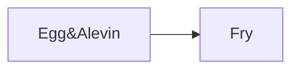

# FishTalk Batch Overview (CSV-derived)

Fish group: `Benchmark Gen. Desembur 2024` (InputProjectID: `FE206D1D-C98D-4362-8E19-E18B388E43F3`)

- Populations: 221
- Containers: 92
- Time span: 2024-12-18 -> 2026-01-16

## Feed / Mortality / Weight Summary

- Feed total: 297,524.4 kg
- Mortality total: 1,246,577
- Weight samples (AvgWeight g): n=415, min=0.1 median=5.0 max=168.8

## Stage Rollup (event coverage)

| Stage | Event count |
| --- | --- |
| Fry | 142 |
| Egg&Alevin | 78 |

## Stage Transition Diagram

## Hall Summary (ContainerGroup)

| Hall | Units | Containers | Populations | Start | End | Span days | Lifecycle stages | Feed kg | Mortality | Fish count (end) | Weight samples (n/median g) |
| --- | --- | --- | --- | --- | --- | --- | --- | --- | --- | --- | --- |
| A Høll | A01, A02, A03, A04, A05, A06, A07, A08, A09, A10, A11, A12, A13, A14, A15, A16, A17, A18, A19, A20, A21, A22, A23, A24, A25, A26, A27, A28, A29, A30, A31, A32, A33, A34, A35, A36, A37, A38, A39 | 39 | 39 | 2024-12-18 | 2025-03-05 | 77 | Egg&Alevin | 0.0 | 307,854 | 3,196,671 | 78/0.1 |
| B Høll | B01, B02, B03, B04, B05, B06, B07, B08, B09, B10, B11, B12 | 12 | 12 | 2025-03-05 | 2025-05-30 | 85 | Fry | 8,882.1 | 876,726 | 2,359,332 | 156/1.6 |
| C Høll | C1, C2, C3, C5, C6, C7 | 6 | 38 | 2025-05-26 | 2025-10-24 | 151 | Fry | 54,481.5 | 11,364 | 747,072 | 33/34.9 |
| D Høll | D1, D2, D3, D4, D5, D6, D7, D8 | 8 | 42 | 2025-05-26 | 2025-10-16 | 142 | Fry | 87,353.4 | 26,785 | 1,463,286 | 88/32.6 |
| E Høll | E01, E02, E03, E04, E05, E06 | 6 | 25 | 2025-07-25 | 2026-01-16 | 175 | Fry | 68,517.5 | 11,840 | 833,698 | 26/94.1 |
| F Høll | F01, F02, F03, F04, F05, F06 | 6 | 26 | 2025-07-25 | 2026-01-13 | 171 | Fry | 74,406.6 | 10,627 | 830,213 | 34/112.2 |
| G Høll | G1, G2, G3, G4 | 4 | 10 | 2025-11-13 | 2025-12-22 | 39 |  | 0.0 | 0 |  | 0/ |
| H Høll | H1, H2, H3, H4 | 4 | 9 | 2025-10-22 | 2025-11-13 | 21 | Fry | 3,883.3 | 1,381 | 589,535 | 0/ |
| I Høll | I1, I2, I3 | 3 | 9 | 2026-01-13 | 2026-01-16 | 3 |  | 0.0 | 0 |  | 0/ |
| J Høll | J1, J2, J3, J4 | 4 | 11 | 2025-12-22 | 2026-01-13 | 21 |  | 0.0 | 0 |  | 0/ |

## Unit Summary (Container)

| Hall | Unit | Start | End | Span days | Populations | Stage sequences | Feed kg | Mortality | Fish count (end) | Weight samples (n/median g) |
| --- | --- | --- | --- | --- | --- | --- | --- | --- | --- | --- |
| A Høll | A01 | 2024-12-18 | 2025-03-05 | 77 | 1 | Egg&Alevin -> Egg&Alevin | 0.0 | 2,556 | 87,304 | 2/0.1 |
| A Høll | A02 | 2024-12-18 | 2025-03-05 | 77 | 1 | Egg&Alevin -> Egg&Alevin | 0.0 | 3,230 | 86,630 | 2/0.1 |
| A Høll | A03 | 2024-12-18 | 2025-03-05 | 77 | 1 | Egg&Alevin -> Egg&Alevin | 0.0 | 2,645 | 87,215 | 2/0.1 |
| A Høll | A04 | 2024-12-18 | 2025-03-05 | 77 | 1 | Egg&Alevin -> Egg&Alevin | 0.0 | 4,135 | 85,725 | 2/0.1 |
| A Høll | A05 | 2024-12-18 | 2025-03-05 | 77 | 1 | Egg&Alevin -> Egg&Alevin | 0.0 | 3,868 | 85,992 | 2/0.1 |
| A Høll | A06 | 2024-12-18 | 2025-03-05 | 77 | 1 | Egg&Alevin -> Egg&Alevin | 0.0 | 3,357 | 86,503 | 2/0.1 |
| A Høll | A07 | 2024-12-18 | 2025-03-05 | 77 | 1 | Egg&Alevin -> Egg&Alevin | 0.0 | 3,633 | 86,227 | 2/0.1 |
| A Høll | A08 | 2024-12-18 | 2025-03-05 | 77 | 1 | Egg&Alevin -> Egg&Alevin | 0.0 | 5,115 | 84,745 | 2/0.1 |
| A Høll | A09 | 2024-12-18 | 2025-03-05 | 77 | 1 | Egg&Alevin -> Egg&Alevin | 0.0 | 3,616 | 86,244 | 2/0.1 |
| A Høll | A10 | 2024-12-18 | 2025-03-05 | 77 | 1 | Egg&Alevin -> Egg&Alevin | 0.0 | 7,336 | 82,524 | 2/0.1 |
| A Høll | A11 | 2024-12-18 | 2025-03-05 | 77 | 1 | Egg&Alevin -> Egg&Alevin | 0.0 | 4,348 | 85,512 | 2/0.1 |
| A Høll | A12 | 2024-12-18 | 2025-03-05 | 77 | 1 | Egg&Alevin -> Egg&Alevin | 0.0 | 4,666 | 85,194 | 2/0.1 |
| A Høll | A13 | 2024-12-18 | 2025-03-05 | 77 | 1 | Egg&Alevin -> Egg&Alevin | 0.0 | 4,691 | 85,169 | 2/0.1 |
| A Høll | A14 | 2024-12-18 | 2025-03-05 | 77 | 1 | Egg&Alevin -> Egg&Alevin | 0.0 | 3,474 | 86,386 | 2/0.1 |
| A Høll | A15 | 2024-12-18 | 2025-03-05 | 77 | 1 | Egg&Alevin -> Egg&Alevin | 0.0 | 5,603 | 84,257 | 2/0.1 |
| A Høll | A16 | 2024-12-18 | 2025-03-05 | 77 | 1 | Egg&Alevin -> Egg&Alevin | 0.0 | 6,432 | 83,428 | 2/0.1 |
| A Høll | A17 | 2024-12-18 | 2025-03-05 | 77 | 1 | Egg&Alevin -> Egg&Alevin | 0.0 | 6,194 | 83,666 | 2/0.1 |
| A Høll | A18 | 2024-12-18 | 2025-03-05 | 77 | 1 | Egg&Alevin -> Egg&Alevin | 0.0 | 4,718 | 85,142 | 2/0.1 |
| A Høll | A19 | 2024-12-18 | 2025-03-05 | 77 | 1 | Egg&Alevin -> Egg&Alevin | 0.0 | 3,908 | 85,952 | 2/0.1 |
| A Høll | A20 | 2024-12-18 | 2025-03-05 | 77 | 1 | Egg&Alevin -> Egg&Alevin | 0.0 | 3,125 | 86,735 | 2/0.1 |
| A Høll | A21 | 2024-12-18 | 2025-03-05 | 77 | 1 | Egg&Alevin -> Egg&Alevin | 0.0 | 3,290 | 86,570 | 2/0.1 |
| A Høll | A22 | 2024-12-18 | 2025-03-05 | 77 | 1 | Egg&Alevin -> Egg&Alevin | 0.0 | 6,733 | 83,127 | 2/0.1 |
| A Høll | A23 | 2024-12-18 | 2025-03-05 | 77 | 1 | Egg&Alevin -> Egg&Alevin | 0.0 | 9,517 | 80,343 | 2/0.1 |
| A Høll | A24 | 2024-12-18 | 2025-03-05 | 77 | 1 | Egg&Alevin -> Egg&Alevin | 0.0 | 9,974 | 79,886 | 2/0.1 |
| A Høll | A25 | 2024-12-18 | 2025-03-05 | 77 | 1 | Egg&Alevin -> Egg&Alevin | 0.0 | 4,842 | 85,017 | 2/0.1 |
| A Høll | A26 | 2024-12-18 | 2025-03-05 | 77 | 1 | Egg&Alevin -> Egg&Alevin | 0.0 | 4,058 | 85,801 | 2/0.1 |
| A Høll | A27 | 2024-12-18 | 2025-03-05 | 77 | 1 | Egg&Alevin -> Egg&Alevin | 0.0 | 7,876 | 81,983 | 2/0.1 |
| A Høll | A28 | 2024-12-18 | 2025-03-05 | 77 | 1 | Egg&Alevin -> Egg&Alevin | 0.0 | 7,458 | 82,401 | 2/0.1 |
| A Høll | A29 | 2024-12-18 | 2025-03-05 | 77 | 1 | Egg&Alevin -> Egg&Alevin | 0.0 | 9,971 | 79,888 | 2/0.1 |
| A Høll | A30 | 2024-12-18 | 2025-03-05 | 77 | 1 | Egg&Alevin -> Egg&Alevin | 0.0 | 3,932 | 85,927 | 2/0.1 |
| A Høll | A31 | 2024-12-18 | 2025-03-05 | 77 | 1 | Egg&Alevin -> Egg&Alevin | 0.0 | 4,075 | 85,784 | 2/0.1 |
| A Høll | A32 | 2024-12-18 | 2025-03-05 | 77 | 1 | Egg&Alevin -> Egg&Alevin | 0.0 | 29,688 | 60,171 | 2/0.1 |
| A Høll | A33 | 2024-12-18 | 2025-03-05 | 77 | 1 | Egg&Alevin -> Egg&Alevin | 0.0 | 6,493 | 83,366 | 2/0.1 |
| A Høll | A34 | 2024-12-18 | 2025-03-05 | 77 | 1 | Egg&Alevin -> Egg&Alevin | 0.0 | 10,557 | 79,302 | 2/0.1 |
| A Høll | A35 | 2024-12-18 | 2025-03-05 | 77 | 1 | Egg&Alevin -> Egg&Alevin | 0.0 | 28,421 | 61,438 | 2/0.1 |
| A Høll | A36 | 2024-12-18 | 2025-03-05 | 77 | 1 | Egg&Alevin -> Egg&Alevin | 0.0 | 20,179 | 69,680 | 2/0.1 |
| A Høll | A37 | 2024-12-18 | 2025-03-05 | 77 | 1 | Egg&Alevin -> Egg&Alevin | 0.0 | 13,239 | 76,620 | 2/0.1 |
| A Høll | A38 | 2024-12-18 | 2025-03-05 | 77 | 1 | Egg&Alevin -> Egg&Alevin | 0.0 | 10,280 | 79,579 | 2/0.1 |
| A Høll | A39 | 2024-12-18 | 2025-03-05 | 77 | 1 | Egg&Alevin -> Egg&Alevin | 0.0 | 30,621 | 59,238 | 2/0.1 |
| B Høll | B01 | 2025-03-05 | 2025-05-27 | 82 | 1 | Fry | 694.0 | 142,315 | 166,002 | 13/1.4 |
| B Høll | B02 | 2025-03-05 | 2025-05-28 | 84 | 1 | Fry | 714.9 | 83,866 | 199,155 | 13/1.3 |
| B Høll | B03 | 2025-03-05 | 2025-05-26 | 81 | 1 | Fry | 718.5 | 103,700 | 182,999 | 13/1.3 |
| B Høll | B04 | 2025-03-05 | 2025-05-30 | 85 | 1 | Fry | 727.1 | 45,356 | 215,984 | 13/1.6 |
| B Høll | B05 | 2025-03-05 | 2025-05-28 | 83 | 1 | Fry | 759.3 | 48,252 | 214,474 | 13/1.5 |
| B Høll | B06 | 2025-03-05 | 2025-05-28 | 83 | 1 | Fry | 619.6 | 78,974 | 187,631 | 13/1.3 |
| B Høll | B07 | 2025-03-05 | 2025-05-27 | 82 | 1 | Fry | 722.7 | 47,871 | 215,893 | 13/1.7 |
| B Høll | B08 | 2025-03-05 | 2025-05-26 | 81 | 1 | Fry | 889.8 | 92,905 | 195,286 | 13/1.6 |
| B Høll | B09 | 2025-03-05 | 2025-05-26 | 81 | 1 | Fry | 723.9 | 62,337 | 200,368 | 13/1.6 |
| B Høll | B10 | 2025-03-05 | 2025-05-26 | 81 | 1 | Fry | 813.5 | 76,822 | 187,847 | 13/1.6 |
| B Høll | B11 | 2025-03-05 | 2025-05-27 | 82 | 1 | Fry | 697.3 | 61,465 | 193,177 | 13/1.6 |
| B Høll | B12 | 2025-03-05 | 2025-05-27 | 82 | 1 | Fry | 801.5 | 32,863 | 200,516 | 13/1.6 |
| C Høll | C1 | 2025-05-27 | 2025-07-17 | 51 | 6 | Fry | 3,394.7 | 2,497 | 312,966 | 4/12.5 |
| C Høll | C2 | 2025-05-26 | 2025-08-12 | 78 | 8 | Fry | 3,248.4 | 2,930 | 367 | 4/11.4 |
| C Høll | C3 | 2025-07-25 | 2025-08-15 | 21 | 5 | Fry | 880.1 | 275 | 72,757 | 1/48.6 |
| C Høll | C5 | 2025-07-15 | 2025-10-21 | 98 | 4 | Fry | 15,839.4 | 1,203 | 106,578 | 8/61.9 |
| C Høll | C6 | 2025-07-15 | 2025-10-23 | 99 | 3 | Fry | 15,927.5 | 1,371 | 130,289 | 8/51.3 |
| C Høll | C7 | 2025-07-15 | 2025-10-24 | 101 | 12 | Fry | 15,191.3 | 3,088 | 124,115 | 8/37.7 |
| D Høll | D1 | 2025-05-26 | 2025-07-31 | 65 | 6 | Fry | 7,166.7 | 3,942 | 222,896 | 8/24.9 |
| D Høll | D2 | 2025-05-28 | 2025-08-19 | 83 | 3 | Fry | 9,432.6 | 1,033 | 213,468 | 11/27.1 |
| D Høll | D3 | 2025-05-26 | 2025-07-29 | 63 | 6 | Fry | 7,524.2 | 5,250 | 213,209 | 8/25.0 |
| D Høll | D4 | 2025-05-27 | 2025-07-26 | 60 | 7 | Fry | 6,112.6 | 655 | 114,324 | 8/28.2 |
| D Høll | D5 | 2025-05-26 | 2025-08-21 | 86 | 4 | Fry | 10,689.6 | 1,160 | 227,952 | 11/30.5 |
| D Høll | D6 | 2025-05-26 | 2025-10-16 | 142 | 5 | Fry | 20,740.7 | 10,769 | 110,778 | 16/41.8 |
| D Høll | D7 | 2025-05-27 | 2025-09-29 | 124 | 3 | Fry | 18,352.6 | 2,154 | 212,598 | 14/39.7 |
| D Høll | D8 | 2025-05-27 | 2025-08-22 | 87 | 8 | Fry | 7,334.3 | 1,822 | 148,061 | 12/35.1 |
| E Høll | E01 | 2025-07-25 | 2025-10-28 | 94 | 5 | Fry | 22,656.9 | 1,081 | 205,955 | 10/84.2 |
| E Høll | E02 | 2025-10-21 | 2026-01-16 | 86 | 7 | Fry | 238.9 | 219 |  | 0/ |
| E Høll | E03 | 2025-10-21 | 2026-01-14 | 84 | 4 | Fry | 395.4 | 212 |  | 0/ |
| E Høll | E04 | 2025-08-19 | 2025-10-23 | 65 | 3 | Fry | 18,484.7 | 878 | 215,533 | 7/98.0 |
| E Høll | E05 | 2025-08-15 | 2025-11-13 | 89 | 4 | Fry | 22,447.7 | 1,099 | 214,916 | 7/91.0 |
| E Høll | E06 | 2025-09-24 | 2025-12-22 | 89 | 2 | Fry | 4,294.0 | 8,351 | 197,294 | 2/109.2 |
| F Høll | F01 | 2025-09-30 | 2025-12-23 | 84 | 3 | Fry | 6,501.1 | 698 | 196,141 | 4/109.4 |
| F Høll | F02 | 2025-09-29 | 2025-12-29 | 91 | 2 | Fry | 7,091.8 | 968 |  | 4/124.8 |
| F Høll | F03 | 2025-08-15 | 2025-11-14 | 90 | 4 | Fry | 17,431.1 | 2,996 | 219,147 | 7/110.0 |
| F Høll | F04 | 2025-10-22 | 2026-01-13 | 82 | 7 | Fry | 102.0 | 2,240 |  | 0/ |
| F Høll | F05 | 2025-07-25 | 2025-11-17 | 115 | 5 | Fry | 21,401.1 | 2,531 | 205,739 | 10/93.0 |
| F Høll | F06 | 2025-07-25 | 2025-10-22 | 89 | 5 | Fry | 21,879.5 | 1,194 | 209,186 | 9/115.7 |
| G Høll | G1 | 2025-11-13 | 2025-11-18 | 5 | 3 |  | 0.0 | 0 |  | 0/ |
| G Høll | G2 | 2025-11-13 | 2025-11-17 | 4 | 2 |  | 0.0 | 0 |  | 0/ |
| G Høll | G3 | 2025-11-13 | 2025-11-18 | 5 | 3 |  | 0.0 | 0 |  | 0/ |
| G Høll | G4 | 2025-11-17 | 2025-12-22 | 35 | 2 |  | 0.0 | 0 |  | 0/ |
| H Høll | H1 | 2025-10-28 | 2025-11-13 | 16 | 1 | Fry | 85.8 | 532 | 132,142 | 0/ |
| H Høll | H2 | 2025-10-22 | 2025-10-24 | 1 | 2 | Fry | 1,652.1 | 315 | 146,997 | 0/ |
| H Høll | H3 | 2025-10-22 | 2025-11-13 | 21 | 3 | Fry | 959.3 | 299 | 158,411 | 0/ |
| H Høll | H4 | 2025-10-22 | 2025-11-13 | 21 | 3 | Fry | 1,186.1 | 235 | 151,985 | 0/ |
| I Høll | I1 | 2026-01-13 | 2026-01-16 | 3 | 3 |  | 0.0 | 0 |  | 0/ |
| I Høll | I2 | 2026-01-13 | 2026-01-16 | 3 | 3 |  | 0.0 | 0 |  | 0/ |
| I Høll | I3 | 2026-01-13 | 2026-01-16 | 3 | 3 |  | 0.0 | 0 |  | 0/ |
| J Høll | J1 | 2025-12-22 | 2025-12-30 | 7 | 3 |  | 0.0 | 0 |  | 0/ |
| J Høll | J2 | 2025-12-22 | 2025-12-29 | 6 | 2 |  | 0.0 | 0 |  | 0/ |
| J Høll | J3 | 2025-12-22 | 2026-01-13 | 21 | 4 |  | 0.0 | 0 |  | 0/ |
| J Høll | J4 | 2025-12-29 | 2026-01-13 | 14 | 2 |  | 0.0 | 0 |  | 0/ |

## Data Gaps / Notes

- Timeline windows use `Ext_Populations_v2.StartTime/EndTime`; EndTime gaps are inferred from the next container/group start or SubTransfers.
- FishTalk stage tables only record Egg/Alevin and Fry for this fish group; no Parr/Smolt/Post‑Smolt/Adult stage entries are present.
- 40 populations have no stage events; later stages are not recorded in PopulationProductionStages for this fish group.
- Detailed rows: `population_segments.csv`, `container_durations.csv`, `stage_timeline.csv`, `hall_summary.csv`.
