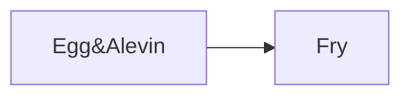

# FishTalk Batch Overview (CSV-derived)

Fish group: `Stofnfiskur Aug 2024` (InputProjectID: `AEEDBACC-168E-454E-9C7C-84FAE328D604`)

- Populations: 183
- Containers: 73
- Time span: 2024-08-08 -> 2025-12-29

## Feed / Mortality / Weight Summary

- Feed total: 320,240.4 kg
- Mortality total: 250,518
- Weight samples (AvgWeight g): n=116, min=0.0 median=4.6 max=191.2

## Stage Rollup (event coverage)

| Stage | Event count |
| --- | --- |
| Fry | 179 |
| Egg&Alevin | 5 |

## Stage Transition Diagram

## Hall Summary (ContainerGroup)

| Hall | Units | Containers | Populations | Start | End | Span days | Lifecycle stages | Feed kg | Mortality | Fish count (end) | Weight samples (n/median g) |
| --- | --- | --- | --- | --- | --- | --- | --- | --- | --- | --- | --- |
| A Høll | A01, A17, A33, A49, A65 | 5 | 5 | 2024-08-08 | 2024-10-17 | 70 | Fry | 0.0 | 41,548 | 1,586,912 | 10/0.0 |
| B Høll | B01, B02, B03, B04, B05, B06, B07, B08 | 8 | 10 | 2024-12-11 | 2025-01-26 | 45 | Fry | 2,625.8 | 34,129 | 1,210,064 | 24/3.3 |
| C Høll | C. 18, C.17, C01, C02, C03, C04, C05, C06, C07, C08, C09, C10, C11, C12, C13, C14, C15, C16 | 18 | 99 | 2025-01-24 | 2025-08-14 | 202 | Fry | 61,993.8 | 60,379 | 1,682,324 | 48/43.5 |
| D Høll | D01, D02, D03, D04 | 4 | 22 | 2025-06-10 | 2025-10-09 | 120 | Fry | 104,043.6 | 8,703 | 1,092,916 | 4/152.6 |
| E1 Høll | E01, E02, E03, E04 | 4 | 8 | 2025-08-11 | 2025-11-17 | 98 | Fry | 110,092.7 | 4,601 | 281,515 | 0/ |
| E2 Høll | E05, E06, E07, E08 | 4 | 5 | 2025-10-02 | 2025-12-29 | 88 | Fry | 40,210.2 | 1,296 | 489,535 | 0/ |
| Startfóðringshøll | I01, I02, I03, I04, I05, I06, I07, I08, I09, I10, I11, I13, I14, I15, I16, I17, I18, I19, I20, I21, I22, I23, I24, I25, I26, I27, I28, I29, I30, I31 | 30 | 34 | 2024-10-17 | 2024-12-13 | 56 | Fry | 1,274.3 | 99,862 | 1,487,236 | 30/1.3 |

## Unit Summary (Container)

| Hall | Unit | Start | End | Span days | Populations | Stage sequences | Feed kg | Mortality | Fish count (end) | Weight samples (n/median g) |
| --- | --- | --- | --- | --- | --- | --- | --- | --- | --- | --- |
| A Høll | A01 | 2024-08-08 | 2024-10-17 | 70 | 1 | Egg&Alevin -> Fry | 0.0 | 9,119 | 316,573 | 2/0.0 |
| A Høll | A17 | 2024-08-08 | 2024-10-17 | 70 | 1 | Egg&Alevin -> Fry | 0.0 | 6,607 | 319,085 | 2/0.0 |
| A Høll | A33 | 2024-08-08 | 2024-10-17 | 70 | 1 | Egg&Alevin -> Fry | 0.0 | 7,137 | 318,555 | 2/0.0 |
| A Høll | A49 | 2024-08-08 | 2024-10-17 | 70 | 1 | Egg&Alevin -> Fry | 0.0 | 6,002 | 319,690 | 2/0.0 |
| A Høll | A65 | 2024-08-08 | 2024-10-17 | 70 | 1 | Egg&Alevin -> Fry | 0.0 | 12,683 | 313,009 | 2/0.0 |
| B Høll | B01 | 2024-12-11 | 2025-01-24 | 43 | 1 | Fry | 328.3 | 2,276 | 145,660 | 3/3.9 |
| B Høll | B02 | 2024-12-11 | 2025-01-24 | 43 | 1 | Fry | 328.3 | 3,999 | 153,641 | 3/4.0 |
| B Høll | B03 | 2024-12-13 | 2025-01-25 | 42 | 1 | Fry | 328.3 | 1,724 | 155,467 | 3/3.1 |
| B Høll | B04 | 2024-12-11 | 2025-01-25 | 44 | 2 | Fry | 328.3 | 3,804 | 151,371 | 3/3.2 |
| B Høll | B05 | 2024-12-11 | 2025-01-25 | 44 | 2 | Fry | 328.3 | 1,975 | 159,312 | 3/3.3 |
| B Høll | B06 | 2024-12-13 | 2025-01-26 | 43 | 1 | Fry | 328.3 | 4,411 | 158,871 | 3/3.1 |
| B Høll | B07 | 2024-12-11 | 2025-01-26 | 45 | 1 | Fry | 328.1 | 13,581 | 130,867 | 3/4.2 |
| B Høll | B08 | 2024-12-11 | 2025-01-26 | 45 | 1 | Fry | 328.1 | 2,359 | 154,875 | 3/3.2 |
| C Høll | C. 18 | 2025-03-27 | 2025-06-17 | 81 | 4 | Fry | 2,218.8 | 5,698 | 32,479 | 2/26.4 |
| C Høll | C.17 | 2025-03-24 | 2025-06-16 | 83 | 6 | Fry | 3,525.0 | 503 | 94,318 | 3/32.2 |
| C Høll | C01 | 2025-04-30 | 2025-07-16 | 77 | 3 | Fry | 5,750.0 | 506 | 52,110 | 2/68.8 |
| C Høll | C02 | 2025-04-02 | 2025-08-14 | 134 | 10 | Fry | 7,950.0 | 3,555 | 85,552 | 7/64.9 |
| C Høll | C03 | 2025-04-30 | 2025-07-14 | 75 | 5 | Fry | 4,750.0 | 371 | 76,085 | 3/71.0 |
| C Høll | C04 | 2025-05-02 | 2025-07-07 | 65 | 3 | Fry | 3,500.0 | 1,395 | 159,851 | 2/29.5 |
| C Høll | C05 | 2025-01-25 | 2025-04-15 | 80 | 4 | Fry | 1,525.0 | 1,978 | 93,553 | 2/12.7 |
| C Høll | C06 | 2025-01-25 | 2025-05-01 | 96 | 4 | Fry | 2,150.0 | 505 | 81,387 | 2/22.0 |
| C Høll | C07 | 2025-01-26 | 2025-04-30 | 94 | 3 | Fry | 2,325.0 | 609 | 90,692 | 2/19.8 |
| C Høll | C08 | 2025-01-24 | 2025-04-14 | 80 | 4 | Fry | 1,825.0 | 4,863 | 108,916 | 2/10.9 |
| C Høll | C09 | 2025-05-01 | 2025-07-17 | 77 | 14 | Fry | 1,825.0 | 725 | 32,958 | 2/62.6 |
| C Høll | C10 | 2025-05-12 | 2025-08-08 | 87 | 12 | Fry | 4,250.0 | 2,268 | 0 | 5/59.7 |
| C Høll | C11 | 2025-03-27 | 2025-07-17 | 111 | 6 | Fry | 7,250.0 | 687 | 51,856 | 4/66.7 |
| C Høll | C12 | 2025-03-24 | 2025-07-07 | 104 | 7 | Fry | 7,500.0 | 3,435 | 126,560 | 4/54.8 |
| C Høll | C13 | 2025-01-24 | 2025-05-03 | 99 | 7 | Fry | 1,487.5 | 984 | 113,474 | 2/13.5 |
| C Høll | C14 | 2025-01-24 | 2025-05-03 | 99 | 3 | Fry | 1,437.5 | 20,401 | 94,262 | 2/10.4 |
| C Høll | C15 | 2025-01-25 | 2025-04-02 | 67 | 2 | Fry | 1,437.5 | 11,533 | 248,846 | 1/10.8 |
| C Høll | C16 | 2025-01-25 | 2025-04-02 | 67 | 2 | Fry | 1,287.5 | 363 | 139,425 | 1/16.1 |
| D Høll | D01 | 2025-06-30 | 2025-09-09 | 71 | 4 | Fry | 28,578.4 | 2,125 | 298,936 | 1/147.3 |
| D Høll | D02 | 2025-06-10 | 2025-08-11 | 61 | 7 | Fry | 18,534.9 | 2,451 | 303,184 | 1/121.6 |
| D Høll | D03 | 2025-07-14 | 2025-10-02 | 79 | 8 | Fry | 40,588.0 | 3,368 | 327,277 | 1/191.2 |
| D Høll | D04 | 2025-08-04 | 2025-10-09 | 66 | 3 | Fry | 16,342.3 | 759 | 163,519 | 1/157.8 |
| E1 Høll | E01 | 2025-09-09 | 2025-11-14 | 66 | 1 | Fry | 23,284.5 | 2,027 | 143,164 | 0/ |
| E1 Høll | E02 | 2025-08-11 | 2025-11-15 | 96 | 1 | Fry | 35,836.0 | 1,042 | 138,351 | 0/ |
| E1 Høll | E03 | 2025-09-09 | 2025-11-16 | 67 | 3 | Fry | 15,156.6 | 896 |  | 0/ |
| E1 Høll | E04 | 2025-08-11 | 2025-11-17 | 98 | 3 | Fry | 35,815.6 | 636 |  | 0/ |
| E2 Høll | E05 | 2025-10-02 | 2025-12-12 | 70 | 1 | Fry | 8,828.2 | 417 | 101,429 | 0/ |
| E2 Høll | E06 | 2025-10-02 | 2025-12-11 | 69 | 1 | Fry | 12,909.2 | 291 | 101,134 | 0/ |
| E2 Høll | E07 | 2025-10-09 | 2025-12-28 | 79 | 1 | Fry | 8,935.8 | 309 | 143,120 | 0/ |
| E2 Høll | E08 | 2025-10-02 | 2025-12-29 | 88 | 2 | Fry | 9,537.0 | 279 | 143,852 | 0/ |
| Startfóðringshøll | I01 | 2024-10-17 | 2024-12-11 | 54 | 1 | Fry | 33.7 | 3,083 | 36,804 | 1/1.4 |
| Startfóðringshøll | I02 | 2024-10-17 | 2024-12-11 | 54 | 1 | Fry | 33.7 | 748 | 39,142 | 1/1.3 |
| Startfóðringshøll | I03 | 2024-10-17 | 2024-12-11 | 54 | 1 | Fry | 33.7 | 831 | 39,063 | 1/1.3 |
| Startfóðringshøll | I04 | 2024-10-17 | 2024-12-11 | 54 | 1 | Fry | 33.7 | 941 | 38,948 | 1/1.3 |
| Startfóðringshøll | I05 | 2024-10-17 | 2024-12-11 | 54 | 1 | Fry | 33.7 | 960 | 38,932 | 1/1.3 |
| Startfóðringshøll | I06 | 2024-10-17 | 2024-12-11 | 54 | 1 | Fry | 33.7 | 1,039 | 38,789 | 1/1.3 |
| Startfóðringshøll | I07 | 2024-10-17 | 2024-12-11 | 54 | 1 | Fry | 33.7 | 2,559 | 37,262 | 1/1.4 |
| Startfóðringshøll | I08 | 2024-10-17 | 2024-12-11 | 54 | 1 | Fry | 33.7 | 2,965 | 36,855 | 1/1.4 |
| Startfóðringshøll | I09 | 2024-10-17 | 2024-12-11 | 54 | 1 | Fry | 33.7 | 1,234 | 38,587 | 1/1.3 |
| Startfóðringshøll | I10 | 2024-10-17 | 2024-12-11 | 54 | 1 | Fry | 33.7 | 1,780 | 38,042 | 1/1.3 |
| Startfóðringshøll | I11 | 2024-10-17 | 2024-12-11 | 54 | 1 | Fry | 33.7 | 1,574 | 38,248 | 1/1.3 |
| Startfóðringshøll | I13 | 2024-10-17 | 2024-12-11 | 54 | 1 | Fry | 33.7 | 908 | 38,666 | 1/1.3 |
| Startfóðringshøll | I14 | 2024-10-17 | 2024-12-11 | 54 | 1 | Fry | 33.7 | 1,238 | 38,336 | 1/1.3 |
| Startfóðringshøll | I15 | 2024-10-17 | 2024-12-11 | 54 | 1 | Fry | 33.7 | 1,513 | 38,062 | 1/1.3 |
| Startfóðringshøll | I16 | 2024-10-17 | 2024-12-11 | 54 | 1 | Fry | 33.7 | 986 | 38,591 | 1/1.3 |
| Startfóðringshøll | I17 | 2024-10-17 | 2024-12-11 | 54 | 1 | Fry | 33.7 | 905 | 38,670 | 1/1.3 |
| Startfóðringshøll | I18 | 2024-10-17 | 2024-12-11 | 54 | 1 | Fry | 33.7 | 1,162 | 38,413 | 1/1.3 |
| Startfóðringshøll | I19 | 2024-10-17 | 2024-12-11 | 54 | 1 | Fry | 32.7 | 1,246 | 38,327 | 1/1.3 |
| Startfóðringshøll | I20 | 2024-10-17 | 2024-12-11 | 54 | 1 | Fry | 33.7 | 1,108 | 38,464 | 1/1.3 |
| Startfóðringshøll | I21 | 2024-10-17 | 2024-12-11 | 54 | 1 | Fry | 33.7 | 811 | 39,076 | 1/1.3 |
| Startfóðringshøll | I22 | 2024-10-17 | 2024-12-11 | 54 | 1 | Fry | 33.7 | 2,335 | 37,558 | 1/1.4 |
| Startfóðringshøll | I23 | 2024-10-17 | 2024-12-11 | 54 | 1 | Fry | 34.0 | 2,892 | 37,010 | 1/1.4 |
| Startfóðringshøll | I24 | 2024-10-17 | 2024-12-13 | 56 | 2 | Fry | 66.7 | 6,616 | 93,232 | 1/1.1 |
| Startfóðringshøll | I25 | 2024-10-17 | 2024-12-13 | 56 | 2 | Fry | 66.7 | 8,328 | 91,522 | 1/1.1 |
| Startfóðringshøll | I26 | 2024-10-17 | 2024-12-13 | 56 | 2 | Fry | 66.7 | 8,559 | 91,281 | 1/1.1 |
| Startfóðringshøll | I27 | 2024-10-17 | 2024-12-13 | 56 | 2 | Fry | 66.7 | 10,363 | 89,504 | 1/1.1 |
| Startfóðringshøll | I28 | 2024-10-17 | 2024-12-13 | 56 | 1 | Fry | 66.7 | 8,853 | 69,406 | 1/1.4 |
| Startfóðringshøll | I29 | 2024-10-17 | 2024-12-13 | 56 | 1 | Fry | 66.7 | 7,647 | 70,611 | 1/1.4 |
| Startfóðringshøll | I30 | 2024-10-17 | 2024-12-13 | 56 | 1 | Fry | 66.8 | 9,593 | 68,664 | 1/1.4 |
| Startfóðringshøll | I31 | 2024-10-17 | 2024-12-13 | 56 | 1 | Fry | 66.8 | 7,085 | 71,171 | 1/1.4 |

## Data Gaps / Notes

- Timeline windows use `Ext_Populations_v2.StartTime/EndTime`; EndTime gaps are inferred from the next container/group start or SubTransfers.
- FishTalk stage tables only record Egg/Alevin and Fry for this fish group; no Parr/Smolt/Post‑Smolt/Adult stage entries are present.
- 40 populations have no stage events; later stages are not recorded in PopulationProductionStages for this fish group.
- Detailed rows: `population_segments.csv`, `container_durations.csv`, `stage_timeline.csv`, `hall_summary.csv`.
