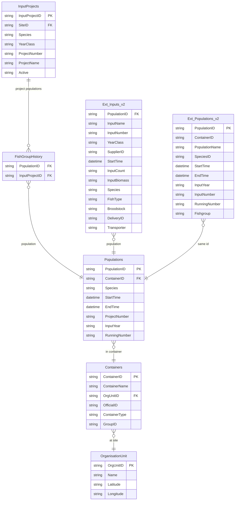
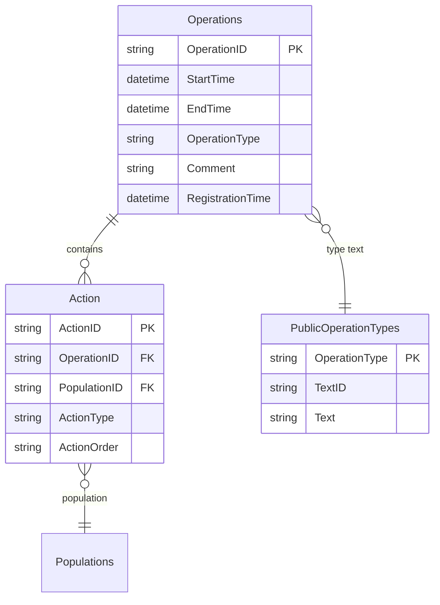
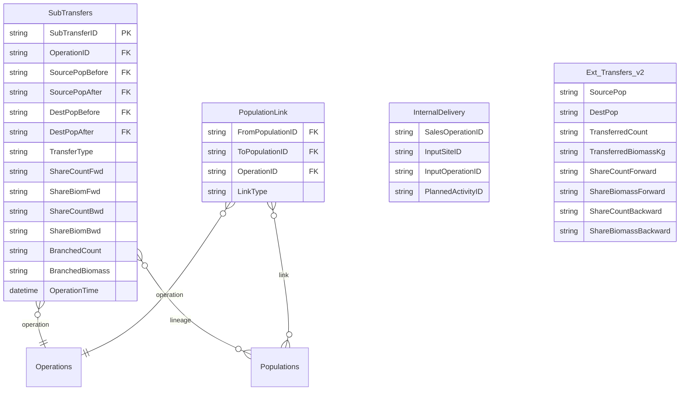
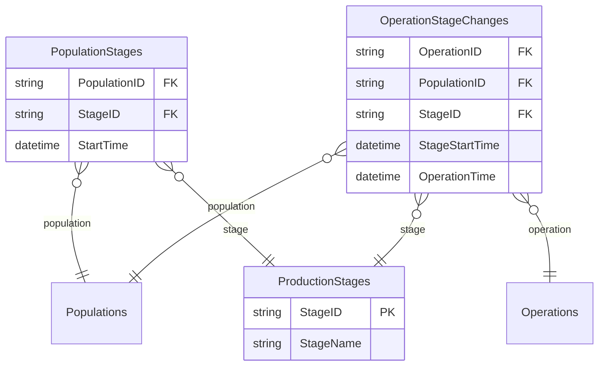
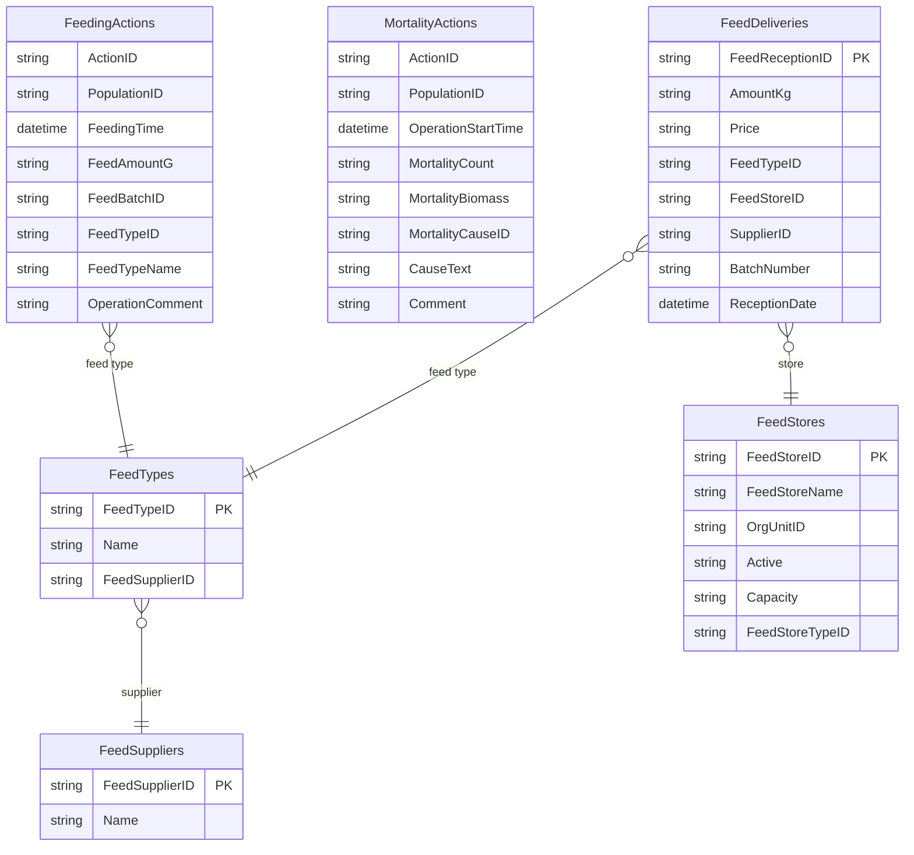
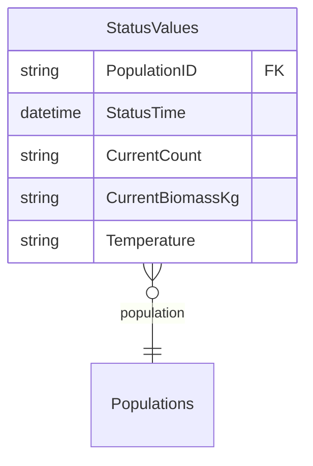
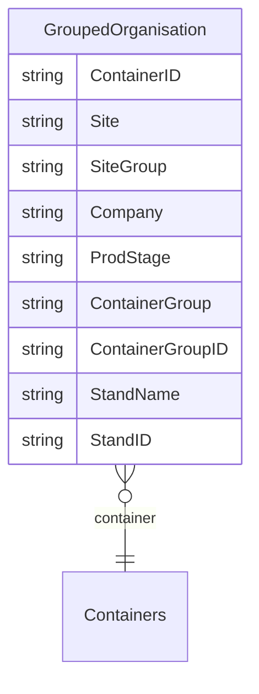
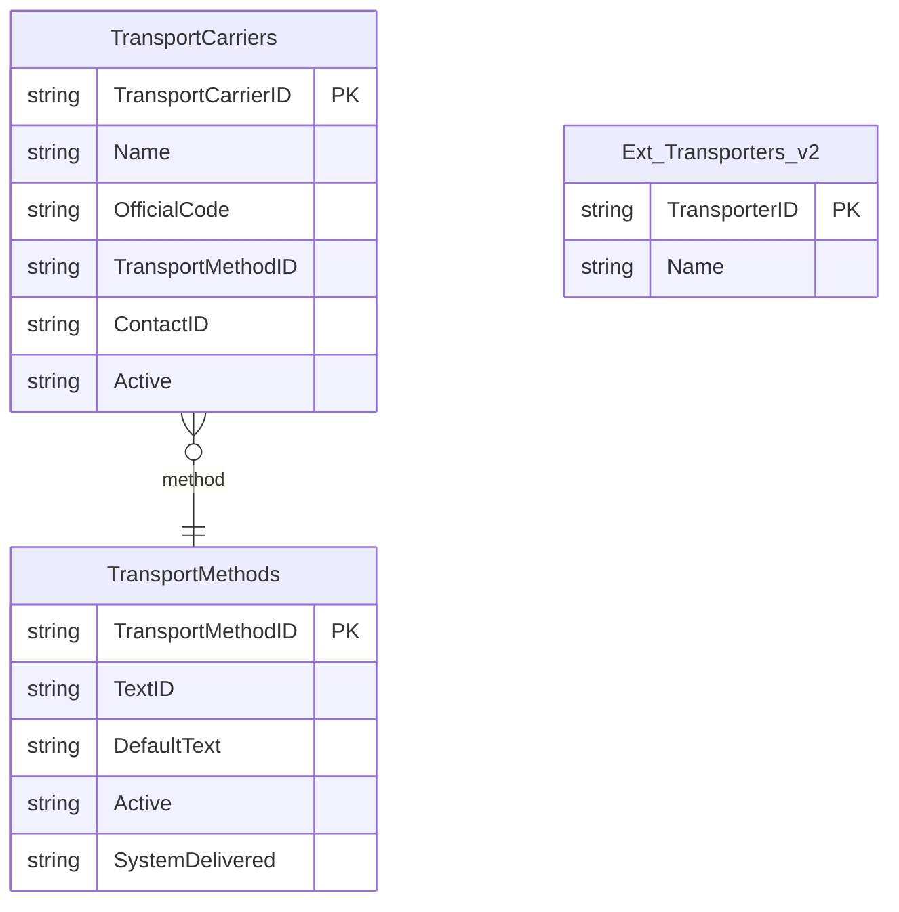

# FishTalk Database ERD (Extract-Verified)

Last verified: 2026-02-04
Source: CSV extracts under `scripts/migration/data/extract/`
Scope: Only columns and relationships present in extracts. This is a partial view.

For broader schema notes and caveats, see `FISHTALK_SCHEMA_ANALYSIS.md`.

---

## 1. Core Entities (Input Projects -> Populations -> Containers)

Notes
- `Ext_Populations_v2` is a reporting view used for display names and fish group fields. Join on `PopulationID`.
- `Ext_Inputs_v2` is the main input batch feed (InputName/InputNumber/YearClass) and anchors a population.

---

## 2. Operations and Actions (Event Log Core)

Notes
- `ActionType` is the best available discriminator for domain tables (Feeding, Mortality, Treatment, etc).
- `OperationType` is a broader category (Transfer/Input/Harvest). See `public_operation_types.csv` and the mapping report in `analysis_reports/2026-02-04/`.

---

## 3. Transfers and Lineage

Notes
- `SubTransfers` is the canonical movement lineage table in extracts.
- `Ext_Transfers_v2` is a reporting extract without `OperationID` and should be treated as supplemental.
- `InternalDelivery` links sales and input operations but lacks unit-level details in current extracts.

---

## 4. Stage Events

---

## 5. Event Extracts (Feeding and Mortality)

These are derived extracts that already join Actions and Operations. They are not raw FishTalk tables.

---

## 6. Status Snapshots

---

## 7. Organization Views (Reporting)

---

## 8. Transport References

Notes
- These tables are reference data for carrier/method names. They are not yet linked to population movement in extracts.

