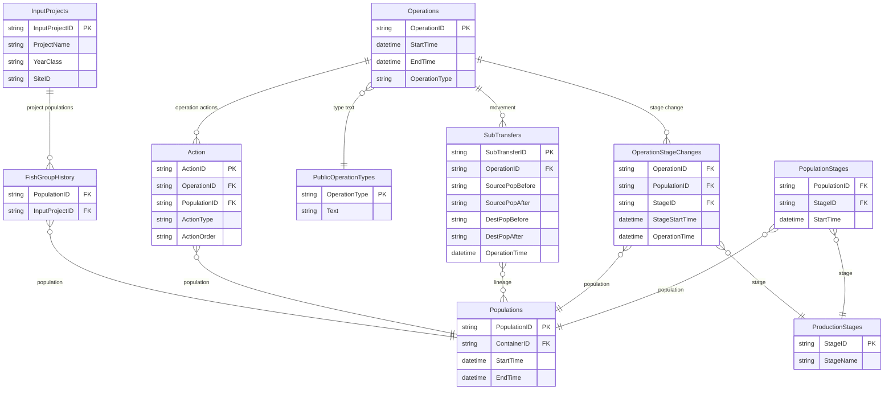

# FishTalk Event Flow ERD (Evidence-Based)

Last verified: 2026-02-04
Source: CSV extracts under `scripts/migration/data/extract/` plus targeted Action sampling.
Scope: This is a working replay model based on verified joins. It is not a full schema.

---

## 1. Working Model Summary

- Operations + Action + domain tables behave like an event log for many domains.
- ActionType identifies the domain table (Feeding, Mortality, Treatment, etc).
- OperationType is a broader category (Input, Transfer, Harvest).
- SubTransfers captures population lineage across transfers.
- Stage changes are captured in OperationStageChanges or PopulationStages.
- Some domains are not Action-linked yet (weight samples, lice samples).

---

## 2. Core Event Graph (Verified Joins)

---

## 3. ActionType Mapping (Empirical Sample)

Source: `analysis_reports/2026-02-04/action_type_mapping_2026-02-04.md`

| ActionType | Domain table (sampled) | Notes |
|---|---|---|
| 3 | Mortality | Stable in samples |
| 5 | Feeding | Stable in samples |
| 16 | Culling | Stable in samples |
| 18 | Escapes | Low sample count |
| 21 | Treatment | Also seen as 22 and 58 |
| 22 | Treatment | Low sample count |
| 30 | HistoricalSpawning | Stable in samples |
| 31 | HistoricalHatching | Stable in samples |
| 32 | HistoricalStartFeeding | Low sample count |
| 46 | SpawningSelection | Stable in samples |
| 53 | HarvestResult | Stable in samples |
| 54 | UserSample, UserSampleParameterValue, UserSampleTypes | Shared ActionType |
| 58 | Treatment | Alternate ActionType |

Notes
- This is a sampled mapping, not exhaustive. Use as a guide for replay categorization.

---

## 4. OperationType Mapping (Empirical Sample)

Source: `analysis_reports/2026-02-04/operation_type_mapping_2026-02-04.md`

| OperationType | Observed tables | Notes |
|---|---|---|
| 1 | SubTransfers, PublicTransfers | Transfer |
| 5 | PopulationLink, OperationStageChanges, SubTransfers | Input |
| 7 | PopulationLink | Sale |
| 8 | SubTransfers, PublicTransfers | Harvest |
| 22 | OperationStageChanges | Hatching |
| 31 | SubTransfers, PublicTransfers | Many to many transfer |

Notes
- `PublicOperationTypes` provides the authoritative text name.
- `ext_weight_samples_v2.csv` includes OperationType values but no OperationID.

---

## 5. Replay Ordering (MVP)

Suggested ordering when replaying a single fish group:

1. Resolve populations from `InputProjects` + `FishGroupHistory` or `Ext_Inputs_v2`.
2. Build a movement lineage using `SubTransfers` ordered by `OperationTime`.
3. Merge stage events from `OperationStageChanges` and `PopulationStages`.
4. Attach event rows from Action-linked domain tables (Feeding, Mortality, Treatment, Culling, etc) using `ActionType`.
5. Use `Operations.StartTime` for event ordering when Action records are present.

---

## 6. Known Gaps (Not Yet Action-Linked)

- Weight samples: `ext_weight_samples_v2.csv` has OperationType but no ActionID or OperationID.
- Lice samples: `PublicLiceSamples` and `PublicLiceSampleData` exist, but Action/Operation linkage is not yet confirmed.
- Transport and internal delivery chain tables are not yet linked to movement lineage in extracts.

---

## 7. Cautions

- Do not assume OperationType equals event domain. Use ActionType for domain tables.
- Do not infer missing links. Only document joins that are verified by foreign keys or shared IDs in extracts.

