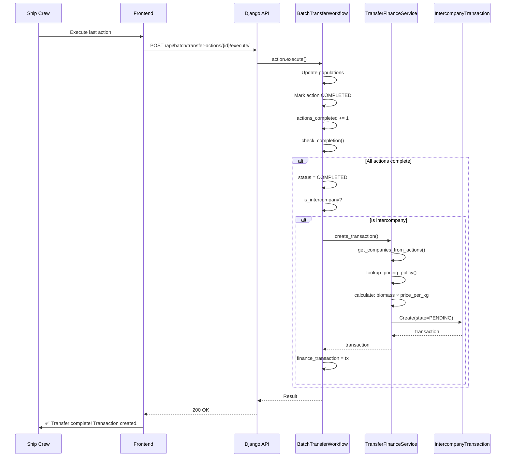
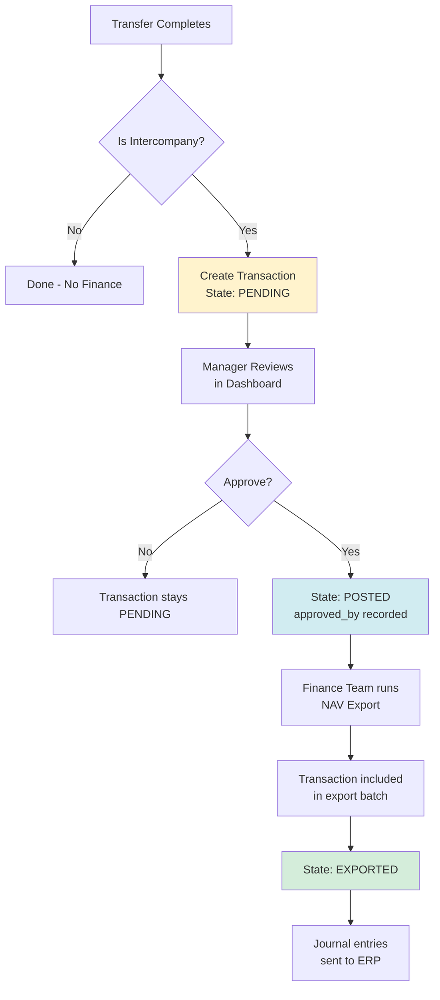

# Transfer Workflow & Finance Integration - User Guide

**Version**: 1.0  
**Last Updated**: October 20, 2024  
**Audience**: Freshwater Managers, Ship Crew, Farming Managers, Finance Team

---

## 📖 Table of Contents

1. [Overview](#overview)
2. [When Finance Transactions Are Created](#when-finance-transactions-are-created)
3. [User Workflows](#user-workflows)
4. [System Workflows](#system-workflows)
5. [API Reference](#api-reference)
6. [Troubleshooting](#troubleshooting)

---

## Overview

The Transfer Workflow system manages multi-step batch transfers that can span days or weeks. When transfers cross subsidiary boundaries (intercompany transfers), the system automatically creates financial transactions that require manager approval.

### Key Capabilities

✅ **Multi-day Operations** - Plan and execute transfers over days or weeks  
✅ **Progress Tracking** - Real-time visibility into completion status  
✅ **Mobile Execution** - Ship crew can execute actions from tablets/phones  
✅ **Finance Automation** - Auto-creates intercompany transactions  
✅ **Approval Workflow** - Manager approval before accounting export  
✅ **Multi-Currency** - Supports DKK, GBP, NOK, ISK, EUR

---

## When Finance Transactions Are Created

### ✅ Intercompany Transfers (Create Transactions)

Only **TWO** transfer scenarios create financial transactions:

#### 1. **Freshwater → Farming** (Post-Smolt Transfer to Sea)
```
Source: Post-Smolt tanks (Freshwater subsidiary)
Destination: Adult sea rings/pens (Farming subsidiary)
Pricing: Lifecycle-based (€/kg by stage)
Example: 1,250 kg × 168 NOK/kg = 210,000 NOK
```

#### 2. **Farming → Harvest** (Harvest Event)
```
Source: Adult sea rings (Farming subsidiary)
Destination: Processing (Harvest subsidiary)
Pricing: Grade-based (Superior, Standard, etc.)
Example: 5,000 kg × Market Price
```

### ❌ Internal Transfers (No Transactions)

These transfers **do NOT** create financial transactions:

- Egg → Alevin (Freshwater internal)
- Alevin → Fry (Freshwater internal)
- Fry → Parr (Freshwater internal)  
- Parr → Smolt (Freshwater internal)
- Smolt → Post-Smolt (Freshwater internal)
- Any redistribution within same subsidiary

---

## User Workflows

### Workflow 1: Plan Multi-Day Transfer (Freshwater Manager)

**Scenario**: Transfer 10 Post-Smolt tanks to sea over 2 weeks

**Steps**:

1. **Navigate** to batch detail page
2. **Click** "Transfer Workflows" tab or sidebar link
3. **View** existing workflows or click "Create New"
4. **Select** workflow type: "Lifecycle Transition"
5. **Choose** source stage: Post-Smolt → dest stage: Adult
6. **Set** planned start date: October 20, 2024
7. **System** creates workflow in DRAFT status
8. **Add Actions** (can add later or now):
   - Source: Tank PS-01 → Dest: Ring A-15 (500 fish, 25 kg)
   - Source: Tank PS-02 → Dest: Ring A-16 (480 fish, 24 kg)
   - ...repeat for all 10 tanks
9. **Review** summary:
   - Total: 10 actions, 5,000 fish, 250 kg
   - Status: Intercompany detected ⚠️
   - Estimated value: 42,000 NOK
10. **Click** "Plan Workflow"
11. **Result**: Workflow → PLANNED status, ready for execution

---

### Workflow 2: Execute Transfer Action (Ship Crew - Mobile)

**Scenario**: Execute transfer from Post-Smolt tank to sea ring during voyage

**Steps**:

1. **Open** AquaMind app on tablet/phone
2. **Navigate** to Transfer Workflows
3. **Find** workflow TRF-2024-042 (or from push notification)
4. **View** pending actions list
5. **Click** "Execute" on Action #5
6. **Dialog opens** with transfer details:
   - From: Tank PS-05 (500 fish, 25 kg)
   - To: Ring A-19 (currently empty)
7. **Fill in** execution details:
   - Mortality: 8 fish
   - Transfer method: NET
   - Water temp: 12.5°C
   - O₂ level: 9.2 mg/L
   - Duration: 45 minutes
   - Notes: "Good conditions, fish adapting well"
8. **Click** "Execute Transfer"
9. **System**:
   - Reduces source tank: 500 → 492 fish (8 mortality)
   - Increases dest ring: 0 → 492 fish
   - Marks action: COMPLETED
   - Updates workflow: Progress 5/10 (50%)
   - If last action: Auto-completes workflow
10. **Result**: Action completed, progress updated

---

### Workflow 3: Approve Finance Transaction (Farming Manager)

**Scenario**: Approve intercompany transaction after Post-Smolt transfer completes

**Steps**:

1. **Navigate** to Transfer Workflows or Finance Dashboard
2. **Click** "Pending Approvals" (badge shows count)
3. **View** pending transaction:
   - Workflow: TRF-2024-042
   - From: Norway Freshwater → Norway Farming
   - Biomass: 1,250 kg
   - Amount: 210,000 NOK (@ 168 NOK/kg)
   - Status: PENDING
4. **Review** details:
   - Click "View Workflow Details" to see transfer actions
   - Verify biomass calculation is correct
   - Check pricing policy (Post-Smolt: 168 NOK/kg)
5. **Click** "Approve Transaction"
6. **System**:
   - State: PENDING → POSTED
   - Records: approved_by = Your User ID
   - Records: approval_date = now()
7. **Result**: Transaction approved, ready for NAV export

---

## System Workflows

### System Workflow 1: Complete Transfer with Finance



---

### System Workflow 2: Approval to NAV Export



---

## API Reference

### Backend Endpoints

#### **Workflows**

```http
# List workflows
GET /api/v1/batch/transfer-workflows/
  ?status=IN_PROGRESS
  &workflow_type=LIFECYCLE_TRANSITION
  &batch=206
  &is_intercompany=true

# Get workflow detail
GET /api/v1/batch/transfer-workflows/{id}/

# Create workflow
POST /api/v1/batch/transfer-workflows/
{
  "batch": 206,
  "workflow_type": "LIFECYCLE_TRANSITION",
  "source_lifecycle_stage": 6,
  "dest_lifecycle_stage": 7,
  "planned_start_date": "2024-10-20"
}

# Plan workflow (DRAFT → PLANNED)
POST /api/v1/batch/transfer-workflows/{id}/plan/

# Cancel workflow
POST /api/v1/batch/transfer-workflows/{id}/cancel/
{
  "cancellation_reason": "Weather conditions unsafe"
}
```

#### **Actions**

```http
# List actions for workflow
GET /api/v1/batch/transfer-actions/
  ?workflow=42
  &status=PENDING

# Get action detail
GET /api/v1/batch/transfer-actions/{id}/

# Execute action
POST /api/v1/batch/transfer-actions/{id}/execute/
{
  "mortality_during_transfer": 8,
  "transfer_method": "NET",
  "water_temp_c": "12.5",
  "oxygen_level": "9.2",
  "execution_duration_minutes": 45,
  "notes": "Good conditions"
}

# Skip action
POST /api/v1/batch/transfer-actions/{id}/skip/
{
  "reason": "Weather delay, rescheduling"
}
```

#### **Finance Approval**

```http
# List pending approvals
GET /api/v1/finance/intercompany-transactions/pending-approvals/

# Approve transaction
POST /api/v1/finance/intercompany-transactions/{tx_id}/approve/

Response:
{
  "message": "Transaction approved successfully",
  "transaction": {
    "tx_id": 123,
    "state": "posted",
    "amount": "210000.00",
    "currency": "NOK",
    "approved_by": 5,
    "approval_date": "2024-10-20T14:30:00Z"
  }
}
```

---

### Frontend Pages

```
/transfer-workflows              - Workflow list (filterable)
/transfer-workflows/{id}         - Workflow detail & execution
/finance/approvals               - Pending transaction approvals
```

---

## Pricing Configuration

### Lifecycle-Based Pricing Policies

Configured in Django Admin: **Finance → Intercompany Policies**

**Post-Smolt Transfer Pricing** (Freshwater → Farming):

| Geography | Lifecycle Stage | Price/kg | Currency |
|-----------|----------------|----------|----------|
| Norway | Parr | 95.00 | NOK |
| Norway | Smolt | 140.00 | NOK |
| Norway | Post-Smolt | 168.00 | NOK |
| Scotland | Parr | 7.50 | GBP |
| Scotland | Smolt | 11.00 | GBP |
| Scotland | Post-Smolt | 13.00 | GBP |
| Denmark/Faroe | Parr | 63.00 | DKK |
| Denmark/Faroe | Smolt | 93.00 | DKK |
| Denmark/Faroe | Post-Smolt | 112.00 | DKK |

**Note**: These are placeholder prices. Adjust in admin interface to reflect actual transfer pricing policies.

---

## State Machines

### Workflow States

```
DRAFT (Planning)
  ↓ plan_workflow()
PLANNED (Ready to Execute)
  ↓ execute first action
IN_PROGRESS (Partially Executed)
  ↓ execute last action
COMPLETED (All Actions Done)
```

**Alternative Paths**:
- DRAFT/PLANNED/IN_PROGRESS → cancel_workflow() → CANCELLED

### Action States

```
PENDING (Not Started)
  ↓ execute()
IN_PROGRESS (Executing)
  ↓ success
COMPLETED (Done)
```

**Alternative Paths**:
- PENDING → skip() → SKIPPED
- IN_PROGRESS → validation error → FAILED
- FAILED → retry() → PENDING

### Transaction States

```
PENDING (Awaiting Approval)
  ↓ approve()
POSTED (Approved)
  ↓ NAV export
EXPORTED (Sent to ERP)
```

---

## Example: Complete End-to-End Flow

### Day 1 - Planning (Freshwater Manager - Desktop)

**9:00 AM** - Create workflow TRF-2024-042
- Batch: SCO-2024-001 (Atlantic Salmon, 5,000 fish)
- Type: Lifecycle Transition (Post-Smolt → Adult)
- Source: 10 Post-Smolt tanks at Norway Freshwater
- Destination: 12 sea rings at Norway Farming
- Planned: Oct 20 - Nov 3 (2 weeks)
- Status: DRAFT

**10:30 AM** - Add 10 transfer actions
- PS-01 → Ring-A15: 500 fish, 25 kg
- PS-02 → Ring-A16: 480 fish, 24 kg
- ...8 more actions
- Total: 5,000 fish, 250 kg

**11:00 AM** - Plan workflow
- System detects: Intercompany (Freshwater → Farming)
- Estimated value: 42,000 NOK (250 kg × 168 NOK/kg)
- Status: PLANNED → ready for execution

---

### Days 1-14 - Execution (Ship Crew - Mobile)

**Day 1 (Oct 20) - 14:00**
- Ship arrives at first sea ring location
- Crew opens workflow on tablet
- Executes Action #1: PS-01 → Ring-A15
  - Mortality: 5 fish
  - Method: NET
  - Temp: 12.5°C, O₂: 9.2 mg/L
  - Duration: 45 minutes
  - Notes: "Smooth transfer, fish active"
- Result: Status → IN_PROGRESS (10% complete)

**Day 3 (Oct 22) - 09:30**
- Execute Action #2: PS-02 → Ring-A16
- Result: Progress 2/10 (20%)

**Days 4-13**
- Execute actions #3-#9 gradually
- Progress: 30%, 40%, 50%, 60%, 70%, 80%, 90%

**Day 14 (Nov 3) - 11:15**
- Execute Action #10 (last one): PS-10 → Ring-A24
- Result: **Workflow AUTO-COMPLETES** ✅
- System creates IntercompanyTransaction:
  - tx_id: 456
  - Amount: 42,000 NOK (actual biomass transferred)
  - State: PENDING
  - Policy: Norway FW → Norway FM (Post-Smolt)

---

### Day 14 - Approval (Farming Manager - Desktop)

**15:00 PM** - Review pending transaction
- Navigate to "Pending Approvals" (shows badge: 1 pending)
- View transaction details:
  - Source Workflow: TRF-2024-042
  - Biomass: 1,250 kg (actual, includes mortality)
  - Amount: 210,000 NOK
  - Price: 168 NOK/kg
  - Lifecycle: Post-Smolt
- Verify accuracy by viewing workflow details
- Click "Approve Transaction"
- Result: State → POSTED ✅

---

### Week After - NAV Export (Finance Team)

**Next Monday** - Export to accounting system
- Finance team runs NAV export batch
- Selects: Norway Farming, Oct 1-31
- System includes transaction #456
- Creates journal entries:
  - Debit: Biological Assets (Farming)
  - Credit: Intercompany Payable (Freshwater)
  - Amount: 210,000 NOK
- Transaction state: POSTED → EXPORTED
- CSV exported to ERP system

---

## UI Walkthrough

### Transfer Workflows Page

```
┌────────────────────────────────────────────────────────────┐
│  Transfer Workflows                        [View Batches]  │
│  Manage multi-step batch transfer operations               │
├────────────────────────────────────────────────────────────┤
│  Filters:                                                   │
│  Status: [All] Type: [All] Batch: [____]                  │
├────────────────────────────────────────────────────────────┤
│  Workflows (25 total)                                       │
│                                                              │
│  # │ Batch │ Type │ Status │ Progress │ Started │ Actions  │
│  ──┼───────┼──────┼────────┼──────────┼─────────┼─────────│
│  TRF-2024-042 │ SCO-001 │ Lifecycle │ IN_PROGRESS│         │
│                                  [●●●●●○○○○○] 50%           │
│                                  5/10    Oct 20   [View]   │
│  ──┼───────┼──────┼────────┼──────────┼─────────┼─────────│
│  TRF-2024-041 │ NOR-123 │ Redistribution │ COMPLETED│      │
│                                  [●●●●●●●●●●] 100%          │
│                                  8/8     Oct 15   [View]   │
└────────────────────────────────────────────────────────────┘
```

---

### Workflow Detail Page

```
┌────────────────────────────────────────────────────────────┐
│  ← TRF-2024-042 [IN_PROGRESS] [IC]        [Cancel]        │
│  SCO-2024-001 • Lifecycle Stage Transition                 │
├────────────────────────────────────────────────────────────┤
│  Progress Overview                                          │
│  Actions Completed: 5 / 10 (50.0%)                         │
│  [●●●●●○○○○○○○○○○○○○○○] 50%                               │
│                                                              │
│  Total Transferred │ Total Biomass │ Mortality │ Days      │
│  2,450            │ 122.5 kg      │ 25        │ 5 days    │
├────────────────────────────────────────────────────────────┤
│  Timeline                                                   │
│  Planned Start: Oct 20 │ Actual Start: Oct 20               │
│  Completion: Nov 3                                          │
├────────────────────────────────────────────────────────────┤
│  💰 Intercompany Transaction                               │
│  Norway Freshwater → Norway Farming                        │
│  Transaction will be created when all actions complete.     │
├────────────────────────────────────────────────────────────┤
│  Transfer Actions                                           │
│  # │ Status │ Source │ Dest │ Count │ Biomass │ Executed  │
│  1 │ ✅ COMPLETED │ PS-01 │ A-15 │ 495 │ 24.75kg │ Oct 20 │
│  2 │ ✅ COMPLETED │ PS-02 │ A-16 │ 475 │ 23.75kg │ Oct 22 │
│  3-5 │ ✅ ...                                               │
│  6 │ ⏳ PENDING │ PS-06 │ A-20 │ 500 │ 25.00kg │ — [Execute]│
│  7-10 │ ⏳ ...                                              │
└────────────────────────────────────────────────────────────┘
```

---

### Execute Action Dialog (Mobile)

```
┌──────────────────────────────────────────┐
│  Execute Transfer Action #6              │
│  Workflow: TRF-2024-042                  │
├──────────────────────────────────────────┤
│  ┌──────────────┐  ┌──────────────────┐ │
│  │ FROM         │  │ TO               │ │
│  │ Tank PS-06   │  │ Ring A-20        │ │
│  │ 500 fish     │  │ Empty            │ │
│  │ 25.00 kg     │  │ Cap: 1,000 fish  │ │
│  └──────────────┘  └──────────────────┘ │
│           ⬇️                             │
│  Transferring 500 fish (25.00 kg)        │
├──────────────────────────────────────────┤
│  Mortality During Transfer:              │
│  [8] fish                                │
│                                          │
│  Transfer Method:                        │
│  [NET ▼]                                 │
│                                          │
│  Water Temp (°C)  │  O₂ Level (mg/L)   │
│  [12.5]          │  [9.2]             │
│                                          │
│  Duration (minutes):                     │
│  [45]                                    │
│                                          │
│  Notes (Optional):                       │
│  [Conditions good, minimal stress...]    │
├──────────────────────────────────────────┤
│  [Cancel]    [Execute Transfer] ✅       │
└──────────────────────────────────────────┘
```

---

## Troubleshooting

### Problem: Workflow won't plan

**Symptom**: "Cannot plan workflow" error

**Solutions**:
- ✅ Ensure at least one action is added
- ✅ Verify workflow is in DRAFT status
- ✅ Check all action fields are filled

---

### Problem: Can't execute action

**Symptom**: Execute button disabled or error

**Solutions**:
- ✅ Workflow must be in PLANNED or IN_PROGRESS status
- ✅ Action must be in PENDING status
- ✅ Check source container has sufficient fish
- ✅ Verify mortality + transferred count ≤ source population

---

### Problem: Finance transaction not created

**Symptom**: Workflow completed but no transaction

**Possible Causes**:
1. **Not intercompany**: Transfer within same subsidiary
2. **Missing pricing policy**: No policy configured for lifecycle stage
3. **Error logged**: Check Django logs for TransferFinanceError

**Solutions**:
- ✅ Verify source and dest containers are in different subsidiaries
- ✅ Check pricing policy exists in admin
- ✅ Review logs: `grep "TransferFinanceError" logs/`
- ✅ Create transaction manually in admin if needed

---

### Problem: Can't approve transaction

**Symptom**: Approve button missing or error

**Solutions**:
- ✅ Must be Finance Manager role
- ✅ Transaction must be in PENDING state
- ✅ Check user permissions in admin

---

## Admin Tasks

### Seed Pricing Policies (One-Time Setup)

```bash
# Dry run to preview
python manage.py seed_smolt_policies --dry-run

# Actually create policies
python manage.py seed_smolt_policies
```

**Output Example**:
```
Processing geography: Norway
  ✓ Created: Norway Freshwater → Norway Farming (Parr) @ kr95.00/kg (NOK)
  ✓ Created: Norway Freshwater → Norway Farming (Smolt) @ kr140.00/kg (NOK)
  ✓ Created: Norway Freshwater → Norway Farming (Post-Smolt) @ kr168.00/kg (NOK)

Successfully created 3 intercompany pricing policies
```

---

### Adjust Pricing (Ongoing)

**Django Admin** → Finance → Intercompany Policies

1. Find policy: Norway Freshwater → Norway Farming (Post-Smolt)
2. Edit `price_per_kg` field
3. Save
4. Future transfers will use new price

---

### Manual Transaction Creation (Emergency)

If automatic creation fails:

**Django Admin** → Finance → Intercompany Transactions

1. Click "Add Intercompany Transaction"
2. Select content type: "batch transfer workflow"
3. Enter object ID: (workflow ID)
4. Select policy
5. Enter amount manually
6. Set state: PENDING
7. Save
8. Manager can approve as normal

---

## Best Practices

### ✅ Do's

- **Plan ahead**: Create workflows in advance for scheduling
- **Execute promptly**: Complete actions on planned dates when possible
- **Record details**: Fill in environmental conditions and notes
- **Review before approve**: Verify biomass and pricing before approving
- **Use mobile**: Execute actions from tablets during transport

### ❌ Don'ts

- **Don't skip validation**: All fields are important for audit trail
- **Don't execute without data**: Record actual mortality and conditions
- **Don't approve blindly**: Review source workflow first
- **Don't bypass workflow**: Don't create manual transfers for intercompany

---

## Key Metrics

### Dashboard KPIs

- **Active Workflows**: Count of IN_PROGRESS workflows
- **Pending Approvals**: Count of PENDING finance transactions
- **This Month Transferred**: Sum of completed biomass (kg)
- **Average Mortality Rate**: Total mortality / total transferred

### Operational Metrics

- **Transfer Success Rate**: Actions completed / total actions
- **Average Duration**: Mean execution_duration_minutes
- **On-Time Completion**: % completed by planned_completion_date

---

## Support & Maintenance

### For Operational Issues
- Contact: Operations Manager
- Email: ops@aquamind.com
- Escalation: If workflow stuck or blocking operations

### For Finance Issues
- Contact: Finance Manager
- Email: finance@aquamind.com
- Escalation: Missing pricing policy, approval questions

### For Technical Issues
- Contact: IT Support
- Email: support@aquamind.com
- Include: Workflow number, screenshot, error message

---

## Glossary

**Workflow**: Logical transfer operation that may contain multiple actions

**Action**: Individual container-to-container fish movement

**Intercompany Transfer**: Transfer crossing subsidiary boundaries (creates finance transaction)

**Pricing Policy**: Configured price per kg for lifecycle stage or product grade

**Biomass**: Total weight of fish in kilograms

**Mortality**: Fish deaths during transfer operation

**PENDING**: Awaiting approval from manager

**POSTED**: Approved and ready for accounting export

**EXPORTED**: Sent to external ERP/accounting system

---

## Change Log

### Version 1.0 (October 20, 2024)
- ✅ Initial release
- ✅ Workflow management UI
- ✅ Action execution dialog
- ✅ Finance integration
- ✅ Multi-currency support
- ✅ Approval workflow

---

## Quick Reference Card

### Ship Crew (Mobile)

```
Execute Transfer:
1. Open workflow on tablet
2. Find next PENDING action
3. Click [Execute]
4. Fill mortality, temp, O₂
5. Submit
6. Confirm success ✅
```

### Freshwater Manager (Desktop)

```
Plan Transfer:
1. Create workflow
2. Add all actions
3. Review summary
4. Click [Plan]
5. Share with crew
```

### Farming Manager (Desktop)

```
Approve Transaction:
1. Check "Pending Approvals"
2. Review workflow details
3. Verify biomass & price
4. Click [Approve]
5. Confirm approval ✅
```

---

**End of Guide** - For questions, contact your system administrator or refer to technical documentation.

