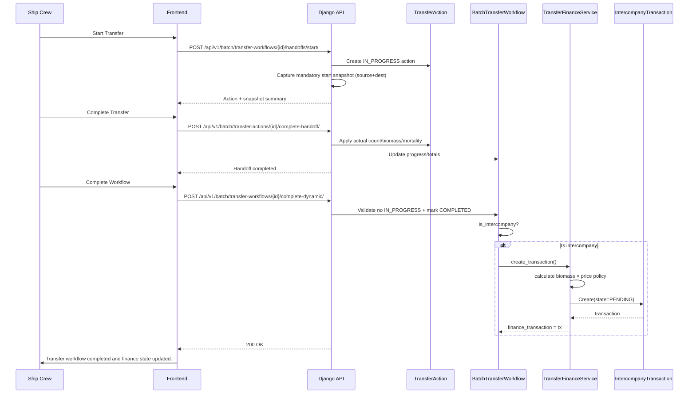
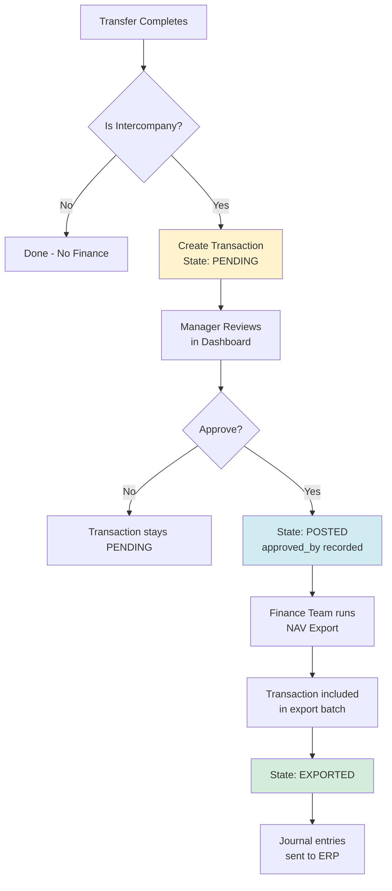

# Transfer Workflow & Finance Integration - User Guide

**Version**: 1.1  
**Last Updated**: March 4, 2026  
**Audience**: Freshwater Managers, Ship Crew, Farming Managers, Finance Team

---

## 📖 Table of Contents

1. [Overview](#overview)
2. [When Finance Transactions Are Created](#when-finance-transactions-are-created)
3. [User Workflows](#user-workflows)
4. [System Workflows](#system-workflows)
5. [API Reference](#api-reference)
6. [Troubleshooting](#troubleshooting)

---

## Overview

The Transfer Workflow system manages multi-step batch transfers that can span days or weeks. When transfers cross subsidiary boundaries (intercompany transfers), the system automatically creates financial transactions that require manager approval.

### Key Capabilities

✅ **Multi-day Operations** - Plan and execute transfers over days or weeks  
✅ **Progress Tracking** - Real-time visibility into completion status  
✅ **Page-Based Execution** - Ship crew runs dynamic FW->Sea from a dedicated execution page  
✅ **Finance Automation** - Auto-creates intercompany transactions  
✅ **Approval Workflow** - Manager approval before accounting export  
✅ **Multi-Currency** - Supports DKK, GBP, NOK, ISK, EUR

---

## When Finance Transactions Are Created

### ✅ Intercompany Transfers (Create Transactions)

Only **TWO** transfer scenarios create financial transactions:

#### 1. **Freshwater → Farming** (Post-Smolt Transfer to Sea)
```
Source: Post-Smolt tanks (Freshwater subsidiary)
Destination: Adult sea rings/pens (Farming subsidiary)
Pricing: Lifecycle-based (€/kg by stage)
Example: 1,250 kg × 168 NOK/kg = 210,000 NOK
```

#### 2. **Farming → Harvest** (Harvest Event)
```
Source: Adult sea rings (Farming subsidiary)
Destination: Processing (Harvest subsidiary)
Pricing: Grade-based (Superior, Standard, etc.)
Example: 5,000 kg × Market Price
```

### ❌ Internal Transfers (No Transactions)

These transfers **do NOT** create financial transactions:

- Egg → Alevin (Freshwater internal)
- Alevin → Fry (Freshwater internal)
- Fry → Parr (Freshwater internal)  
- Parr → Smolt (Freshwater internal)
- Smolt → Post-Smolt (Freshwater internal)
- Any redistribution within same subsidiary

---

## User Workflows

### Workflow 1: Plan Multi-Day Transfer (Freshwater Manager)

**Scenario**: Transfer 10 Post-Smolt tanks to sea over 2 weeks

**Two Entry Points**:

#### **Option A: From Batch Detail Page** (Recommended)
1. **Navigate** to batch detail page (e.g., SCO-2024-001)
2. **Click** "Transfers" tab
3. **View** existing workflows for this batch
4. **Click** "Create Workflow" button (Note: Currently shows "coming soon" - workflow must be created via API or admin for now)

#### **Option B: From Transfer Workflows Page**
1. **Click** "Transfer Workflows" in sidebar
2. **Click** batch dropdown filter
3. **Select** your batch from dropdown (e.g., "SCO-2024-001 - Atlantic Salmon")
4. **View** workflows for that batch
5. **Click** "Create New" (Note: Wizard UI coming in next phase)

**Current Limitation**: Workflow creation wizard is not yet implemented in UI. For now, workflows must be created via:
- Django Admin: Batch → Transfer Workflows → Add
- API: `POST /api/v1/batch/transfer-workflows/`
- Python script/shell

**When Wizard Is Complete** (Future):
- Create workflow in UI with multi-step wizard
- Add actions with source/dest container selection
- Review and plan in one flow

---

### Workflow 2: Execute Dynamic FW->Sea Transfer (Ship Crew - Mobile)

**Scenario**: Execute live station->truck->vessel->ring handoffs during voyage

**Steps**:

1. **Open** AquaMind app on tablet/phone.
2. **Navigate** to the dynamic workflow execution page: `/transfer-workflows/{id}/execute`.
3. In **Start Transfer**, choose leg type and live source/destination.
4. Enter planned transfer quantity and method, then click **Start Transfer**.
5. **System start behavior**:
   - Creates one `TransferAction` in `IN_PROGRESS`.
   - Captures mandatory start compliance snapshot for source + destination.
   - Required parameters: O2, Temperature, CO2 (when mapped).
   - Applies missing-mapping policy (strict block or privileged override with explicit note).
6. In **Complete Transfer**, enter actual count, biomass, mortality, and notes.
7. Click **Complete Transfer**.
8. **System completion behavior**:
   - Applies source/destination assignment mutations.
   - Marks action `COMPLETED` and updates workflow progress/totals.
   - Keeps workflow `IN_PROGRESS` until operator explicitly uses **Complete Workflow**.
9. **Result**: Handoff completed with compliance traceability and finance-ready workflow totals.

---

### Workflow 3: Approve Finance Transaction (Farming Manager)

**Scenario**: Approve intercompany transaction after Post-Smolt transfer completes

**Steps**:

1. **Navigate** to Transfer Workflows or Finance Dashboard
2. **Click** "Pending Approvals" (badge shows count)
3. **View** pending transaction:
   - Workflow: TRF-2024-042
   - From: Norway Freshwater → Norway Farming
   - Biomass: 1,250 kg
   - Amount: 210,000 NOK (@ 168 NOK/kg)
   - Status: PENDING
4. **Review** details:
   - Click "View Workflow Details" to see transfer actions
   - Verify biomass calculation is correct
   - Check pricing policy (Post-Smolt: 168 NOK/kg)
5. **Click** "Approve Transaction"
6. **System**:
   - State: PENDING → POSTED
   - Records: approved_by = Your User ID
   - Records: approval_date = now()
7. **Result**: Transaction approved, ready for NAV export

---

## System Workflows

### System Workflow 1: Complete Transfer with Finance


```mermaid
sequenceDiagram
    participant User as Ship Crew
    participant UI as Frontend
    participant API as Django API
    participant ACT as TransferAction
    participant WF as BatchTransferWorkflow
    participant FS as TransferFinanceService
    participant TX as IntercompanyTransaction

    User->>UI: Start Transfer
    UI->>API: POST /api/v1/batch/transfer-workflows/{id}/handoffs/start/
    API->>ACT: Create IN_PROGRESS action
    API->>API: Capture mandatory start snapshot (source+dest)
    API-->>UI: Action + snapshot summary

    User->>UI: Complete Transfer
    UI->>API: POST /api/v1/batch/transfer-actions/{id}/complete-handoff/
    API->>ACT: Apply actual count/biomass/mortality
    API->>WF: Update progress/totals
    API-->>UI: Handoff completed

    User->>UI: Complete Workflow
    UI->>API: POST /api/v1/batch/transfer-workflows/{id}/complete-dynamic/
    API->>WF: Validate no IN_PROGRESS + mark COMPLETED
    WF->>WF: is_intercompany?

    alt Is intercompany
        WF->>FS: create_transaction()
        FS->>FS: calculate biomass × price policy
        FS->>TX: Create(state=PENDING)
        TX-->>FS: transaction
        FS-->>WF: finance_transaction = tx
    end

    API-->>UI: 200 OK
    UI->>User: Transfer workflow completed and finance state updated.
```

---

### System Workflow 2: Approval to NAV Export


```mermaid
flowchart TD
    A[Transfer Completes] --> B{Is Intercompany?}
    B -->|No| C[Done - No Finance]
    B -->|Yes| D[Create Transaction<br/>State: PENDING]
    
    D --> E[Manager Reviews<br/>in Dashboard]
    E --> F{Approve?}
    F -->|No| G[Transaction stays PENDING]
    F -->|Yes| H[State: POSTED<br/>approved_by recorded]
    
    H --> I[Finance Team runs<br/>NAV Export]
    I --> J[Transaction included<br/>in export batch]
    J --> K[State: EXPORTED]
    K --> L[Journal entries<br/>sent to ERP]
    
    style D fill:#fff3cd
    style H fill:#d1ecf1
    style K fill:#d4edda
```

---

## API Reference

### Backend Endpoints

#### **Workflows**

```http
# List workflows
GET /api/v1/batch/transfer-workflows/
  ?status=IN_PROGRESS
  &workflow_type=LIFECYCLE_TRANSITION
  &batch=206
  &is_intercompany=true

# Get workflow detail
GET /api/v1/batch/transfer-workflows/{id}/

# Create workflow
POST /api/v1/batch/transfer-workflows/
{
  "batch": 206,
  "workflow_type": "LIFECYCLE_TRANSITION",
  "source_lifecycle_stage": 6,
  "dest_lifecycle_stage": 7,
  "planned_start_date": "2024-10-20"
}

# Plan workflow (DRAFT → PLANNED)
POST /api/v1/batch/transfer-workflows/{id}/plan/

# Dynamic execution context
GET /api/v1/batch/transfer-workflows/{id}/execution-context/

# Dynamic start handoff (creates IN_PROGRESS + mandatory start snapshot)
POST /api/v1/batch/transfer-workflows/{id}/handoffs/start/
{
  "leg_type": "STATION_TO_TRUCK",
  "source_assignment_id": 2536,
  "dest_container_id": 4412,
  "planned_transferred_count": 10000,
  "planned_transferred_biomass_kg": "500.00",
  "transfer_method": "PUMP"
}

# Cancel workflow
POST /api/v1/batch/transfer-workflows/{id}/cancel/
{
  "cancellation_reason": "Weather conditions unsafe"
}

# Explicit completion for dynamic workflow
POST /api/v1/batch/transfer-workflows/{id}/complete-dynamic/
{
  "completion_note": "Operation finished and reconciled."
}
```

#### **Actions**

```http
# List actions for workflow
GET /api/v1/batch/transfer-actions/
  ?workflow=42
  &status=PENDING

# Get action detail
GET /api/v1/batch/transfer-actions/{id}/

# Non-dynamic execute action (legacy/standard workflows)
POST /api/v1/batch/transfer-actions/{id}/execute/

# Skip action
POST /api/v1/batch/transfer-actions/{id}/skip/
{
  "reason": "Weather delay, rescheduling"
}

# Dynamic complete handoff (IN_PROGRESS -> COMPLETED)
POST /api/v1/batch/transfer-actions/{id}/complete-handoff/
{
  "transferred_count": 9800,
  "transferred_biomass_kg": "490.00",
  "mortality_during_transfer": 40,
  "notes": "Final tally from crew counters"
}

# Optional in-transit compliance snapshot
POST /api/v1/batch/transfer-actions/{id}/snapshot/
{
  "moment": "in_transit"
}
```

#### **Finance Approval**

```http
# List pending approvals
GET /api/v1/finance/intercompany-transactions/pending-approvals/

# Approve transaction
POST /api/v1/finance/intercompany-transactions/{tx_id}/approve/

Response:
{
  "message": "Transaction approved successfully",
  "transaction": {
    "tx_id": 123,
    "state": "posted",
    "amount": "210000.00",
    "currency": "NOK",
    "approved_by": 5,
    "approval_date": "2024-10-20T14:30:00Z"
  }
}
```

---

### Frontend Pages

```
/transfer-workflows              - Workflow list (filterable)
/transfer-workflows/{id}         - Workflow detail
/transfer-workflows/{id}/execute - Dynamic execution page (Start/Complete handoffs)
/finance/approvals               - Pending transaction approvals
```

---

## Pricing Configuration

### Lifecycle-Based Pricing Policies

Configured in Django Admin: **Finance → Intercompany Policies**

**Post-Smolt Transfer Pricing** (Freshwater → Farming):

| Geography | Lifecycle Stage | Price/kg | Currency |
|-----------|----------------|----------|----------|
| Norway | Parr | 95.00 | NOK |
| Norway | Smolt | 140.00 | NOK |
| Norway | Post-Smolt | 168.00 | NOK |
| Scotland | Parr | 7.50 | GBP |
| Scotland | Smolt | 11.00 | GBP |
| Scotland | Post-Smolt | 13.00 | GBP |
| Denmark/Faroe | Parr | 63.00 | DKK |
| Denmark/Faroe | Smolt | 93.00 | DKK |
| Denmark/Faroe | Post-Smolt | 112.00 | DKK |

**Note**: These are placeholder prices. Adjust in admin interface to reflect actual transfer pricing policies.

---

## State Machines

### Workflow States

```
DRAFT (Planning)
  ↓ plan_workflow()
PLANNED (Ready to Execute)
  ↓ start first handoff/action
IN_PROGRESS (Partially Executed)
  ↓ complete_dynamic() for dynamic workflows
COMPLETED (Operator Signoff Done)
```

**Alternative Paths**:
- DRAFT/PLANNED/IN_PROGRESS → cancel_workflow() → CANCELLED

### Action States

```
PENDING (Standard Workflow Action)
  ↓ execute() [standard workflows]
IN_PROGRESS (Executing)
  ↓ complete-handoff() [dynamic workflows]
COMPLETED (Done)
```

**Alternative Paths**:
- PENDING → skip() → SKIPPED
- IN_PROGRESS → validation error → FAILED
- FAILED → retry() → PENDING

### Transaction States

```
PENDING (Awaiting Approval)
  ↓ approve()
POSTED (Approved)
  ↓ NAV export
EXPORTED (Sent to ERP)
```

---

## Example: Complete End-to-End Flow

### Day 1 - Planning (Freshwater Manager - Desktop)

**9:00 AM** - Create workflow TRF-2024-042
- Batch: SCO-2024-001 (Atlantic Salmon, 5,000 fish)
- Type: Lifecycle Transition (Post-Smolt → Adult)
- Source: 10 Post-Smolt tanks at Norway Freshwater
- Destination: 12 sea rings at Norway Farming
- Planned: Oct 20 - Nov 3 (2 weeks)
- Status: DRAFT

**10:30 AM** - Add 10 transfer actions
- PS-01 → Ring-A15: 500 fish, 25 kg
- PS-02 → Ring-A16: 480 fish, 24 kg
- ...8 more actions
- Total: 5,000 fish, 250 kg

**11:00 AM** - Plan workflow
- System detects: Intercompany (Freshwater → Farming)
- Estimated value: 42,000 NOK (250 kg × 168 NOK/kg)
- Status: PLANNED → ready for execution

---

### Days 1-14 - Execution (Ship Crew - Mobile)

**Day 1 (Oct 20) - 14:00**
- Ship arrives at first sea ring location
- Crew opens `/transfer-workflows/{id}/execute` on tablet
- Starts handoff (station -> truck) with mandatory start snapshot
- Completes handoff with actual mortality/method/notes
- Result: workflow remains `IN_PROGRESS` with updated totals/progress

**Day 3 (Oct 22) - 09:30**
- Start + complete next handoff from execution page
- Result: dynamic progress updates from actual transferred totals

**Days 4-13**
- Start/complete additional handoffs as live route conditions dictate
- No speculative pending handoffs are required in advance

**Day 14 (Nov 3) - 11:15**
- Complete final handoff
- Operator selects **Complete Workflow** (explicit dynamic completion)
- Result: workflow transitions to `COMPLETED` ✅
- System creates IntercompanyTransaction:
  - tx_id: 456
  - Amount: 42,000 NOK (actual biomass transferred)
  - State: PENDING
  - Policy: Norway FW → Norway FM (Post-Smolt)

---

### Day 14 - Approval (Farming Manager - Desktop)

**15:00 PM** - Review pending transaction
- Navigate to "Pending Approvals" (shows badge: 1 pending)
- View transaction details:
  - Source Workflow: TRF-2024-042
  - Biomass: 1,250 kg (actual, includes mortality)
  - Amount: 210,000 NOK
  - Price: 168 NOK/kg
  - Lifecycle: Post-Smolt
- Verify accuracy by viewing workflow details
- Click "Approve Transaction"
- Result: State → POSTED ✅

---

### Week After - NAV Export (Finance Team)

**Next Monday** - Export to accounting system
- Finance team runs NAV export batch
- Selects: Norway Farming, Oct 1-31
- System includes transaction #456
- Creates journal entries:
  - Debit: Biological Assets (Farming)
  - Credit: Intercompany Payable (Freshwater)
  - Amount: 210,000 NOK
- Transaction state: POSTED → EXPORTED
- CSV exported to ERP system

---

## UI Walkthrough

### Transfer Workflows Page

```
┌────────────────────────────────────────────────────────────┐
│  Transfer Workflows                        [View Batches]  │
│  Manage multi-step batch transfer operations               │
├────────────────────────────────────────────────────────────┤
│  Filters:                                                   │
│  Status: [All] Type: [All] Batch: [____]                  │
├────────────────────────────────────────────────────────────┤
│  Workflows (25 total)                                       │
│                                                              │
│  # │ Batch │ Type │ Status │ Progress │ Started │ Actions  │
│  ──┼───────┼──────┼────────┼──────────┼─────────┼─────────│
│  TRF-2024-042 │ SCO-001 │ Lifecycle │ IN_PROGRESS│         │
│                                  [●●●●●○○○○○] 50%           │
│                                  5/10    Oct 20   [View]   │
│  ──┼───────┼──────┼────────┼──────────┼─────────┼─────────│
│  TRF-2024-041 │ NOR-123 │ Redistribution │ COMPLETED│      │
│                                  [●●●●●●●●●●] 100%          │
│                                  8/8     Oct 15   [View]   │
└────────────────────────────────────────────────────────────┘
```

---

### Workflow Detail Page

```
┌────────────────────────────────────────────────────────────┐
│  ← TRF-2024-042 [IN_PROGRESS] [IC]        [Cancel]        │
│  SCO-2024-001 • Lifecycle Stage Transition                 │
├────────────────────────────────────────────────────────────┤
│  Progress Overview                                          │
│  Actions Completed: 5 / 10 (50.0%)                         │
│  [●●●●●○○○○○○○○○○○○○○○] 50%                               │
│                                                              │
│  Total Transferred │ Total Biomass │ Mortality │ Days      │
│  2,450            │ 122.5 kg      │ 25        │ 5 days    │
├────────────────────────────────────────────────────────────┤
│  Timeline                                                   │
│  Planned Start: Oct 20 │ Actual Start: Oct 20               │
│  Completion: Nov 3                                          │
├────────────────────────────────────────────────────────────┤
│  💰 Intercompany Transaction                               │
│  Norway Freshwater → Norway Farming                        │
│  Transaction will be created when all actions complete.     │
├────────────────────────────────────────────────────────────┤
│  Transfer Actions                                           │
│  # │ Status │ Source │ Dest │ Count │ Biomass │ Executed  │
│  1 │ ✅ COMPLETED │ PS-01 │ A-15 │ 495 │ 24.75kg │ Oct 20 │
│  2 │ ✅ COMPLETED │ PS-02 │ A-16 │ 475 │ 23.75kg │ Oct 22 │
│  3-5 │ ✅ ...                                               │
│  6 │ ⏳ PENDING │ PS-06 │ A-20 │ 500 │ 25.00kg │ — [Execute]│
│  7-10 │ ⏳ ...                                              │
└────────────────────────────────────────────────────────────┘
```

---

### Dynamic Execution Page (Mobile)

```
┌────────────────────────────────────────────────────────┐
│  TRF-2024-042 Execution [IN_PROGRESS]                 │
├────────────────────────────────────────────────────────┤
│  Start Transfer                                        │
│  Leg: [Station -> Truck]                              │
│  Source: [Station Tank S1]                            │
│  Destination: [Truck-1 Tank]                          │
│  Planned Count: [10000] Biomass: [500.00]             │
│  [Start Transfer]                                      │
│  Start Snapshot Compliance: captured (O2/Temp/CO2)    │
├────────────────────────────────────────────────────────┤
│  Complete Transfer                                     │
│  In-Progress Action: [#12 Station -> Truck]           │
│  Actual Count: [9800] Biomass: [490.00] Mortality:[40]│
│  [Complete Transfer]                                   │
├────────────────────────────────────────────────────────┤
│  Recent Handoffs + Progress + Complete Workflow        │
└────────────────────────────────────────────────────────┘
```

---

## Troubleshooting

### Problem: Workflow won't plan

**Symptom**: "Cannot plan workflow" error

**Solutions**:
- ✅ Ensure at least one action is added
- ✅ Verify workflow is in DRAFT status
- ✅ Check all action fields are filled

---

### Problem: Can't execute action

**Symptom**: Execute button disabled or error

**Solutions**:
- ✅ For dynamic FW->Sea, use execution page (`/transfer-workflows/{id}/execute`) instead of action dialog
- ✅ Workflow must be in PLANNED or IN_PROGRESS status
- ✅ Start requires valid source/destination and mandatory start snapshot compliance
- ✅ If mapping is missing, provide privileged override note only when policy allows it
- ✅ Completion requires action in IN_PROGRESS and actual totals within source availability

---

### Problem: Finance transaction not created

**Symptom**: Workflow completed but no transaction

**Possible Causes**:
1. **Not intercompany**: Transfer within same subsidiary
2. **Missing pricing policy**: No policy configured for lifecycle stage
3. **Error logged**: Check Django logs for TransferFinanceError

**Solutions**:
- ✅ Verify source and dest containers are in different subsidiaries
- ✅ Check pricing policy exists in admin
- ✅ Review logs: `grep "TransferFinanceError" logs/`
- ✅ Create transaction manually in admin if needed

---

### Problem: Can't approve transaction

**Symptom**: Approve button missing or error

**Solutions**:
- ✅ Must be Finance Manager role
- ✅ Transaction must be in PENDING state
- ✅ Check user permissions in admin

---

## Admin Tasks

### Seed Pricing Policies (One-Time Setup)

```bash
# Dry run to preview
python manage.py seed_smolt_policies --dry-run

# Actually create policies
python manage.py seed_smolt_policies
```

**Output Example**:
```
Processing geography: Norway
  ✓ Created: Norway Freshwater → Norway Farming (Parr) @ kr95.00/kg (NOK)
  ✓ Created: Norway Freshwater → Norway Farming (Smolt) @ kr140.00/kg (NOK)
  ✓ Created: Norway Freshwater → Norway Farming (Post-Smolt) @ kr168.00/kg (NOK)

Successfully created 3 intercompany pricing policies
```

---

### Adjust Pricing (Ongoing)

**Django Admin** → Finance → Intercompany Policies

1. Find policy: Norway Freshwater → Norway Farming (Post-Smolt)
2. Edit `price_per_kg` field
3. Save
4. Future transfers will use new price

---

### Manual Transaction Creation (Emergency)

If automatic creation fails:

**Django Admin** → Finance → Intercompany Transactions

1. Click "Add Intercompany Transaction"
2. Select content type: "batch transfer workflow"
3. Enter object ID: (workflow ID)
4. Select policy
5. Enter amount manually
6. Set state: PENDING
7. Save
8. Manager can approve as normal

---

## Best Practices

### ✅ Do's

- **Plan ahead**: Create workflows in advance for scheduling
- **Execute promptly**: Complete actions on planned dates when possible
- **Record details**: Fill in environmental conditions and notes
- **Review before approve**: Verify biomass and pricing before approving
- **Use mobile**: Execute actions from tablets during transport

### ❌ Don'ts

- **Don't skip validation**: All fields are important for audit trail
- **Don't execute without data**: Record actual mortality and conditions
- **Don't approve blindly**: Review source workflow first
- **Don't bypass workflow**: Don't create manual transfers for intercompany

---

## Key Metrics

### Dashboard KPIs

- **Active Workflows**: Count of IN_PROGRESS workflows
- **Pending Approvals**: Count of PENDING finance transactions
- **This Month Transferred**: Sum of completed biomass (kg)
- **Average Mortality Rate**: Total mortality / total transferred

### Operational Metrics

- **Transfer Success Rate**: Actions completed / total actions
- **Average Duration**: Mean execution_duration_minutes
- **On-Time Completion**: % completed by planned_completion_date

---

## Support & Maintenance

### For Operational Issues
- Contact: Operations Manager
- Email: ops@aquamind.com
- Escalation: If workflow stuck or blocking operations

### For Finance Issues
- Contact: Finance Manager
- Email: finance@aquamind.com
- Escalation: Missing pricing policy, approval questions

### For Technical Issues
- Contact: IT Support
- Email: support@aquamind.com
- Include: Workflow number, screenshot, error message

---

## Glossary

**Workflow**: Logical transfer operation that may contain multiple actions

**Action**: Individual container-to-container fish movement

**Intercompany Transfer**: Transfer crossing subsidiary boundaries (creates finance transaction)

**Pricing Policy**: Configured price per kg for lifecycle stage or product grade

**Biomass**: Total weight of fish in kilograms

**Mortality**: Fish deaths during transfer operation

**PENDING**: Awaiting approval from manager

**POSTED**: Approved and ready for accounting export

**EXPORTED**: Sent to external ERP/accounting system

---

## Change Log

### Version 1.1 (March 4, 2026)
- ✅ Dynamic FW->Sea execution page (`/transfer-workflows/{id}/execute`)
- ✅ Two-step runtime handoff flow (`Start Transfer` -> `Complete Transfer`)
- ✅ Mandatory start compliance snapshots (O2/Temperature/CO2 policy path)
- ✅ Explicit dynamic workflow completion (`complete-dynamic`)
- ✅ Deprecated runtime modal path removed for dynamic operations

### Version 1.0 (October 20, 2024)
- ✅ Initial release
- ✅ Workflow management UI
- ✅ Standard action execution dialog
- ✅ Finance integration
- ✅ Multi-currency support
- ✅ Approval workflow

---

## Quick Reference Card

### Ship Crew (Mobile)

```
Execute Dynamic Transfer:
1. Open workflow on tablet
2. Open execution page
3. Start Transfer (mandatory start snapshot gate)
4. Complete Transfer with actuals
5. Repeat handoffs as needed
6. Complete Workflow when done ✅
```

### Freshwater Manager (Desktop)

```
Plan Transfer:
1. Create workflow
2. Add all actions
3. Review summary
4. Click [Plan]
5. Share with crew
```

### Farming Manager (Desktop)

```
Approve Transaction:
1. Check "Pending Approvals"
2. Review workflow details
3. Verify biomass & price
4. Click [Approve]
5. Confirm approval ✅
```

---

**End of Guide** - For questions, contact your system administrator or refer to technical documentation.
