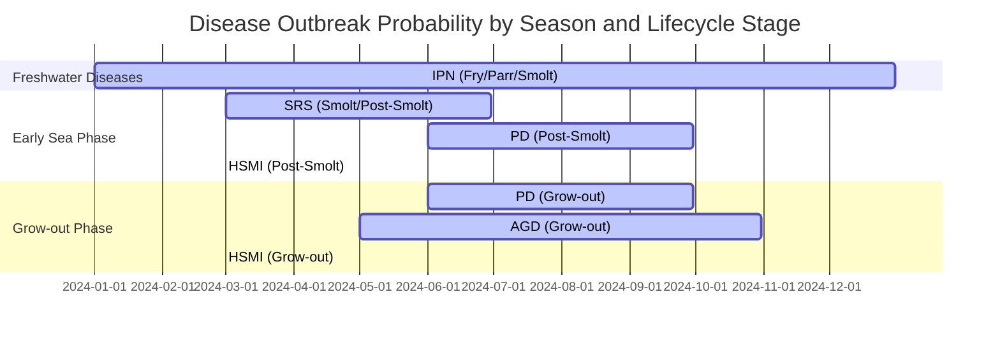

# AquaMind Data Generation Technical Specification

**Author:** Manus AI  
**Date:** August 19, 2025  
**Version:** 1.0

## Executive Summary

This technical specification defines the implementation requirements for generating 10 years of realistic aquaculture data for the AquaMind application. The data generation system will synthesize the complete operational lifecycle of salmon farming, from egg procurement through harvest, including all intermediate stages, environmental factors, health management, and business operations.

The system must generate data that accurately reflects the operational patterns identified in the Bakkafrost annual report, maintaining approximately 40-50 active batches at any given time with staggered production cycles to ensure continuous supply chain flow while respecting facility grace periods for compliance requirements.

## Core Data Generation Requirements

### Batch Management and Supply Chain Flow

The data generation system must create a realistic production pipeline that maintains steady-state operations with overlapping batch cycles. Based on the annual report analysis, the system should maintain approximately 40-50 active batches distributed across different lifecycle stages at any point in time.

**Batch Initialization Pattern:**
- New batches start with 3.0-3.5 million eggs
- 60% sourced from external suppliers, 40% from internal broodstock
- Batch creation follows seasonal patterns (higher frequency in Q1-Q2)
- Each batch assigned unique identifiers following company naming conventions

**Supply Chain Continuity:**
- Staggered batch starts ensure continuous facility utilization
- Grace periods enforced between facility uses (14-21 days for compliance)
- Facility capacity constraints respected (no overbooking)
- Realistic transfer scheduling between lifecycle stages

### Lifecycle Stage Modeling

The system must accurately model the complete salmon lifecycle with realistic durations and transitions:

**Stage Durations and Characteristics:**
- Egg/Alevin: 85-95 days (temperature dependent)
- Fry: 85-95 days 
- Parr: 85-95 days
- Smolt: 85-95 days
- Post-Smolt: 85-95 days
- Sea-phase (Grow-out): 400-500 days

**Container Type Progression:**
- Eggs: Incubation trays in hatchery
- Alevin: Start tanks in freshwater halls
- Fry: Circular tanks (increasing size)
- Parr: Larger circular tanks or raceways
- Smolt: Even larger circular tanks or raceways
- Post-Smolt: Pre-transfer tanks
- Grow-out: Sea cages (standard mesh)

### Growth Modeling Implementation

The growth model must use Thermal Growth Coefficient (TGC) calculations as the primary method, supplemented by Feed Conversion Ratio (FCR) data, since manual measurements are infrequent.

**TGC-Based Growth Calculation:**
```python
# TGC = (W_final^(1/3) - W_initial^(1/3)) / (temperature_sum * days)
# Where temperature_sum = sum of daily temperatures above 0°C

def calculate_fish_weight(initial_weight, days, avg_temp, tgc_coefficient):
    """
    Calculate fish weight using TGC model
    
    Args:
        initial_weight: Starting weight in grams
        days: Number of days
        avg_temp: Average temperature in Celsius
        tgc_coefficient: TGC value (species/strain specific)
    
    Returns:
        Final weight in grams
    """
    if avg_temp <= 0:
        return initial_weight
    
    initial_cube_root = initial_weight ** (1/3)
    temperature_sum = avg_temp * days
    growth_increment = tgc_coefficient * temperature_sum
    final_cube_root = initial_cube_root + growth_increment
    
    return final_cube_root ** 3
```

**Stage-Specific TGC Values:**
- Alevin/Fry: 0.8-1.2
- Parr: 1.0-1.4  
- Smolt: 1.2-1.6
- Post-Smolt: 1.4-1.8
- Sea-phase: 1.6-2.2

**FCR Integration:**
```python
def calculate_fcr_impact(current_weight, feed_consumed, days):
    """
    Calculate growth based on feed consumption
    Used as validation/adjustment for TGC calculations
    """
    expected_weight_gain = feed_consumed / fcr_target
    daily_growth_rate = expected_weight_gain / days
    return current_weight + (daily_growth_rate * days)
```

### Feed Management System

The feed management system must track the complete feed supply chain from procurement through consumption, including realistic pricing fluctuations and inventory management.

**Feed Procurement and Pricing:**
```python
class FeedPricingModel:
    def __init__(self):
        self.base_prices = {
            'starter': 2.8,  # EUR/kg for fry feed
            'grower': 2.2,   # EUR/kg for parr/smolt
            'finisher': 1.9  # EUR/kg for sea-phase
        }
        self.seasonal_multipliers = {
            'Q1': 1.05, 'Q2': 0.98, 'Q3': 1.02, 'Q4': 1.08
        }
    
    def get_feed_price(self, feed_type, date):
        """Generate realistic feed prices with seasonal and market variations"""
        base_price = self.base_prices[feed_type]
        seasonal_factor = self.seasonal_multipliers[self.get_quarter(date)]
        market_volatility = random.uniform(0.92, 1.12)  # ±12% market variation
        
        return base_price * seasonal_factor * market_volatility
```

**Feed Distribution and Consumption:**
- Feed delivered to site-specific storage facilities
- Distribution to individual containers/cages tracked
- Daily consumption calculated based on biomass and feeding rates
- Automatic reorder triggers when inventory falls below thresholds
- Feed conversion efficiency varies by lifecycle stage and environmental conditions

### Environmental Data Generation

Environmental parameters must be generated with realistic temporal patterns and correlations that impact fish growth, health, and mortality.

**Multi-Parameter Environmental Model:**
```python
class EnvironmentalDataGenerator:
    def generate_daily_parameters(self, site_type, date, previous_values):
        """
        Generate correlated environmental parameters
        
        Parameters include:
        - Water temperature (°C)
        - Dissolved oxygen (mg/L)
        - Salinity (ppt) - for seawater sites
        - pH
        - Current speed (m/s) - for sea sites
        """
        
        # Temperature follows seasonal patterns with daily variation
        base_temp = self.get_seasonal_temperature(date, site_type)
        daily_temp_variation = random.normalvariate(0, 1.5)
        temperature = base_temp + daily_temp_variation
        
        # Oxygen inversely correlated with temperature
        oxygen_base = 14.0 - (temperature * 0.4)  # Simplified relationship
        oxygen = max(6.0, oxygen_base + random.normalvariate(0, 0.8))
        
        # pH relatively stable with small variations
        ph = 7.8 + random.normalvariate(0, 0.2)
        
        return {
            'temperature': round(temperature, 1),
            'oxygen': round(oxygen, 1),
            'ph': round(ph, 1),
            'salinity': 34.5 + random.normalvariate(0, 0.5) if site_type == 'sea' else 0
        }
```

**Environmental Impact on Growth:**
Environmental conditions directly influence TGC calculations and mortality rates. Temperature is the primary growth driver, while oxygen levels and pH affect fish health and stress levels.


### Health and Mortality Modeling

The mortality system must simulate realistic death patterns influenced by multiple factors including lifecycle stage, environmental conditions, disease outbreaks, and management practices.

**Base Mortality Rates by Lifecycle Stage:**
```python
BASE_MORTALITY_RATES = {
    'egg': 0.15,      # 15% cumulative mortality during egg stage
    'alevin': 0.08,   # 8% cumulative mortality during alevin stage
    'fry': 0.05,      # 5% cumulative mortality during fry stage
    'parr': 0.03,     # 3% cumulative mortality during parr stage
    'smolt': 0.02,    # 2% cumulative mortality during smolt stage
    'post_smolt': 0.015, # 1.5% monthly mortality in early sea phase
    'grow_out': 0.008    # 0.8% monthly mortality in grow-out phase
}
```

**Daily Mortality Calculation:**
```python
def calculate_daily_mortality(batch, environmental_data, disease_status):
    """
    Calculate realistic daily mortality based on multiple factors
    """
    base_rate = BASE_MORTALITY_RATES[batch.lifecycle_stage]
    daily_base_rate = base_rate / get_stage_duration_days(batch.lifecycle_stage)
    
    # Environmental stress multipliers
    temp_stress = calculate_temperature_stress(environmental_data['temperature'], 
                                             batch.lifecycle_stage)
    oxygen_stress = calculate_oxygen_stress(environmental_data['oxygen'])
    
    # Disease impact
    disease_multiplier = 1.0
    if disease_status.active_diseases:
        disease_multiplier = calculate_disease_mortality_impact(disease_status)
    
    # Age-related mortality curve (U-shaped: high at start and end of stage)
    age_factor = calculate_age_mortality_factor(batch.days_in_current_stage, 
                                              batch.lifecycle_stage)
    
    final_mortality_rate = (daily_base_rate * temp_stress * oxygen_stress * 
                           disease_multiplier * age_factor)
    
    # Apply stochastic variation
    actual_mortality = numpy.random.poisson(batch.current_count * final_mortality_rate)
    
    return min(actual_mortality, batch.current_count)
```

**Disease Outbreak Modeling:**

The system must simulate common salmon diseases with realistic outbreak patterns, duration, and impact:

```python
DISEASE_PROFILES = {
    'PD': {  # Pancreas Disease
        'probability': 0.15,  # 15% annual probability per site
        'mortality_multiplier': 2.5,
        'duration_days': (45, 90),
        'affected_stages': ['post_smolt', 'grow_out'],
        'seasonal_bias': 'summer'  # Higher probability in warmer months
    },
    'SRS': {  # Salmonid Rickettsial Septicaemia
        'probability': 0.08,
        'mortality_multiplier': 3.2,
        'duration_days': (30, 60),
        'affected_stages': ['smolt', 'post_smolt'],
        'seasonal_bias': 'spring'
    },
    'IPN': {  # Infectious Pancreatic Necrosis
        'probability': 0.12,
        'mortality_multiplier': 4.0,
        'duration_days': (21, 45),
        'affected_stages': ['fry', 'parr', 'smolt'],
        'seasonal_bias': None
    },
    'HSMI': {  # Heart and Skeletal Muscle Inflammation
        'probability': 0.10,
        'mortality_multiplier': 1.8,
        'duration_days': (60, 120),
        'affected_stages': ['post_smolt', 'grow_out'],
        'seasonal_bias': 'winter'
    },
    'AGD': {  # Amoebic Gill Disease
        'probability': 0.25,  # More common in sea phase
        'mortality_multiplier': 1.5,
        'duration_days': (30, 90),
        'affected_stages': ['post_smolt', 'grow_out'],
        'seasonal_bias': 'summer'
    }
}
```

Let me create a visual diagram showing the disease outbreak probability timeline:



### Treatment and Vaccination System

The system must model realistic treatment protocols and their effectiveness:

```python
class TreatmentSystem:
    def __init__(self):
        self.vaccination_protocols = {
            'standard_smolt': {
                'vaccines': ['IPN', 'VHS', 'IHNV'],
                'timing': 'pre_seawater_transfer',
                'effectiveness': 0.85,
                'duration_days': 180
            },
            'enhanced_protocol': {
                'vaccines': ['IPN', 'VHS', 'IHNV', 'PD', 'SRS'],
                'timing': 'pre_seawater_transfer',
                'effectiveness': 0.78,
                'duration_days': 210
            }
        }
        
        self.treatments = {
            'antibiotic_bath': {
                'effective_against': ['SRS', 'bacterial_infections'],
                'duration_days': 7,
                'mortality_reduction': 0.6,
                'cost_per_kg_biomass': 0.15
            },
            'freshwater_bath': {
                'effective_against': ['AGD', 'sea_lice'],
                'duration_days': 1,
                'mortality_reduction': 0.4,
                'cost_per_kg_biomass': 0.05
            },
            'medicated_feed': {
                'effective_against': ['PD', 'HSMI'],
                'duration_days': 14,
                'mortality_reduction': 0.3,
                'cost_per_kg_biomass': 0.25
            }
        }
```

### Facility Management and Grace Periods

The system must enforce realistic facility utilization patterns with mandatory grace periods for biosecurity compliance:

```python
class FacilityManager:
    def __init__(self):
        self.grace_periods = {
            'hatchery_tray': 7,      # 7 days cleaning/disinfection
            'start_tank': 14,        # 14 days cleaning/disinfection
            'circular_tank': 14,     # 14 days cleaning/disinfection
            'raceway': 21,           # 21 days cleaning/disinfection
            'sea_cage': 30           # 30 days fallowing period
        }
    
    def check_facility_availability(self, facility_id, requested_date):
        """
        Check if facility is available considering grace periods
        """
        last_use = self.get_last_use_date(facility_id)
        if not last_use:
            return True
            
        facility_type = self.get_facility_type(facility_id)
        grace_period = self.grace_periods[facility_type]
        
        days_since_last_use = (requested_date - last_use).days
        return days_since_last_use >= grace_period
    
    def schedule_batch_transfer(self, batch, target_facility_type, preferred_date):
        """
        Schedule batch transfer respecting facility constraints
        """
        available_facilities = self.get_available_facilities(
            target_facility_type, 
            preferred_date,
            batch.current_count
        )
        
        if not available_facilities:
            # Find next available date
            next_available = self.find_next_available_date(
                target_facility_type, 
                preferred_date,
                batch.current_count
            )
            return self.assign_facility(batch, available_facilities[0], next_available)
        
        return self.assign_facility(batch, available_facilities[0], preferred_date)
```

### Data Generation Architecture

The data generation system follows a modular architecture where each component can be developed and tested independently:

```python
class AquaMindDataGenerator:
    def __init__(self, start_date, end_date):
        self.start_date = start_date
        self.end_date = end_date
        self.current_date = start_date
        
        # Initialize subsystems
        self.facility_manager = FacilityManager()
        self.environmental_generator = EnvironmentalDataGenerator()
        self.growth_calculator = GrowthCalculator()
        self.mortality_calculator = MortalityCalculator()
        self.feed_manager = FeedManager()
        self.disease_simulator = DiseaseSimulator()
        self.treatment_system = TreatmentSystem()
        
        # Django model interfaces
        self.django_interface = DjangoModelInterface()
    
    def generate_full_dataset(self):
        """
        Main orchestration method for generating complete dataset
        """
        # Phase 1: Initialize company structure and facilities
        self.initialize_company_structure()
        
        # Phase 2: Generate historical batches with staggered starts
        self.generate_historical_batches()
        
        # Phase 3: Simulate daily operations for entire period
        while self.current_date <= self.end_date:
            self.simulate_daily_operations()
            self.current_date += timedelta(days=1)
        
        # Phase 4: Generate summary reports and validate data integrity
        self.generate_summary_reports()
        self.validate_data_integrity()
    
    def simulate_daily_operations(self):
        """
        Simulate all daily operations for current date
        """
        # Generate environmental data for all sites
        self.generate_daily_environmental_data()
        
        # Process all active batches
        active_batches = self.get_active_batches(self.current_date)
        
        for batch in active_batches:
            # Calculate growth
            self.update_batch_growth(batch)
            
            # Calculate and apply mortality
            self.apply_daily_mortality(batch)
            
            # Update feed consumption
            self.update_feed_consumption(batch)
            
            # Check for lifecycle stage transitions
            self.check_stage_transitions(batch)
            
            # Check for disease outbreaks
            self.check_disease_outbreaks(batch)
            
            # Apply treatments if active
            self.apply_active_treatments(batch)
        
        # Check for new batch starts
        self.check_new_batch_starts()
        
        # Update feed inventory and procurement
        self.update_feed_inventory()
```

Let me create a system architecture diagram to visualize the data flow:


### Django Integration Patterns

The data generation system must integrate seamlessly with the existing Django application by calling model methods and services rather than directly manipulating the database. This ensures all business logic, validation, and audit trails are properly executed.

**User Action Emulation Pattern:**
```python
class UserActionEmulator:
    """
    Emulates user actions through Django's service layer
    Ensures all audit trails and business logic are triggered
    """
    
    def __init__(self):
        self.current_user = self.get_system_user()
        self.request_factory = RequestFactory()
    
    def create_batch(self, batch_data):
        """
        Emulate user creating a new batch through the web interface
        """
        request = self.request_factory.post('/api/batches/', batch_data)
        request.user = self.current_user
        
        # Call the actual Django view/service
        from aquamind.batches.services import BatchService
        batch_service = BatchService(request)
        
        return batch_service.create_batch(batch_data)
    
    def record_mortality(self, batch_id, mortality_data):
        """
        Emulate field worker recording mortality via mobile app
        """
        request = self.request_factory.post(
            f'/api/batches/{batch_id}/mortality/', 
            mortality_data
        )
        request.user = self.current_user
        
        from aquamind.health.services import HealthService
        health_service = HealthService(request)
        
        return health_service.record_mortality(batch_id, mortality_data)
    
    def update_environmental_data(self, site_id, env_data):
        """
        Emulate sensor data or manual environmental readings
        """
        request = self.request_factory.post(
            f'/api/sites/{site_id}/environmental/', 
            env_data
        )
        request.user = self.current_user
        
        from aquamind.environmental.services import EnvironmentalService
        env_service = EnvironmentalService(request)
        
        return env_service.record_environmental_data(site_id, env_data)
```

**Batch Creation with Realistic Staggering:**
```python
class BatchCreationScheduler:
    """
    Manages realistic batch creation timing to maintain 40-50 active batches
    """
    
    def __init__(self, target_active_batches=45):
        self.target_active_batches = target_active_batches
        self.seasonal_multipliers = {
            1: 1.3,   # January - higher batch starts
            2: 1.2,   # February
            3: 1.1,   # March
            4: 0.9,   # April
            5: 0.8,   # May
            6: 0.7,   # June - lower batch starts
            7: 0.7,   # July
            8: 0.8,   # August
            9: 0.9,   # September
            10: 1.0,  # October
            11: 1.1,  # November
            12: 1.2   # December
        }
    
    def should_create_batch(self, current_date, active_batch_count):
        """
        Determine if a new batch should be started based on current capacity
        and seasonal patterns
        """
        if active_batch_count >= self.target_active_batches + 5:
            return False
        
        if active_batch_count < self.target_active_batches - 5:
            return True
        
        # Apply seasonal probability
        month = current_date.month
        seasonal_factor = self.seasonal_multipliers[month]
        base_probability = 0.1  # 10% daily probability when at target
        
        adjusted_probability = base_probability * seasonal_factor
        return random.random() < adjusted_probability
    
    def generate_batch_parameters(self, current_date):
        """
        Generate realistic batch parameters
        """
        # Egg count variation
        base_egg_count = 3_250_000
        egg_count = int(base_egg_count + random.normalvariate(0, 250_000))
        egg_count = max(3_000_000, min(3_500_000, egg_count))
        
        # Source determination (60% external, 40% internal)
        is_external = random.random() < 0.6
        
        # Genetic strain selection
        available_strains = ['AquaGen_Supreme', 'SalmoBreed_Plus', 'Internal_Line_A']
        genetic_strain = random.choice(available_strains)
        
        return {
            'egg_count': egg_count,
            'source_type': 'external' if is_external else 'internal',
            'genetic_strain': genetic_strain,
            'expected_start_date': current_date,
            'batch_name': self.generate_batch_name(current_date)
        }
    
    def generate_batch_name(self, start_date):
        """
        Generate batch names following company conventions
        """
        year = start_date.year
        week = start_date.isocalendar()[1]
        batch_number = random.randint(1, 99)
        
        return f"BAK{year}{week:02d}{batch_number:02d}"
```

**Environmental Data Generation with Realistic Correlations:**
```python
class RealisticEnvironmentalGenerator:
    """
    Generates environmental data with proper correlations and seasonal patterns
    """
    
    def __init__(self):
        self.site_baselines = {
            'freshwater': {
                'temperature': {'min': 4, 'max': 16, 'optimal': 10},
                'oxygen': {'min': 8, 'max': 14, 'optimal': 11},
                'ph': {'min': 6.5, 'max': 8.5, 'optimal': 7.2}
            },
            'seawater': {
                'temperature': {'min': 6, 'max': 18, 'optimal': 12},
                'oxygen': {'min': 6, 'max': 12, 'optimal': 9},
                'ph': {'min': 7.5, 'max': 8.3, 'optimal': 8.0},
                'salinity': {'min': 32, 'max': 36, 'optimal': 34.5}
            }
        }
    
    def generate_daily_readings(self, site, date, previous_day_data=None):
        """
        Generate correlated environmental readings for a specific site and date
        """
        site_type = 'seawater' if site.site_type == 'sea' else 'freshwater'
        baselines = self.site_baselines[site_type]
        
        # Seasonal temperature variation
        day_of_year = date.timetuple().tm_yday
        seasonal_temp_adjustment = 6 * math.sin(2 * math.pi * (day_of_year - 80) / 365)
        
        base_temp = baselines['temperature']['optimal'] + seasonal_temp_adjustment
        
        # Add daily variation with some persistence from previous day
        if previous_day_data:
            temp_persistence = 0.7
            daily_variation = random.normalvariate(0, 1.5)
            temperature = (previous_day_data['temperature'] * temp_persistence + 
                         base_temp * (1 - temp_persistence) + daily_variation)
        else:
            temperature = base_temp + random.normalvariate(0, 2.0)
        
        # Oxygen inversely correlated with temperature
        temp_effect_on_oxygen = -0.3 * (temperature - baselines['temperature']['optimal'])
        oxygen = (baselines['oxygen']['optimal'] + temp_effect_on_oxygen + 
                 random.normalvariate(0, 0.8))
        
        # pH relatively stable
        ph = baselines['ph']['optimal'] + random.normalvariate(0, 0.15)
        
        readings = {
            'site_id': site.id,
            'date': date,
            'temperature': round(max(0, temperature), 1),
            'dissolved_oxygen': round(max(4, oxygen), 1),
            'ph': round(max(6.0, min(9.0, ph)), 1)
        }
        
        # Add salinity for seawater sites
        if site_type == 'seawater':
            salinity = baselines['salinity']['optimal'] + random.normalvariate(0, 0.5)
            readings['salinity'] = round(max(30, min(38, salinity)), 1)
        
        return readings
```

**Feed Management with Realistic Inventory Dynamics:**
```python
class FeedInventoryManager:
    """
    Manages feed procurement, distribution, and consumption with realistic patterns
    """
    
    def __init__(self):
        self.feed_types = {
            'starter_0.5mm': {'stages': ['fry'], 'price_base': 2.8},
            'starter_1.0mm': {'stages': ['parr'], 'price_base': 2.6},
            'grower_2.0mm': {'stages': ['smolt'], 'price_base': 2.2},
            'grower_3.0mm': {'stages': ['post_smolt'], 'price_base': 2.0},
            'finisher_4.5mm': {'stages': ['grow_out'], 'price_base': 1.9},
            'finisher_6.0mm': {'stages': ['grow_out'], 'price_base': 1.8}
        }
        
        self.reorder_thresholds = {
            'starter_0.5mm': 5000,    # kg
            'starter_1.0mm': 8000,    # kg
            'grower_2.0mm': 15000,    # kg
            'grower_3.0mm': 25000,    # kg
            'finisher_4.5mm': 50000,  # kg
            'finisher_6.0mm': 75000   # kg
        }
    
    def calculate_daily_consumption(self, batch):
        """
        Calculate realistic daily feed consumption for a batch
        """
        if batch.current_count == 0:
            return 0
        
        # Get average fish weight using TGC calculation
        avg_weight = self.calculate_average_weight(batch)
        
        # Feed rate as percentage of body weight (varies by stage and temperature)
        feed_rate_percent = self.get_feed_rate(batch.lifecycle_stage, 
                                             batch.current_temperature)
        
        # Total daily consumption
        total_biomass = batch.current_count * avg_weight / 1000  # kg
        daily_consumption = total_biomass * (feed_rate_percent / 100)
        
        return daily_consumption
    
    def get_feed_rate(self, lifecycle_stage, temperature):
        """
        Get feeding rate as percentage of body weight
        Adjusted for temperature and lifecycle stage
        """
        base_rates = {
            'fry': 8.0,        # 8% of body weight
            'parr': 6.0,       # 6% of body weight
            'smolt': 4.0,      # 4% of body weight
            'post_smolt': 2.5, # 2.5% of body weight
            'grow_out': 1.5    # 1.5% of body weight
        }
        
        base_rate = base_rates.get(lifecycle_stage, 2.0)
        
        # Temperature adjustment (feeding reduces at low temperatures)
        if temperature < 6:
            temp_multiplier = 0.3
        elif temperature < 10:
            temp_multiplier = 0.7
        elif temperature > 16:
            temp_multiplier = 0.8
        else:
            temp_multiplier = 1.0
        
        return base_rate * temp_multiplier
    
    def process_feed_procurement(self, site, date):
        """
        Process automatic feed reordering when inventory falls below thresholds
        """
        for feed_type, threshold in self.reorder_thresholds.items():
            current_inventory = self.get_current_inventory(site, feed_type)
            
            if current_inventory < threshold:
                order_quantity = self.calculate_order_quantity(feed_type, site)
                unit_price = self.get_current_feed_price(feed_type, date)
                
                # Create purchase order through Django service
                purchase_data = {
                    'site_id': site.id,
                    'feed_type': feed_type,
                    'quantity_kg': order_quantity,
                    'unit_price': unit_price,
                    'supplier': self.select_supplier(feed_type),
                    'expected_delivery': date + timedelta(days=3),
                    'order_date': date
                }
                
                self.user_emulator.create_feed_purchase_order(purchase_data)
```

### Implementation Phases for Coding Agents

**Phase 1: Foundation Setup**
- Initialize Django model interfaces and user emulation system
- Create base environmental data generator with seasonal patterns
- Implement facility management with grace period enforcement
- Set up batch creation scheduler with realistic timing

**Phase 2: Core Simulation Logic**
- Implement TGC-based growth calculations with environmental factors
- Create mortality calculation system with disease modeling
- Build feed consumption and inventory management
- Develop disease outbreak simulation with treatment responses

**Phase 3: Integration and Orchestration**
- Create main data generation orchestrator
- Implement daily operation simulation loop
- Add data validation and integrity checks
- Create progress monitoring and logging

**Phase 4: Historical Data Generation**
- Generate 10-year historical dataset with proper batch staggering
- Ensure realistic facility utilization patterns
- Validate data consistency and business rule compliance
- Generate summary reports and analytics

### Key Implementation Considerations for Coding Agents

**Data Consistency Requirements:**
- All timestamps must be in UTC with proper timezone handling
- Batch counts must never go negative (mortality cannot exceed current count)
- Facility assignments must respect capacity constraints and grace periods
- Feed consumption must not exceed available inventory
- Environmental readings must be within realistic ranges for site type

**Performance Optimization:**
- Use bulk database operations for large data insertions
- Implement efficient date range queries for time-series data
- Cache frequently accessed reference data (feed prices, facility info)
- Use database transactions to ensure data consistency

**Error Handling and Validation:**
- Validate all generated data against Django model constraints
- Implement rollback mechanisms for failed batch operations
- Log all data generation activities for debugging
- Provide clear error messages for constraint violations

**Testing and Validation:**
- Create unit tests for each simulation component
- Implement integration tests for end-to-end data generation
- Validate generated data against known industry benchmarks
- Provide data quality reports and anomaly detection

This technical specification provides coding agents with the detailed implementation guidance needed to create a realistic and comprehensive aquaculture data generation system that fully integrates with the existing AquaMind Django application while maintaining data integrity and business rule compliance.

